# Домашнее задание "Вычислительные мощности. Балансировщики нагрузки" — Прыкин Сергей

---

## Содержание

- [Архитектура решения](#архитектура-решения)
- [Задание 1. Yandex Cloud](#задание-1-yandex-cloud)
- [Проверка работоспособности](#проверка-работоспособности)
- [Проверка отказоустойчивости](#проверка-отказоустойчивости)
- [Пояснения](#пояснение)

---

## Архитектура решения

В рамках задания создана следующая инфраструктура:

- **Object Storage бакет** `snprykin-compute-lb-2026` — публичный, содержит картинку `picture.jpg`.
- **VPC** `compute-lb-network` с публичной подсетью `10.10.0.0/24` в зоне `ru-central1-a`.
- **Instance Group** `lamp-ig` — 3 ВМ с шаблоном LAMP, публичным IP, healthcheck.
- **Network Load Balancer** `lamp-nlb` — внешний, порт 80, привязан к target group Instance Group.

Схема трафика:
Клиент → NLB (158.160.225.0:80) → Instance Group (3 ВМ с LAMP) → отдаёт HTML со ссылкой на картинку из бакета

---

## Задание 1. Yandex Cloud

### 1.1. Инициализация Terraform

```
terraform init
```
Провайдер yandex-cloud/yandex установлен с зеркала Yandex Cloud.
Скриншот 1: terraform init — провайдер установлен.
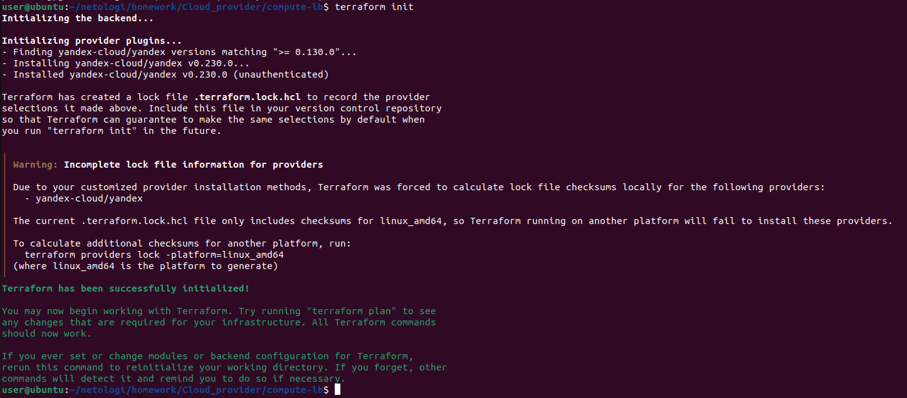

### 1.2. Планирование инфраструктуры
```
terraform plan
```
План создания 9 ресурсов: VPC, подсеть, security group, сервисный аккаунт, IAM-привязка, бакет, объект, Instance Group, Network Load Balancer.
Скриншот 2: terraform plan — Plan: 9 to add, 0 to change, 0 to destroy.
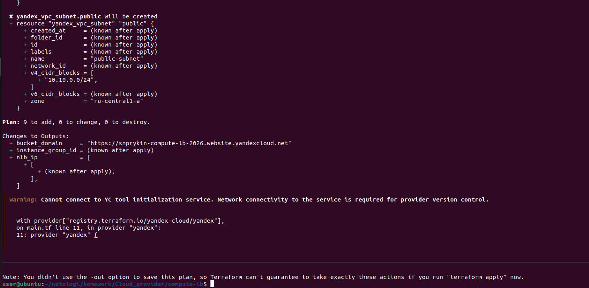

### 1.3. Применение конфигурации
```
terraform apply
```
Скриншот 3: terraform apply — Apply complete! 
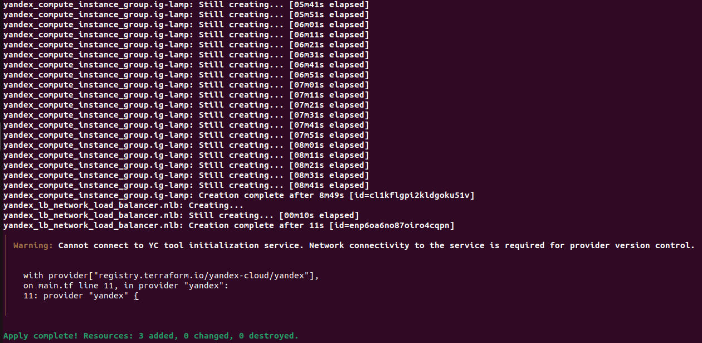

### 1.4. Получение IP-адресов и домена
```
terraform output
```
Результат:
Bucket domain: https://snprykin-compute-lb-2026.website.yandexcloud.net
Instance Group ID: cl1kflgpi2kldgoku51v
NLB IP: 158.160.225.0
Скриншот 4: terraform output — IP балансировщика, ID Instance Group, домен бакета.
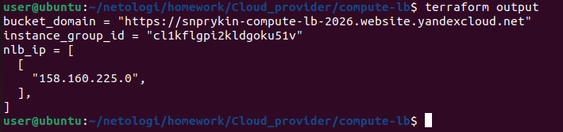

### 1.5. Файл main.tf
Файл: main.tf
```
terraform {
  required_providers {
    yandex = {
      source  = "yandex-cloud/yandex"
      version = ">= 0.130.0"
    }
  }
  required_version = ">= 1.0"
}

provider "yandex" {
  zone                     = "ru-central1-a"
  folder_id                = "b1g9p43hspfbf3eqck03"
  service_account_key_file = "/home/user/.authorized_key.json"
}

# Сервисный аккаунт для Instance Group
resource "yandex_iam_service_account" "ig-sa" {
  name        = "ig-sa"
  description = "Service account for Instance Group"
}

resource "yandex_resourcemanager_folder_iam_member" "ig-sa-editor" {
  folder_id = "b1g9p43hspfbf3eqck03"
  role      = "editor"
  member    = "serviceAccount:${yandex_iam_service_account.ig-sa.id}"
}

# VPC и подсеть
resource "yandex_vpc_network" "network" {
  name = "compute-lb-network"
}

resource "yandex_vpc_subnet" "public" {
  name           = "public-subnet"
  zone           = "ru-central1-a"
  network_id     = yandex_vpc_network.network.id
  v4_cidr_blocks = ["10.10.0.0/24"]
}

# Security Group
resource "yandex_vpc_security_group" "sg" {
  name       = "compute-lb-sg"
  network_id = yandex_vpc_network.network.id

  egress {
    protocol       = "ANY"
    description    = "any"
    v4_cidr_blocks = ["0.0.0.0/0"]
  }

  ingress {
    protocol       = "TCP"
    description    = "http"
    v4_cidr_blocks = ["0.0.0.0/0"]
    port           = 80
  }

  ingress {
    protocol       = "TCP"
    description    = "ssh"
    v4_cidr_blocks = ["0.0.0.0/0"]
    port           = 22
  }

  ingress {
    protocol       = "TCP"
    description    = "nlb-healthchecks"
    v4_cidr_blocks = ["198.18.235.0/24", "198.18.248.0/24"]
    port           = 80
  }
}

# Object Storage — бакет и картинка
resource "yandex_storage_bucket" "bucket" {
  bucket    = "snprykin-compute-lb-2026"
  folder_id = "b1g9p43hspfbf3eqck03"

  website {
    index_document = "index.html"
  }
}

resource "yandex_storage_object" "picture" {
  bucket       = yandex_storage_bucket.bucket.bucket
  key          = "picture.jpg"
  source       = "picture.jpg"
  content_type = "image/jpeg"
  acl          = "public-read"
  depends_on   = [yandex_storage_bucket.bucket]
}

# Instance Group с LAMP
resource "yandex_compute_instance_group" "ig-lamp" {
  name               = "lamp-ig"
  folder_id          = "b1g9p43hspfbf3eqck03"
  service_account_id = yandex_iam_service_account.ig-sa.id

  instance_template {
    platform_id = "standard-v3"

    resources {
      cores  = 2
      memory = 2
    }

    boot_disk {
      mode = "READ_WRITE"
      initialize_params {
        image_id = "fd827b91d99psvq5fjit"
        size     = 10
        type     = "network-hdd"
      }
    }

    network_interface {
      network_id         = yandex_vpc_network.network.id
      subnet_ids         = [yandex_vpc_subnet.public.id]
      nat                = true
      security_group_ids = [yandex_vpc_security_group.sg.id]
    }

    metadata = {
      user-data = <<EOF
#cloud-config
users:
  - name: user
    groups: sudo
    shell: /bin/bash
    sudo: ['ALL=(ALL) NOPASSWD:ALL']
    ssh_authorized_keys:
      - ${file("/home/user/.ssh/id_ed25519.pub")}

write_files:
  - path: /var/www/html/index.html
    permissions: '0644'
    content: |
      <!DOCTYPE html>
      <html>
      <head>
        <meta charset="UTF-8">
        <title>LAMP Instance Group</title>
      </head>
      <body>
        <h1>Hello from Yandex Cloud LAMP!</h1>
        <p>Студент: Прыкин Сергей</p>
        <p>Дата: Сентябрь 2026</p>
        
      </body>
      </html>

runcmd:
  - systemctl restart apache2
EOF
    }
  }

  scale_policy {
    fixed_scale {
      size = 3
    }
  }

  allocation_policy {
    zones = ["ru-central1-a"]
  }

  deploy_policy {
    max_unavailable = 1
    max_creating    = 1
    max_expansion   = 1
    max_deleting    = 1
  }

  health_check {
    interval            = 30
    timeout             = 10
    healthy_threshold   = 3
    unhealthy_threshold = 3
    http_options {
      port = 80
      path = "/"
    }
  }

  load_balancer {
    target_group_name = "lamp-tg"
  }
}

# Network Load Balancer
resource "yandex_lb_network_load_balancer" "nlb" {
  name = "lamp-nlb"

  listener {
    name        = "http"
    port        = 80
    target_port = 80
    external_address_spec {
      ip_version = "ipv4"
    }
  }

  attached_target_group {
    target_group_id = yandex_compute_instance_group.ig-lamp.load_balancer[0].target_group_id

    healthcheck {
      name = "http"
      http_options {
        port = 80
        path = "/"
      }
    }
  }
}
```

### 1.6. Файл outputs.tf
Файл: outputs.tf
```
output "bucket_domain" {
  value = "https://${yandex_storage_bucket.bucket.bucket}.website.yandexcloud.net"
}

output "nlb_ip" {
  value = [
    for listener in yandex_lb_network_load_balancer.nlb.listener :
    [
      for spec in listener.external_address_spec :
      spec.address
    ]
  ]
}

output "instance_group_id" {
  value = yandex_compute_instance_group.ig-lamp.id
}
```
## Проверка работоспособности
### 2.1. Проверка бакета и картинки
```
curl -I https://snprykin-compute-lb-2026.website.yandexcloud.net/picture.jpg
```
Ответ: HTTP/1.1 200 OK, Content-Type: image/jpeg.
Скриншот 5: curl -I на картинку из бакета — 200 OK.
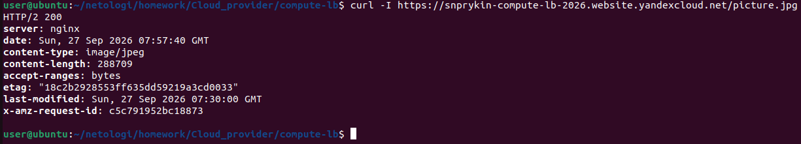

### 2.2. Проверка Instance Group
```
yc compute instance-group list-instances lamp-ig
```
Три ВМ в статусе RUNNING_ACTUAL с публичными и внутренними IP.
Скриншот 6: yc compute instance-group list-instances lamp-ig — 3 ВМ RUNNING_ACTUAL.
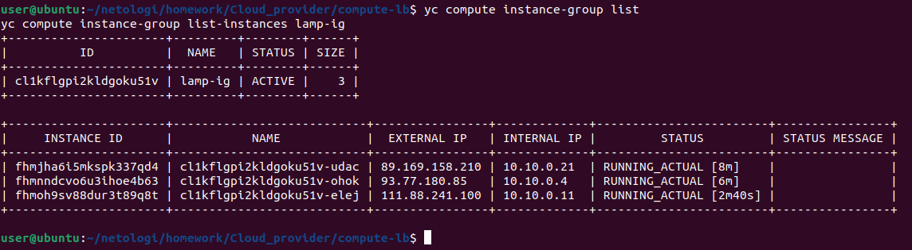

### 2.3. Проверка балансировщика
```
yc load-balancer network-load-balancer get lamp-nlb
```
Балансировщик ACTIVE, тип EXTERNAL, listener на порт 80, привязана target group lamp-tg.
Скриншот 7: yc load-balancer network-load-balancer get lamp-nlb — NLB активен.
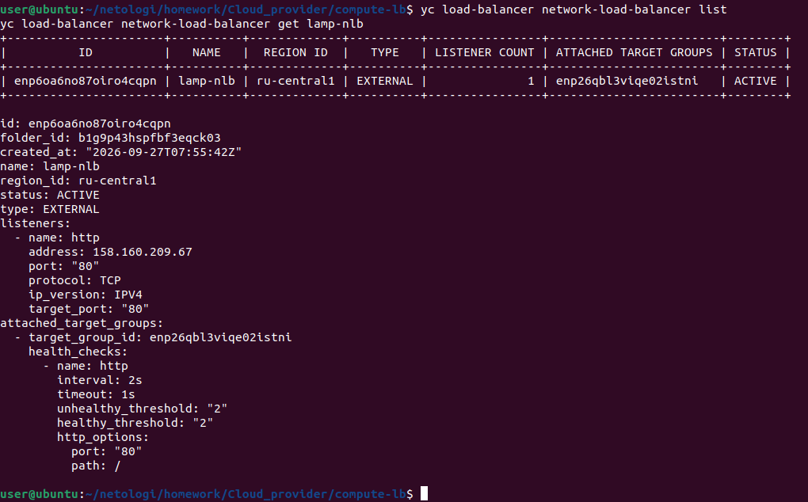

### 2.4. Проверка доступности через балансировщик
```
curl -v http://158.160.225.0/
```
Возвращается HTML-страница LAMP с приветствием и ссылкой на картинку.
Скриншот 8: curl http://158.160.225.0/ — HTML-страница LAMP.
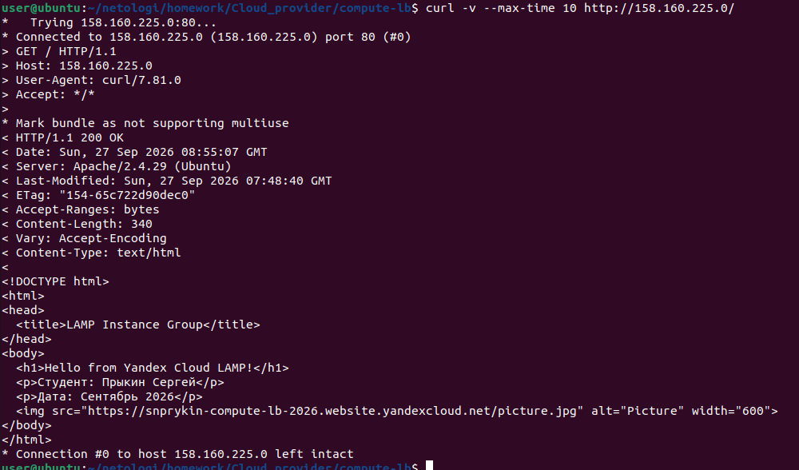

### 2.5. Проверка в браузере
Скриншот 9: Сайт открыт в браузере — картинка из бакета отображается.


## Проверка отказоустойчивости
### 3.1. Удаление одной ВМ
```
yc compute instance-group list-instances lamp-ig
```
К примеру берём ID одной ВМ: fhmjha6i5mkspk337qd4
```
yc compute instance delete fhmjha6i5mkspk337qd4
```
Скриншот 10: yc compute instance delete — одна ВМ удалена.
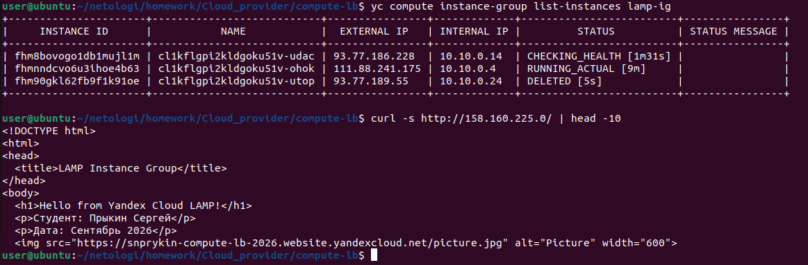
```
curl -s http://158.160.225.0/ | head -10
```
Сайт всё ещё работает — балансировщик перенаправил трафик на две оставшиеся ВМ.

### 3.2. Восстановление Instance Group
```
yc compute instance-group list-instances lamp-ig
```
Instance Group автоматически создала новую ВМ. Снова 3 ВМ в статусе RUNNING_ACTUAL.
Скриншот 11: yc compute instance-group list-instances — 3 ВМ снова RUNNING_ACTUAL.
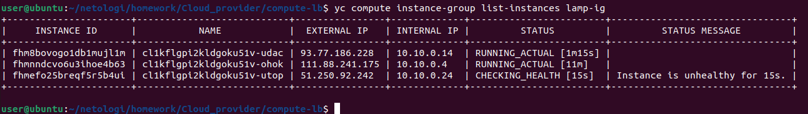

### 3.3. Финальная проверка целей балансировщика
```
yc load-balancer target-states lamp-nlb --target-group-id enp26qbl3viqe02istni
```
Все три цели HEALTHY.
Скриншот 12: yc load-balancer target-states — все цели HEALTHY.
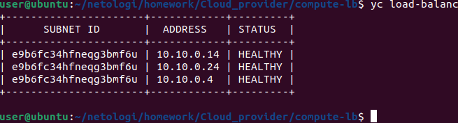

## Пояснения
### Object Storage
Бакет snprykin-compute-lb-2026 создан с публичным доступом. Картинка picture.jpg загружена и доступна по URL:
```
https://snprykin-compute-lb-2026.website.yandexcloud.net/picture.jpg
```
### Instance Group с LAMP
Instance Group состоит из 3 ВМ с образом fd827b91d99psvq5fjit (LAMP). При старте каждая ВМ через user-data создаёт index.html в /var/www/html/ со ссылкой на картинку из бакета.

### Healthcheck
Настроены два уровня проверок:
- IG healthcheck (interval=30s, timeout=10s) — следит за состоянием приложения, при необходимости пересоздаёт ВМ.
- NLB healthcheck (interval=2s, timeout=1s) — определяет, на какие ВМ отправлять трафик.
NLB healthcheck строже, чем IG healthcheck — это соответствует рекомендациям Yandex Cloud.

### Network Load Balancer
NLB lamp-nlb — внешний L4-балансировщик. Слушает порт 80 и распределяет трафик между тремя ВМ Instance Group через target group lamp-tg.

### Отказоустойчивость
При удалении одной из ВМ:
1. Балансировщик мгновенно исключает её из балансировки (healthcheck → UNHEALTHY).
2. Оставшиеся 2 ВМ продолжают обслуживать трафик.
3. Instance Group автоматически создаёт новую ВМ вместо удалённой.
4. Через 1-2 минуты новая ВМ проходит healthcheck и включается в балансировку.
