# Дипломный практикум в Yandex.Cloud — Прыкин Сергей

**Окружение:** Yandex Cloud, Terraform v1.16.3, Kubernetes v1.32.1, GitHub Actions  
**Дата:** Октябрь 2026

---

## Содержание

- [Цели](#цели)
- [Архитектура решения](#архитектура-решения)
- [Репозитории](#репозитории)
- [Этап 1. Создание облачной инфраструктуры](#этап-1-создание-облачной-инфраструктуры)
- [Этап 2. Создание Kubernetes кластера](#этап-2-создание-kubernetes-кластера)
- [Этап 3. Создание тестового приложения](#этап-3-создание-тестового-приложения)
- [Этап 4. Подготовка системы мониторинга и деплой приложения](#этап-4-подготовка-системы-мониторинга-и-деплой-приложения)
- [Этап 5. Установка и настройка CI/CD](#этап-5-установка-и-настройка-cicd)
- [Доступы](#доступы)
- [Инструкция по развёртыванию](#инструкция-по-развёртыванию)

---

## Цели

1. Подготовить облачную инфраструктуру на базе облачного провайдера Yandex.Cloud.
2. Запустить и сконфигурировать Kubernetes кластер.
3. Установить и настроить систему мониторинга.
4. Настроить и автоматизировать сборку тестового приложения с использованием Docker-контейнеров.
5. Настроить CI для автоматической сборки и тестирования.
6. Настроить CD для автоматического развёртывания приложения.

---

## Архитектура решения

- **Cloud:** Yandex Cloud (`ru-central1`)
- **Terraform backend:** S3 bucket `snprykin-diplom-tfstate`
- **Kubernetes:** Managed Service for Kubernetes (региональный мастер, неотказоустойчивый)
- **Worker nodes:** 2-4 прерываемые ВМ (`preemptible: true`)
- **Мониторинг:** kube-prometheus-stack (Prometheus + Grafana + Alertmanager)
- **CI/CD:** GitHub Actions
- **Registry:** Yandex Container Registry `diplom-registry`
- **Ingress:** NGINX Ingress Controller + Network Load Balancer

---

## Репозитории

| Репозиторий | Назначение |
|-------------|------------|
| [snprykin/diplom-infra](https://github.com/snprykin/diplom-infra) | Terraform-конфигурация инфраструктуры |
| [snprykin/diplom-app](https://github.com/snprykin/diplom-app) | Тестовое приложение + Dockerfile + CI/CD |

---

## Этап 1. Создание облачной инфраструктуры

### 1.1. Сервисный аккаунт и S3 backend

Создан сервисный аккаунт `diplom-sa` (`ajee9kgs11q78t7sm6ai`) с минимально необходимыми правами:

- `vpc.admin`, `compute.admin`, `storage.admin`
- `k8s.admin`, `k8s.clusters.agent`
- `container-registry.admin`, `iam.serviceAccounts.user`
- `logging.writer`, `monitoring.editor`
- `vpc.publicAdmin`, `load-balancer.admin`

[Скриншот 1](screenshots/1.png)
*Скриншот 1: Создан сервисный аккаунт*
**Файлы:**

- `terraform/sa/main.tf` — сервисный аккаунт, статический ключ, бакет
- `terraform/sa/outputs.tf` — ID SA, key_id, secret, bucket_name

**Скриншоты:**

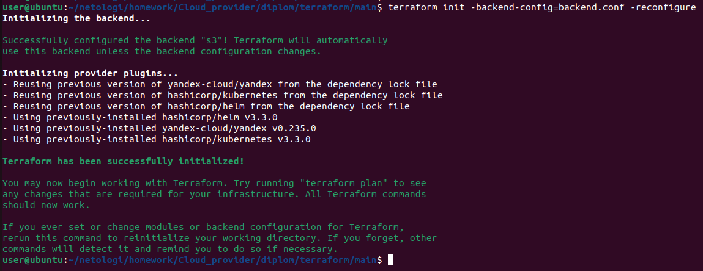
*Скриншот 2: `terraform init` в `terraform/sa/`.*

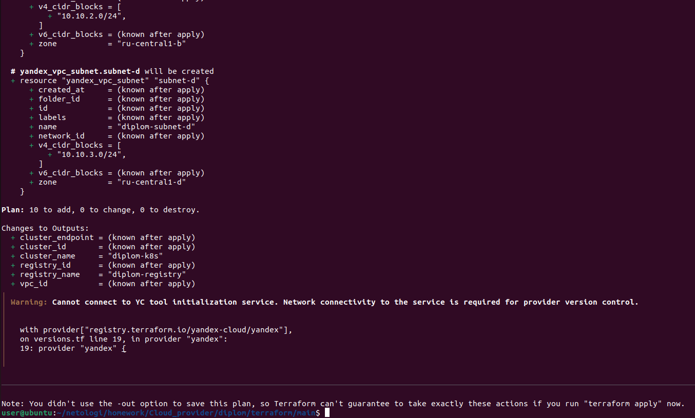
*Скриншот 3: `terraform plan` — план создания SA и бакета.*

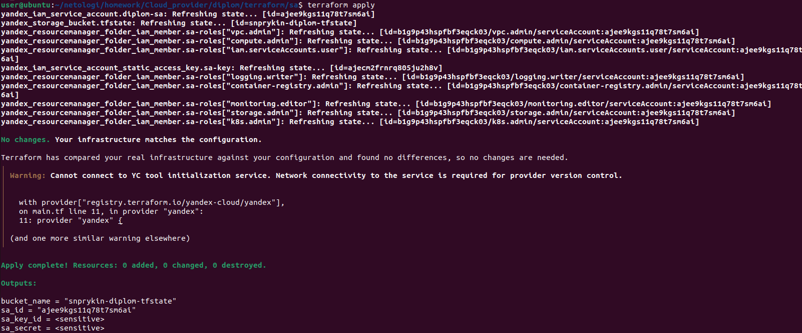
*Скриншот 4: `terraform apply` — SA и бакет созданы.*

### 1.2. VPC и подсети

Создана VPC `diplom-network` с 3 подсетями в разных зонах доступности:

- `diplom-subnet-a` (`10.10.1.0/24`, `ru-central1-a`)
- `diplom-subnet-b` (`10.10.2.0/24`, `ru-central1-b`)
- `diplom-subnet-d` (`10.10.3.0/24`, `ru-central1-d`)

**Security Group `diplom-k8s-sg`** включает правила:

- Intra-cluster communication (10.10.0.0/16, 10.112.0.0/16, 10.96.0.0/16)
- HTTP, HTTPS, SSH, K8s API (6443)
- NodePort (30000-32767) для Ingress
- Healthchecks от балансировщика
- Служебный трафик между мастером и узлами
- ICMP

---

## Этап 2. Создание Kubernetes кластера

### 2.1. Managed Kubernetes (региональный мастер)

Кластер `diplom-k8s` создан через Terraform:

- **Тип мастера:** региональный (неотказоустойчивый, `etcd_cluster_size: 3`)
- **Версия K8s:** 1.32
- **Публичный IP:** `https://158.160.233.194`
- **Внутренний IP:** `https://10.10.1.33`
- **KMS-шифрование секретов:** включено
- **Network Policy:** Calico

### 2.2. Node Group с прерываемыми ВМ

Node Group `diplom-workers`:

- 2-4 прерываемые ВМ (автоскейл)
- Тип: `standard-v3`, 2 vCPU, 4 ГБ RAM, 20% core fraction
- Диск: 64 ГБ network-hdd
- Публичный IP: включён

**Скриншоты:**

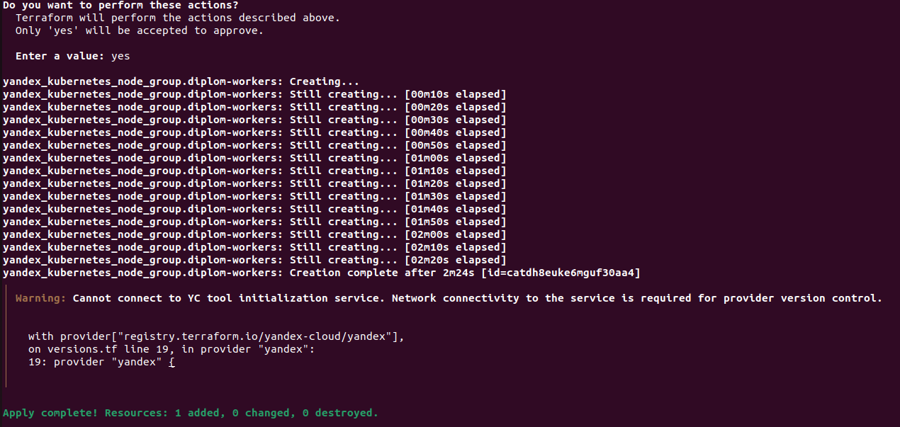
*Скриншот 5: `terraform apply` — кластер создан.*

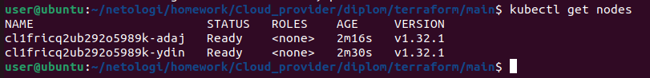
*Скриншот 6: `kubectl get nodes` — 2 worker-ноды в статусе Ready.*

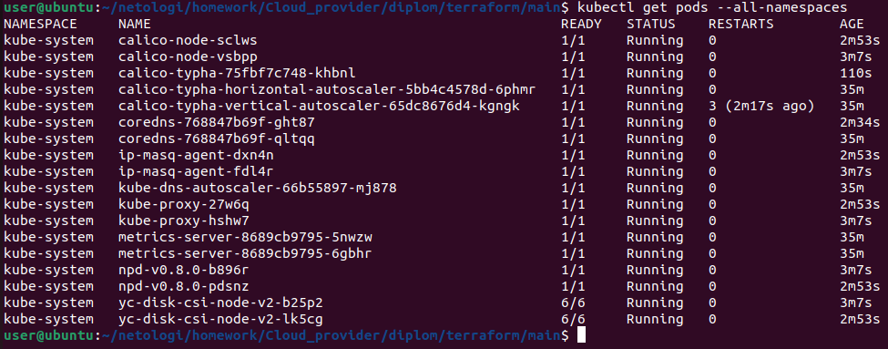
*Скриншот 7: `kubectl get pods --all-namespaces` — все системные поды Running.*

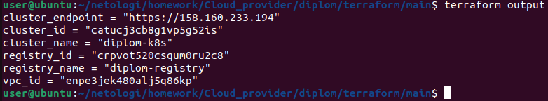
*Скриншот 8: `terraform output` — endpoint, cluster_id, registry_id.*

### 2.3. Проблемы и решения при создании кластера

**Проблема 1:** Кластер зависал в статусе `PROVISIONING` более часа.

**Решение:** В Security Group не хватало правила `self_security_group` для служебного трафика между мастером и узлами. После добавления кластер создался за 6 минут.

**Проблема 2:** Node Group падала с ошибкой `Disk size must be greater or equal than 30 GB`.

**Решение:** Увеличен размер диска с 20 ГБ до 64 ГБ (минимум для Managed K8s).

---

## Этап 3. Создание тестового приложения

### 3.1. Репозиторий `diplom-app`

Создан отдельный GitHub-репозиторий [snprykin/diplom-app](https://github.com/snprykin/diplom-app) с:

- `index.html` — статическая HTML-страница
- `Dockerfile` — образ на базе `nginx:1.27-alpine`
- `.dockerignore`, `README.md`

**Файл: `Dockerfile`**

```
FROM nginx:1.27-alpine

LABEL maintainer="Sergey Prykin <sn.prykin@yandex.ru>"
LABEL description="Diplom test application"

COPY index.html /usr/share/nginx/html/index.html

EXPOSE 80

CMD ["nginx", "-g", "daemon off;"]
```
###  3.2. Сборка и push образа
```
docker build -t diplom-app:v1.0.0 .
docker tag diplom-app:v1.0.0 cr.yandex/crpvot520csqum0ru2c8/diplom-app:v1.0.0
docker push cr.yandex/crpvot520csqum0ru2c8/diplom-app:v1.0.0
```
**Скриншоты:**

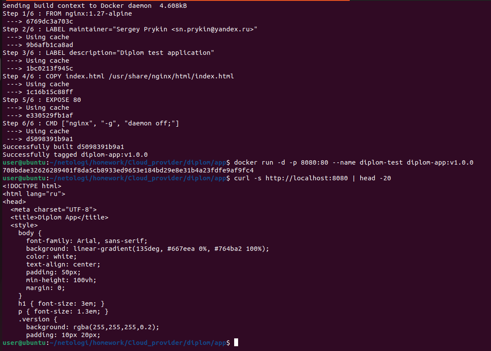
**Скриншот 9: docker build — образ собран, запущен. Приложение работает локально (curl http://localhost:8080).**

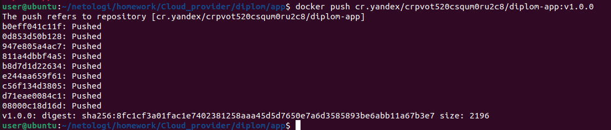
**Скриншот 10: docker push — образ отправлен в Container Registry.**

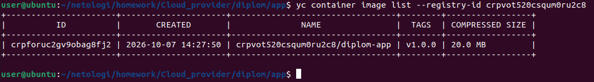
**Скриншот 11: yc container image list — образ в реестре.**

## Этап 4. Подготовка системы мониторинга и деплой приложения
### 4.1. Деплой тестового приложения
Приложение diplom-app развёрнуто в namespace diplom:

Deployment: 2 реплики

Service: ClusterIP на порту 80

Ingress: NGINX Ingress Controller

Файлы:
```
k8s/deployment.yaml, k8s/service.yaml, k8s/ingress.yaml
```
**Скриншоты:**


**Скриншот 12: kubectl get pods -n diplom — поды Running.**

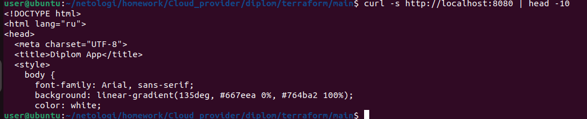
**Скриншот 13: Приложение доступно через port-forward.**

### 4.2. NGINX Ingress Controller
Установлен через Helm:
```
helm install ingress-nginx ingress-nginx/ingress-nginx \
  --namespace ingress-nginx --create-namespace \
  --set controller.service.type=LoadBalancer \
  --set controller.service.annotations."yandex\.cloud/load-balancer-type"="nlb"
```
**Скриншоты:**

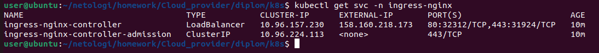
**Скриншот 15: kubectl get svc -n ingress-nginx — внешний IP 158.160.218.173.**

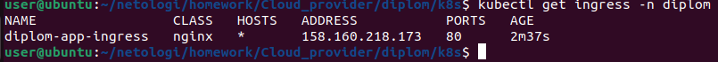
**Скриншот 16: kubectl get ingress -n diplom — Ingress создан.**

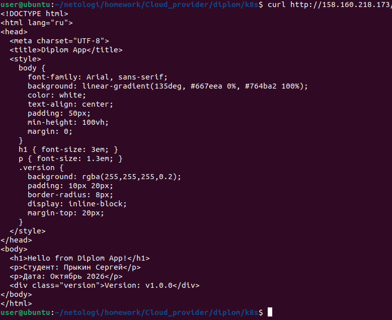
**Скриншот 17: Приложение доступно через Ingress (http://158.160.218.173/).**

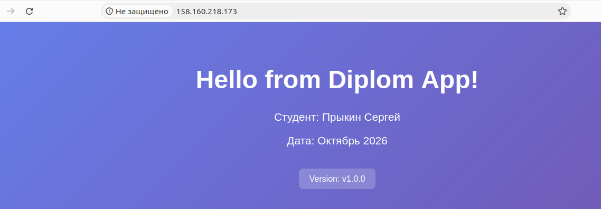
**Скриншот 18: Приложение доступно (http://158.160.218.173/)**

### 4.3. Мониторинг — kube-prometheus-stack
Установлен через Helm:
```
helm install monitoring prometheus-community/kube-prometheus-stack \
  --namespace monitoring --create-namespace \
  --values prometheus-values.yaml
```
Что установлено:
Prometheus (retention 7 дней)
Grafana (админ-пароль diplom2026)
Alertmanager
Node Exporter (DaemonSet)
Kube State Metrics
Prometheus Operator

Grafana доступна по адресу: http://130.193.35.188/ (admin / diplom2026)

**Скриншоты:**

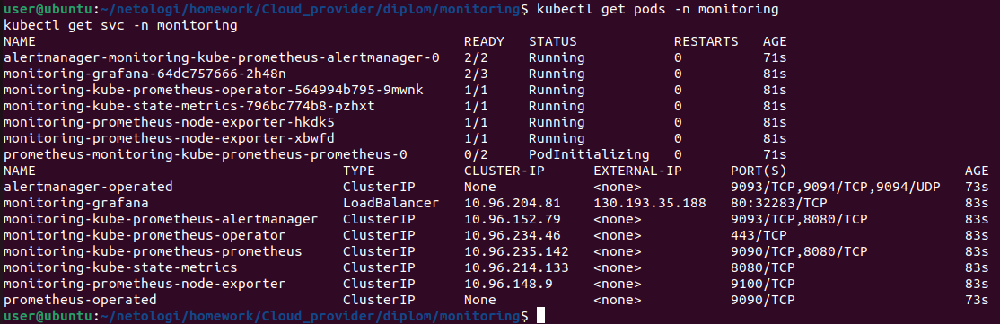
**Скриншот 19: kubectl get pods -n monitoring — все поды Running.**

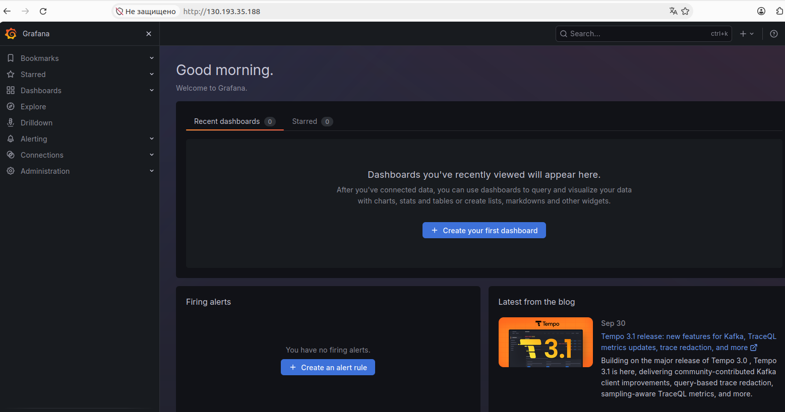
**Скриншот 20: Страница Grafana.**

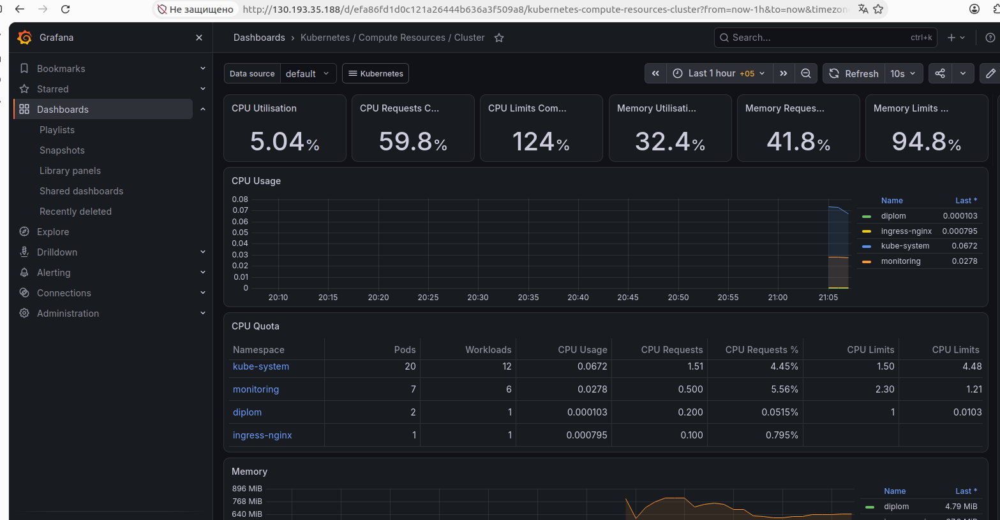
**Скриншот 21: Дашборд Kubernetes / Compute Resources / Cluster.**

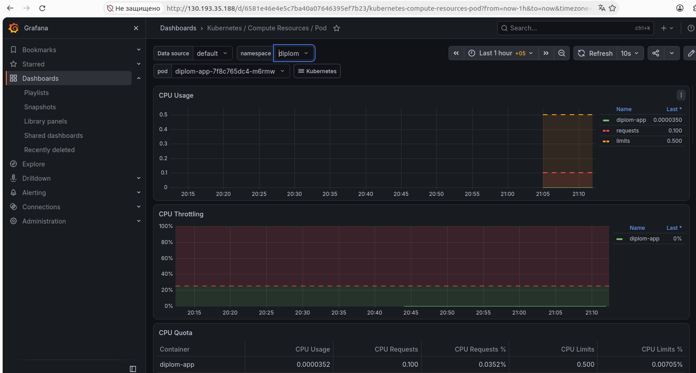
**Скриншот 22: Дашборд Pods с namespace diplom.**

### 4.4. Установка NodeLocal DNS
Для решения проблем с DNS в кластере установлен NodeLocal DNS через Yandex Cloud Marketplace.
Проблема: Grafana не могла подключиться к Prometheus — DNS-запросы таймаутили.
Решение: Установлен NodeLocal DNS Cache на каждой ноде. После этого:
Все ServiceMonitor targets стали up
Графики в Grafana отображаются корректно
kube_pod_info{namespace="diplom"} возвращает данные

**Скриншоты:**
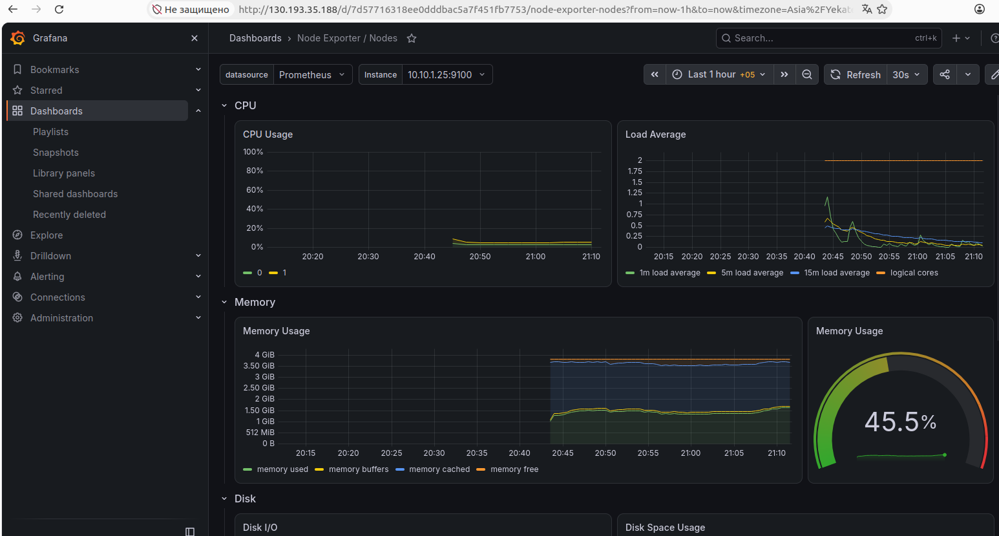
**Скриншот 23: Дашборд Nodes с метриками worker-нод.**

### 4.5. Настройка Security Group для трафика подов
Проблема: ServiceMonitor targets для kube-state-metrics, coredns, alertmanager были в статусе down с ошибкой context deadline exceeded.
Решение: Добавлено правило в Security Group для Pod CIDR 10.112.0.0/16 и Service CIDR 10.96.0.0/16.

## Этап 5. Установка и настройка CI/CD
### 5.1. GitHub Actions для приложения
В репозитории diplom-app настроен workflow .github/workflows/build-deploy.yaml:

Триггеры:
push в main → сборка и push образа
pull_request в main → сборка без push
push тега v* → сборка, push и деплой в K8s

Что делает:
Устанавливает Docker Buildx
Логинится в Container Registry через yc-actions/yc-cr-login
Собирает образ с параметрами provenance: false, sbom: false, oci-mediatypes=false (для совместимости с Yandex Container Registry)
Пушит образ

На тег v*: устанавливает yc CLI, получает IAM-токен, подставляет в kubeconfig, обновляет deployment через kubectl set image

**Скриншоты:**

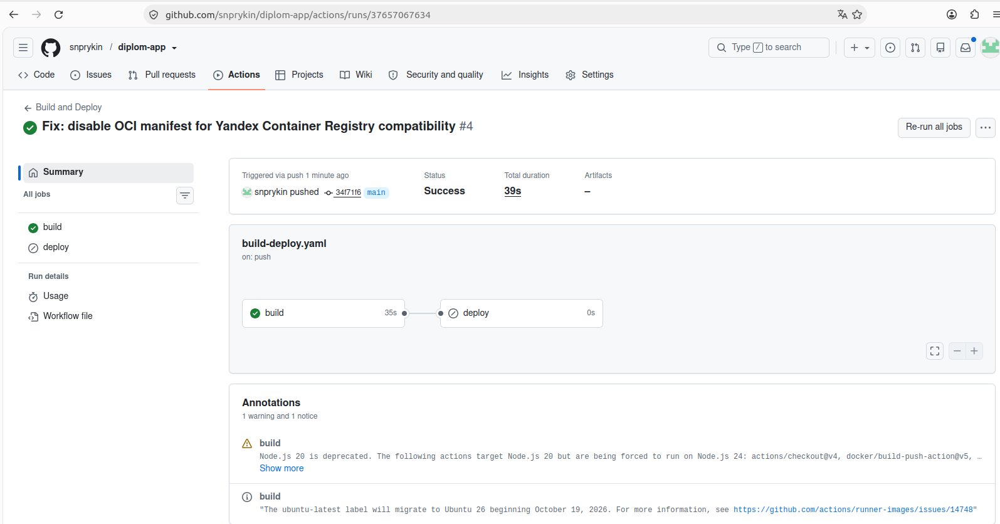
**Скриншот 24: Actions с успешным workflow build.**

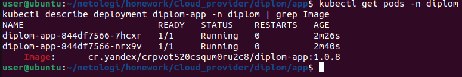
**Скриншот 25: Actions с успешным workflow build + deploy на теге.**

### 5.2. CI/CD для Terraform
В репозитории diplom-infra настроены workflows:
.github/workflows/terraform-plan.yaml — на PR в main:
Устанавливает Terraform
Создаёт /tmp/sa-key.json из секрета
Создаёт /tmp/ssh/id_ed25519.pub из секрета
Создаёт backend.conf из секретов
Выполняет terraform init, fmt, validate, plan
.github/workflows/terraform-apply.yaml — на push в main:
То же самое + terraform apply -auto-approve

**Скриншоты:**

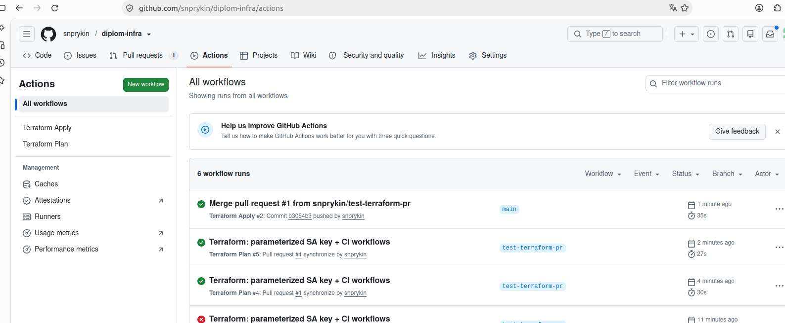
**Скриншот 26: Actions с workflow Terraform Apply (зелёный).**

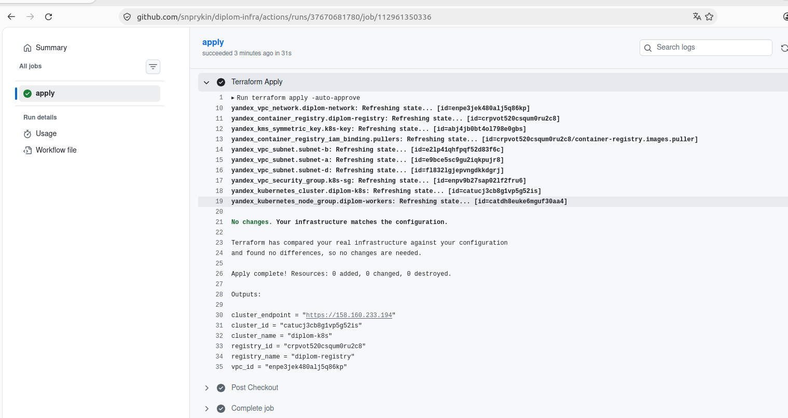
**Скриншот 27: Лог Terraform Apply — Apply complete!.**

| Сервис | URL | Логин / Пароль |
|--------|-----|----------------|
| **Grafana** | http://130.193.35.188/ | admin / diplom2026 |
| **Тестовое приложение** | http://158.160.218.173/ | — |
| **K8s API** | https://158.160.233.194 | kubeconfig |
| **Container Registry** | cr.yandex/crpvot520csqum0ru2c8 | IAM-токен |

## Инструкция по развёртыванию
1. Bootstrap (сервисный аккаунт и бакет)
```
terraform init
terraform apply
terraform output -raw sa_key_id
terraform output -raw sa_secret
```
2. Основная инфраструктура

### Создаём backend.conf с полученными значениями
```
cat > backend.conf <<EOF
access_key = "<sa_key_id>"
secret_key = "<sa_secret>"
EOF
```
### Инициализация с backend
terraform init -backend-config=backend.conf
terraform apply
3. Настройка kubectl
```
yc managed-kubernetes cluster get-credentials diplom-k8s --external --force
kubectl get nodes
```
4. Деплой приложения
```
kubectl apply -f k8s/deployment.yaml
kubectl apply -f k8s/service.yaml
kubectl apply -f k8s/ingress.yaml
```
5. Установка мониторинга
```
helm repo add prometheus-community https://prometheus-community.github.io/helm-charts
helm repo update
helm install monitoring prometheus-community/kube-prometheus-stack \
  --namespace monitoring --create-namespace \
  --values prometheus-values.yaml
```
6. CI/CD
Настроить GitHub Secrets в обоих репозиториях:
diplom-app: YC_SA_KEY, KUBE_CONFIG, YC_REGISTRY_ID
diplom-infra: YC_SA_KEY, YC_SA_KEY_ID, YC_SA_SECRET, SSH_PUBLIC_KEY

## Итог
Все 5 этапов дипломного практикума выполнены:
-  Облачная инфраструктура создана через Terraform с S3 backend
-  Managed Kubernetes кластер с прерываемыми worker-нодами запущен
-  Тестовое приложение упаковано в Docker и запушено в Container Registry
-  Мониторинг (Prometheus + Grafana + Alertmanager) установлен, дашборды работают
-  CI/CD настроен: автоматическая сборка, push и деплой приложения; Terraform plan/apply
