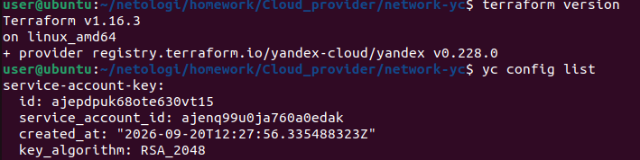
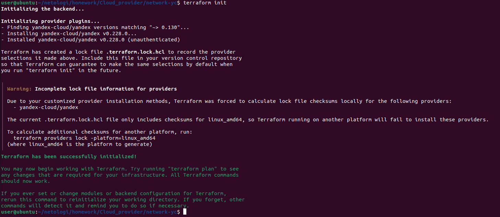
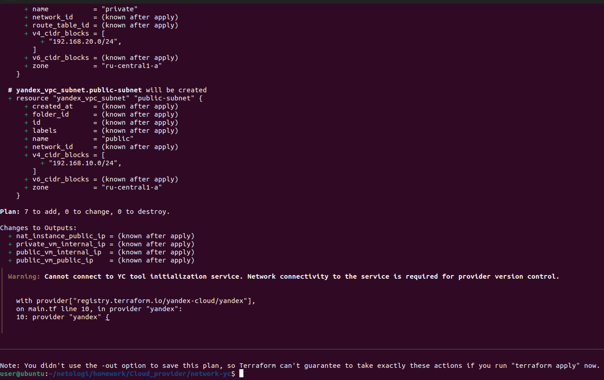
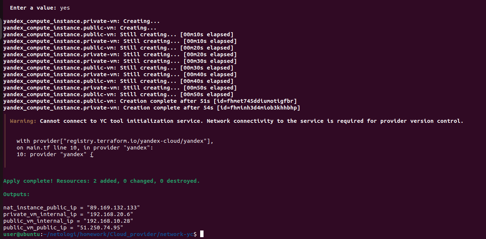
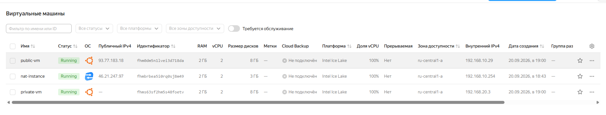
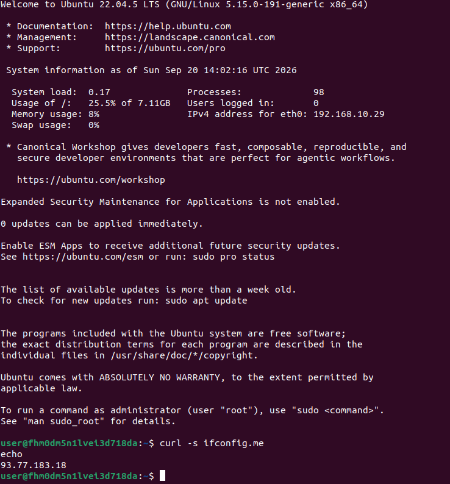
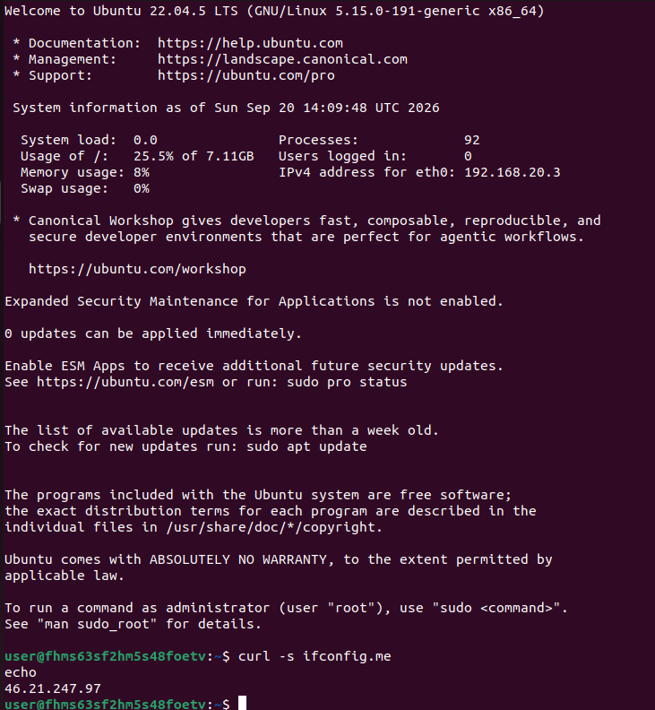
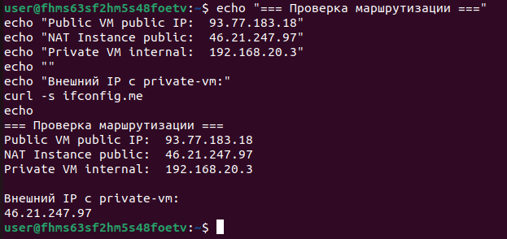
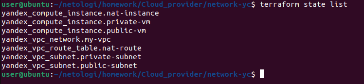

# Домашнее задание "Организация сети" — Прыкин Сергей
---

## Содержание

- [Архитектура решения](#архитектура-решения)
- [Задание 1. Организация сети в Yandex Cloud](#задание-1-организация-сети-в-yandex-cloud)
- [Пояснения](#Пояснения)

---

## Архитектура решения

В рамках задания создана следующая инфраструктура:

- **VPC `my-vpc`** — изолированная облачная сеть.
- **Публичная подсеть `public`** — `192.168.10.0/24`. Здесь размещены:
  - **NAT-инстанс** с внутренним IP `192.168.10.254` и публичным IP для доступа в интернет.
  - **public-vm** — тестовая ВМ с публичным IP.
- **Приватная подсеть `private`** — `192.168.20.0/24`. Здесь размещена:
  - **private-vm** — тестовая ВМ без публичного IP.
- **Route Table `nat-instance-route`** — таблица маршрутизации, направляющая весь исходящий трафик (`0.0.0.0/0`) из приватной подсети на NAT-инстанс.

Схема трафика:
- `public-vm` → интернет напрямую через свой публичный IP.
- `private-vm` → NAT-инстанс (`192.168.10.254`) → интернет через публичный IP NAT-инстанса.

---

## Задание 1. Организация сети в Yandex Cloud

### 1.1. Подготовка окружения

Проверена установка Terraform:

```
terraform version
```
Terraform v1.16.3 установлен через snap. Также настроен YC CLI с сервисным аккаунтом и folder_id.  
Скриншот 1: terraform version и yc config list — окружение готово.


### 1.2. Инициализация Terraform
```
terraform init
```
Провайдер yandex-cloud/yandex успешно установлен с зеркала Yandex Cloud.  
Скриншот 2: terraform init — провайдер установлен.


### 1.3. Планирование инфраструктуры
```
terraform plan
```
Terraform показывает план создания 7 ресурсов: 1 VPC, 2 подсети, 1 route table, 3 ВМ.  
Скриншот 3: terraform plan — Plan: 7 to add, 0 to change, 0 to destroy.


### 1.4. Применение конфигурации
```
terraform apply
```
Все 7 ресурсов успешно созданы.  
Скриншот 4: terraform apply — Apply complete! Resources: 7 added.


| Ресурс | Публичный IP | Внутренний IP |
|--------|--------------|---------------|
| NAT-инстанс | `46.21.247.97` | `192.168.10.254` |
| public-vm | `93.77.183.18` | `192.168.10.29` |
| private-vm | — | `192.168.20.3` |

### 1.5. Проверка ресурсов в Yandex Cloud
Все три ВМ созданы и находятся в статусе RUNNING.  
Скриншот 5:  три ВМ в статусе RUNNING.


### 1.6. Проверка интернета с public-vm
Подключаемся к public-vm:
```
ssh -i ~/.ssh/id_ed25519 user@93.77.183.18
```
Проверяем внешний IP:
```
curl -s ifconfig.me
```
Результат: 93.77.183.18 — публичный IP самой public-vm. Доступ в интернет напрямую.  
Скриншот 6: curl ifconfig.me на public-vm — возвращает собственный публичный IP.


### 1.7. Подключение к private-vm через public-vm
Копируем SSH-ключ на public-vm для доступа к private-vm:
```
scp -i ~/.ssh/id_ed25519 ~/.ssh/id_ed25519 user@93.77.183.18:~/.ssh/id_ed25519
```
С public-vm подключаемся к private-vm по внутреннему IP:
```
ssh -i ~/.ssh/id_ed25519 user@192.168.20.3
```
### 1.8. Проверка интернета с private-vm
Находясь на private-vm, проверяем внешний IP:
```
curl -s ifconfig.me
```
Результат: 46.21.247.97 — публичный IP NAT-инстанса. Это подтверждает, что трафик с private-vm проходит через NAT-инстанс.  
Скриншот 7: curl ifconfig.me на private-vm — возвращает публичный IP NAT-инстанса.


### 1.9. Итоговая проверка маршрутизации
На private-vm выполнен сравнительный вывод:
```
echo "=== Проверка маршрутизации ==="
echo "Public VM public IP:  93.77.183.18"
echo "NAT Instance public:  46.21.247.97"
echo "Private VM internal:  192.168.20.3"
echo ""
echo "Внешний IP с private-vm:"
curl -s ifconfig.me
```
Результат:
=== Проверка маршрутизации ===
Public VM public IP:  93.77.183.18
NAT Instance public:  46.21.247.97
Private VM internal:  192.168.20.3

Внешний IP с private-vm:46.21.247.97  
Скриншот 8: Сравнительная проверка IP-адресов — трафик private-vm идёт через NAT-инстанс.


### 1.10. Проверка состояния Terraform
```
terraform state list
```
Все 7 созданных ресурсов находятся под управлением Terraform.  
Скриншот 9: terraform state list — список управляемых ресурсов.


## Пояснения
### Публичная и приватная подсети
Публичная подсеть 192.168.10.0/24 содержит ВМ с публичными IP, которые доступны из интернета напрямую. Приватная подсеть 192.168.20.0/24 содержит ВМ без публичных IP — они не доступны из интернета напрямую.

### NAT-инстанс
NAT-инстанс — это обычная ВМ с двумя ролями:
1. Шлюз в интернет для приватной подсети (через ip_address = "192.168.10.254").
2. Точка входа для SSH-подключений.
Маршрутизация настраивается через static_route с destination_prefix = "0.0.0.0/0" и next_hop_address = "192.168.10.254" — весь исходящий трафик из приватной подсети направляется на NAT-инстанс.

### Route Table
Таблица маршрутизации nat-instance-route привязывается к приватной подсети через route_table_id. Она содержит один статический маршрут: весь трафик (0.0.0.0/0) идёт через NAT-инстанс (192.168.10.254).

### Проверка маршрутизации
Ключевое доказательство работы NAT — разница во внешних IP:
- С public-vm curl ifconfig.me возвращает её собственный публичный IP (93.77.183.18).
- С private-vm curl ifconfig.me возвращает публичный IP NAT-инстанса (46.21.247.97).
Это доказывает, что трафик из приватной подсети выходит в интернет через NAT-инстанс.
