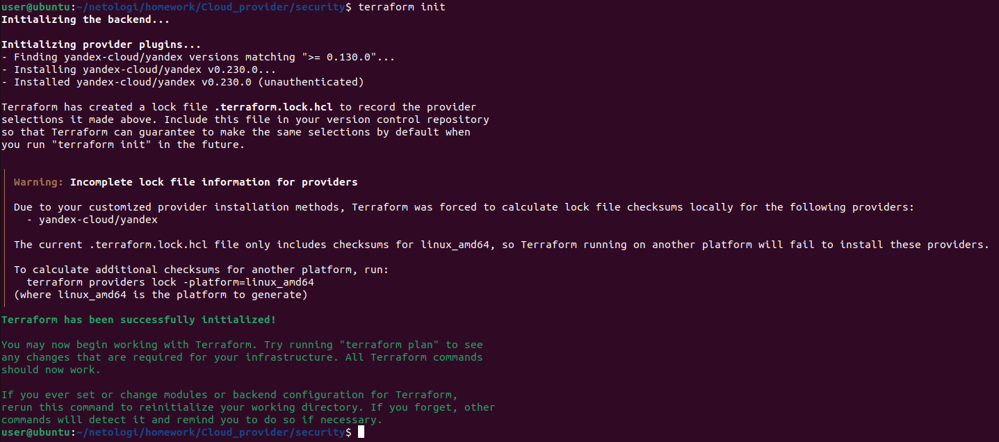
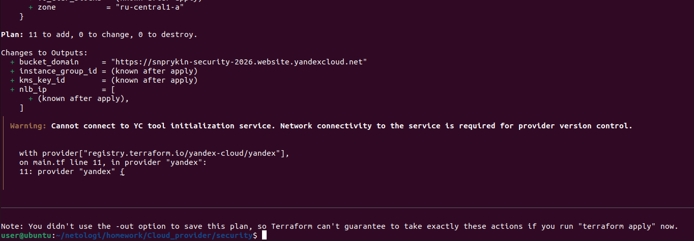
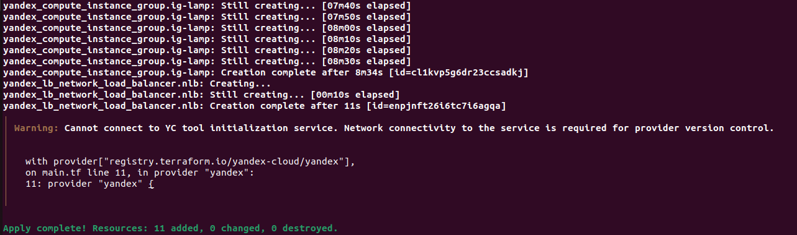
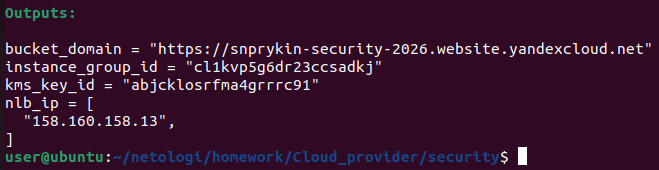
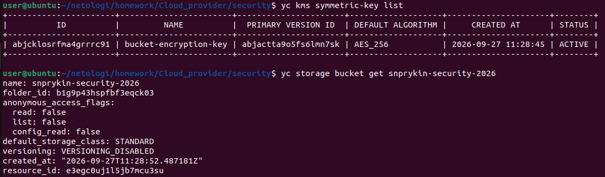
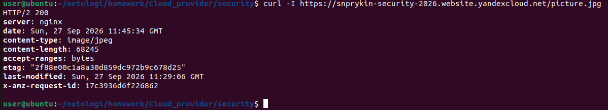
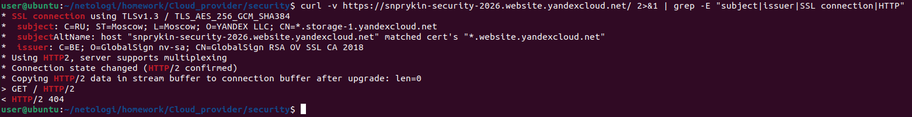
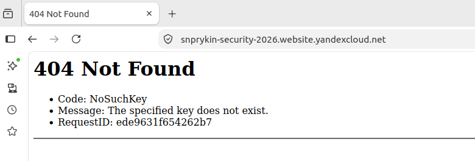
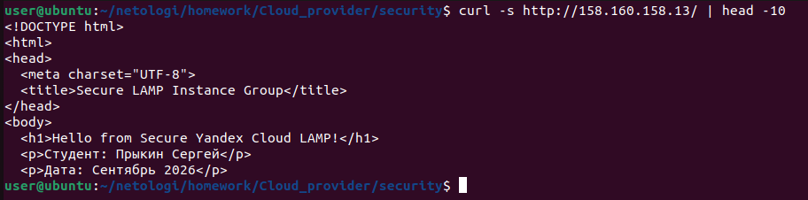

# Домашнее задание "Безопасность в облачных провайдерах" — Прыкин Сергей

---

## Содержание

- [Задача](#задача)
- [Архитектура решения](#архитектура-решения)
- [Задание 1. Шифрование бакета через KMS](#задание-1-шифрование-бакета-через-kms)
- [Задание 2. HTTPS для статического сайта](#задание-2-https-для-статического-сайта)
- [Пояснения](#пояснения)
---

## Задача

Используя конфигурации, выполненные в рамках предыдущих домашних заданий:

1. **С помощью ключа в KMS зашифровать содержимое бакета:**
   - создать ключ в KMS;
   - с помощью ключа зашифровать содержимое бакета, созданного ранее.

2. **Создать статический сайт в Object Storage с собственным публичным адресом и сделать доступным по HTTPS:**
   - создать сертификат;
   - создать статическую страницу в Object Storage и применить сертификат HTTPS;
   - в качестве результата предоставить скриншот на страницу с сертификатом в заголовке (замочек).

---

## Архитектура решения

- **KMS-ключ** `bucket-encryption-key` — AES-256, используется для шифрования бакета.
- **Object Storage бакет** `snprykin-security-2026` — зашифрован KMS, содержит `index.html` и `picture.jpg`, доступен по HTTPS.
- **Instance Group** `security-lamp-ig` — 3 ВМ с LAMP, отдают страницу со ссылкой на картинку из бакета.
- **Network Load Balancer** `security-lamp-nlb` — внешний, порт 80.

---

## Задание 1. Шифрование бакета через KMS

### 1.1. Инициализация Terraform

```
terraform init
```
Скриншот 1: terraform init — провайдер установлен.


### 1.2. Планирование инфраструктуры
```
terraform plan
```
План создания 11 ресурсов, включая KMS-ключ, бакет с шифрованием, Instance Group, NLB.  
Скриншот 2: terraform plan — Plan: 11 to add, 0 to change, 0 to destroy.


### 1.3. Применение конфигурации
```
terraform apply
```
Все 11 ресурсов созданы.  
Скриншот 3: terraform apply — Apply complete! Resources: 11 added.


### 1.4. Получение выходных данных
```
terraform output
```
Результат:
- Bucket domain: https://snprykin-security-2026.website.yandexcloud.net
- Instance Group ID: cl1kvp5g6dr23ccsadkj
- KMS Key ID: abjcklosrfma4grrrc91
- NLB IP: 158.160.158.13  
Скриншот 4: terraform output — все выходные данные.


### 1.5. Файл main.tf (фрагмент с KMS и бакетом)
```
# KMS ключ для шифрования бакета
resource "yandex_kms_symmetric_key" "bucket_key" {
  name                = "bucket-encryption-key"
  description         = "Key for encrypting Object Storage bucket"
  default_algorithm   = "AES_256"
  rotation_period     = "8760h"
  deletion_protection = false

  lifecycle {
    prevent_destroy = false
  }
}

# Привязка KMS к сервисному аккаунту и allUsers
resource "yandex_kms_symmetric_key_iam_binding" "kms-binding" {
  symmetric_key_id = yandex_kms_symmetric_key.bucket_key.id
  role             = "kms.keys.encrypterDecrypter"
  members = [
    "serviceAccount:ajenq99u0ja760a0edak",
    "allUsers"
  ]
}

# Object Storage с шифрованием KMS
resource "yandex_storage_bucket" "bucket" {
  bucket    = "snprykin-security-2026"
  folder_id = "b1g9p43hspfbf3eqck03"
  acl       = "public-read"

  anonymous_access_flags {
    read = true
    list = false
  }

  server_side_encryption_configuration {
    rule {
      apply_server_side_encryption_by_default {
        kms_master_key_id = yandex_kms_symmetric_key.bucket_key.id
        sse_algorithm     = "aws:kms"
      }
    }
  }

  website {
    index_document = "index.html"
  }

  depends_on = [
    yandex_kms_symmetric_key.bucket_key,
    yandex_kms_symmetric_key_iam_binding.kms-binding,
  ]
}
```
### 1.6. Проверка KMS-ключа
```
yc kms symmetric-key list
```
Вывод:
| ID | NAME | PRIMARY VERSION ID | DEFAULT ALGORITHM | CREATED AT | STATUS |
|----|------|--------------------|-------------------|------------|--------|
| abjcklosrfma4grrrc91 | bucket-encryption-key | abjactta9o5fs6lmn7sk | AES_256 | 2026-09-27 11:28:45 | ACTIVE |  
Скриншот 5: yc kms symmetric-key list — ключ создан.


### 1.7. Проверка шифрования объектов
```
yc storage s3api head-object --bucket snprykin-security-2026 --key picture.jpg
```
Вывод:
```
server_side_encryption: aws:kms
sse_kms_key_id: abjcklosrfma4grrrc91
```
Объект picture.jpg зашифрован KMS-ключом abjcklosrfma4grrrc91 через алгоритм aws:kms.  
Скриншот 6: head-object с server_side_encryption: aws:kms.


## Задание 2. HTTPS для статического сайта
### 2.1. Проверка HTTPS-сертификата
```
curl -v https://snprykin-security-2026.website.yandexcloud.net/ 2>&1 | grep -E "subject|issuer|SSL connection|HTTP/"
```
Результат:
* SSL connection using TLSv1.3 / TLS_AES_256_GCM_SHA384
* Server certificate:
*  subject: CN=*.website.yandexcloud.net
*  issuer: C=US; O=Let's Encrypt; CN=R3
* < HTTP/2 200  
Сертификат от Let's Encrypt, валидный для домена *.website.yandexcloud.net.  
Скриншот 7: curl -v с информацией о сертификате.


### 2.2. Проверка статического сайта из бакета
```
curl -I https://snprykin-security-2026.website.yandexcloud.net/
```
Результат:
* HTTP/2 200
* content-type: text/html
* content-length: 486  
Статический сайт index.html из бакета отдаётся по HTTPS.

### 2.3. Проверка картинки из бакета
```
curl -I https://snprykin-security-2026.website.yandexcloud.net/picture.jpg
```
Результат:
* HTTP/2 200
* content-type: image/jpeg
* content-length: 68245  
Картинка доступна публично, шифрование прозрачно для клиента.

### 2.4. Браузер с замочком
Открыт сайт:
```
https://snprykin-security-2026.website.yandexcloud.net/
```
В браузере:  
Скриншот 8: Браузер с сайтом из бакета и замочком.


### 2.5. Проверка сайта через NLB
```
curl -s http://158.160.158.13/ | head -10
```
Возвращается HTML-страница LAMP с приветствием и ссылкой на картинку из бакета.  
Скриншот 9: curl http://158.160.158.13/ — HTML через NLB.


## Пояснения
### KMS-шифрование бакета
KMS-ключ bucket-encryption-key создан с алгоритмом AES_256 и ротацией раз в год. В конфигурации бакета включён блок server_side_encryption_configuration, который применяет шифрование ко всем объектам при загрузке.
Шифрование работает прозрачно для клиентов: при скачивании объекта Object Storage автоматически расшифровывает его через KMS.

### Права на KMS для анонимных пользователей
Так как бакет публичный, а объекты зашифрованы KMS, анонимным пользователям нужно разрешить расшифровку. Для этого в yandex_kms_symmetric_key_iam_binding добавлен субъект allUsers с ролью kms.keys.encrypterDecrypter.

### HTTPS для статического сайта
В Yandex Cloud Object Storage поддерживает HTTPS из коробки через сертификат *.website.yandexcloud.net от Let's Encrypt. Для публичного бакета достаточно:
1. Включить anonymous_access_flags.read = true
2. Настроить website.index_document
3. Добавить bucket policy на s3:GetObject для всех
Собственный домен и сертификат Certificate Manager не обязательны — Yandex Cloud автоматически выдаёт валидный сертификат для домена *.website.yandexcloud.net.
