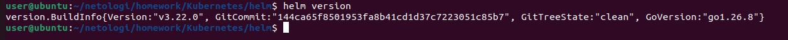
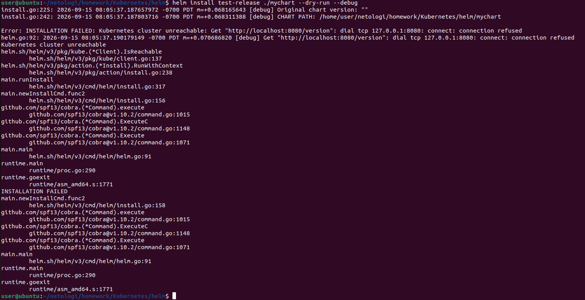
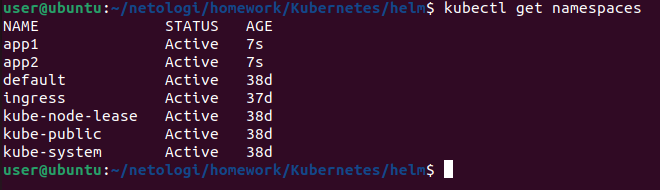
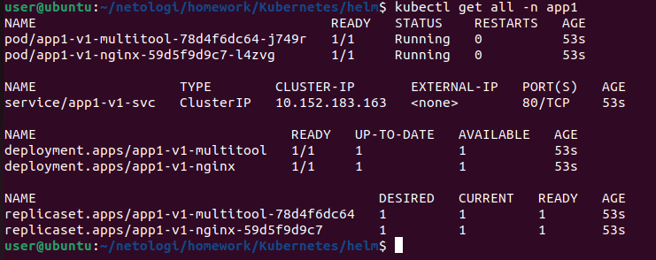
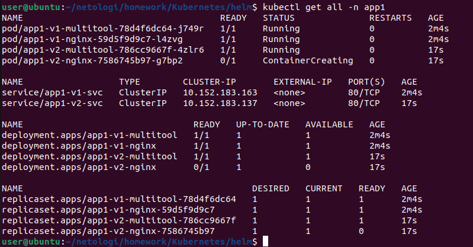
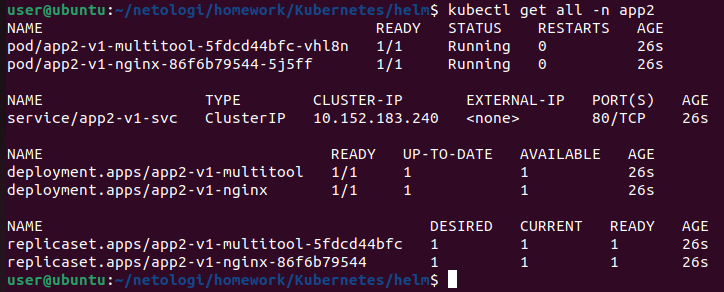
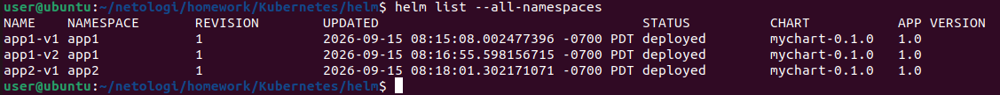
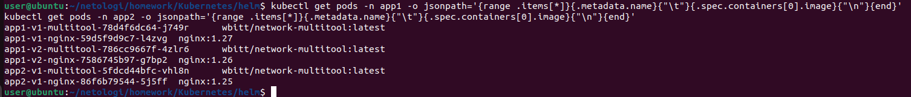
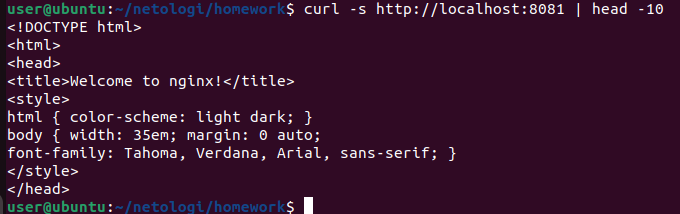
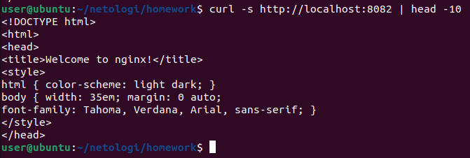

# Домашнее задание "Helm" — Прыкин Сергей
---

## Содержание

- Задание 1. Подготовка Helm-чарта
- Задание 2. Запуск двух версий в разных неймспейсах

---

## Задание 1. Подготовка Helm-чарта

### 1.1. Проверка Helm

```
helm version
```
Helm установлен и работает.
Скриншот 1: helm version — установленная версия Helm.


### 1.2. Структура Helm-чарта
Создан чарт mychart со следующей структурой:
```
mychart/
├── Chart.yaml
├── values.yaml
└── templates/
    ├── deployment-nginx.yaml
    ├── deployment-multitool.yaml
    └── service.yaml
```
Каждый компонент приложения деплоится отдельным Deployment'ом:
nginx — отдельный Deployment
multitool — отдельный Deployment

### 1.3. Файл Chart.yaml
**Файл: `mychart/Chart.yaml`**
```
apiVersion: v2
name: mychart
description: Helm chart for nginx + multitool
type: application
version: 0.1.0
appVersion: "1.0"
```

### 1.4. Файл values.yaml
Переменные чарта позволяют менять образ и тег приложения для деплоя разных версий без редактирования шаблонов.

**Файл: `mychart/values.yaml`**
```
# Версия образа nginx (меняется для деплоя разных версий)
nginx:
  image: nginx
  tag: "1.27"
  replicas: 1

# Версия образа multitool
multitool:
  image: wbitt/network-multitool
  tag: "latest"
  replicas: 1
  port: 8080
```
### 1.5. Шаблон Deployment для nginx
**Файл: `mychart/templates/deployment-nginx.yaml`**
```
apiVersion: apps/v1
kind: Deployment
metadata:
  name: {{ .Release.Name }}-nginx
  labels:
    app: {{ .Release.Name }}-nginx
spec:
  replicas: {{ .Values.nginx.replicas }}
  selector:
    matchLabels:
      app: {{ .Release.Name }}-nginx
  template:
    metadata:
      labels:
        app: {{ .Release.Name }}-nginx
    spec:
      containers:
      - name: nginx
        image: "{{ .Values.nginx.image }}:{{ .Values.nginx.tag }}"
        ports:
        - containerPort: 80
        resources:
          requests:
            cpu: 100m
            memory: 128Mi
          limits:
            cpu: 200m
            memory: 256Mi
```
Ключевой момент: в имени ресурса используется {{ .Release.Name }}. Это позволяет устанавливать несколько копий чарта в одном namespace без конфликтов имён.

### 1.6. Шаблон Deployment для multitool
**Файл: `mychart/templates/deployment-multitool.yaml`**
```
apiVersion: apps/v1
kind: Deployment
metadata:
  name: {{ .Release.Name }}-multitool
  labels:
    app: {{ .Release.Name }}-multitool
spec:
  replicas: {{ .Values.multitool.replicas }}
  selector:
    matchLabels:
      app: {{ .Release.Name }}-multitool
  template:
    metadata:
      labels:
        app: {{ .Release.Name }}-multitool
    spec:
      containers:
      - name: multitool
        image: "{{ .Values.multitool.image }}:{{ .Values.multitool.tag }}"
        env:
        - name: HTTP_PORT
          value: "{{ .Values.multitool.port }}"
        ports:
        - containerPort: {{ .Values.multitool.port }}
        resources:
          requests:
            cpu: 50m
            memory: 64Mi
          limits:
            cpu: 100m
            memory: 128Mi
```
### 1.7. Шаблон Service для nginx
**Файл: `mychart/templates/service.yaml`**
```
apiVersion: v1
kind: Service
metadata:
  name: {{ .Release.Name }}-svc
  labels:
    app: {{ .Release.Name }}-nginx
spec:
  type: ClusterIP
  selector:
    app: {{ .Release.Name }}-nginx
  ports:
  - name: nginx
    protocol: TCP
    port: 80
    targetPort: 80
```
### 1.8. Проверка чарта через dry-run
```
helm install test-release ./mychart --dry-run --debug
```
В выводе видны отрендеренные манифесты с подставленными значениями из values.yaml.
Скриншот 2: helm install test-release ./mychart --dry-run --debug — отрендеренные манифесты.


## Задание 2. Запуск двух версий в разных неймспейсах

### 2.1. Создание неймспейсов
```
kubectl create namespace app1
kubectl create namespace app2
kubectl get namespaces
```
Скриншот 3: kubectl get namespaces — созданы неймспейсы app1 и app2.


### 2.2. Установка первой версии в namespace app1
```
helm install app1-v1 ./mychart --namespace app1
kubectl get all -n app1
```
Релиз app1-v1 установлен в namespace app1. Запущены:
Deployment app1-v1-nginx (nginx:1.27)
Deployment app1-v1-multitool
Service app1-v1-svc

Скриншот 4: kubectl get all -n app1 — первый релиз развёрнут.


### 2.3. Установка второй версии в namespace app1
Устанавливаем ту же версию чарта, но с изменённым тегом nginx (1.26) через --set:
```
helm install app1-v2 ./mychart --namespace app1 --set nginx.tag=1.26
kubectl get all -n app1
```
Теперь в namespace app1 два релиза: app1-v1 (nginx:1.27) и app1-v2 (nginx:1.26).
Скриншот 5: kubectl get all -n app1 — два релиза в одном namespace.


### 2.4. Установка третьей версии в namespace app2
```
helm install app2-v1 ./mychart --namespace app2 --set nginx.tag=1.25
kubectl get all -n app2
```
Релиз app2-v1 установлен в namespace app2 с тегом nginx 1.25.
Скриншот 6: kubectl get all -n app2 — третий релиз развёрнут в отдельном namespace.


### 2.5. Проверка всех релизов
```
helm list --all-namespaces
```
Видим три релиза:
app1-v1 в app1
app1-v2 в app1
app2-v1 в app2

Скриншот 7: helm list --all-namespaces — три релиза в двух namespace.


### 2.6. Проверка версий образов
```
kubectl get pods -n app1 -o jsonpath='{range .items[*]}{.metadata.name}{"\t"}{.spec.containers[0].image}{"\n"}{end}'
kubectl get pods -n app2 -o jsonpath='{range .items[*]}{.metadata.name}{"\t"}{.spec.containers[0].image}{"\n"}{end}'
```
В app1 запущены nginx:1.27 и nginx:1.26, в app2 — nginx:1.25. Версии различаются, что подтверждает корректную работу параметризации чарта.
Скриншот 8: Версии образов nginx в разных namespace.


### 2.7. Проверка доступности nginx в app1-v1
```
kubectl port-forward -n app1 svc/app1-v1-svc 8081:80
```
В другом терминале:
```
curl -s http://localhost:8081 | head -10
```
Возвращается HTML-страница nginx.
Скриншот 9: curl -s http://localhost:8081 — приложение в app1-v1 отвечает.


### 2.8. Проверка доступности nginx в app2-v1
```
kubectl port-forward -n app2 svc/app2-v1-svc 8082:80
```
В другом терминале:
```
curl -s http://localhost:8082 | head -10
```
Скриншот 10: curl -s http://localhost:8082 — приложение в app2-v1 отвечает.


## Пояснения
### Параметризация через values.yaml
Все изменяемые параметры (образы, теги, количество реплик, порты) вынесены в values.yaml. Это позволяет деплоить разные версии приложения без редактирования шаблонов.

### Использование {{ .Release.Name }}
В именах всех ресурсов используется переменная {{ .Release.Name }}. Это позволяет устанавливать несколько копий одного чарта в одном namespace без конфликтов имён. Например, релизы app1-v1 и app1-v2 создают ресурсы с разными именами: app1-v1-nginx и app1-v2-nginx.

### Деплой разных версий через --set
Параметр --set nginx.tag=1.26 переопределяет значение из values.yaml при установке. Это позволяет деплоить разные версии приложения в разных окружениях, используя один и тот же чарт.
