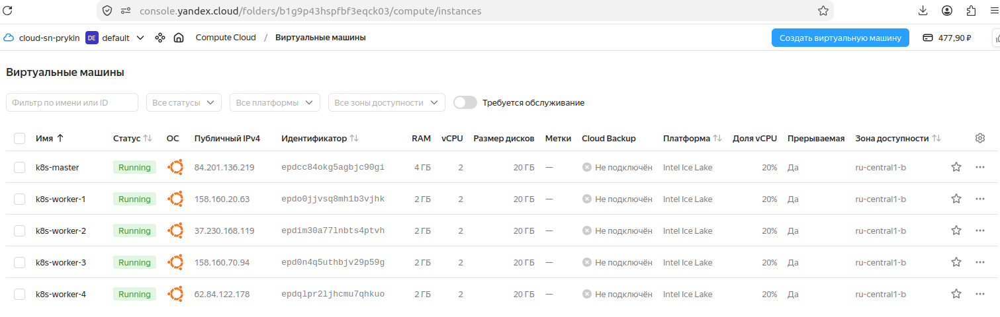
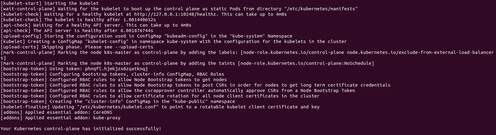
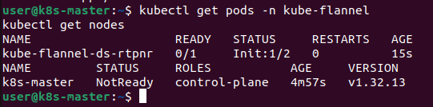
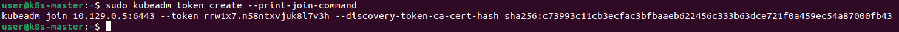
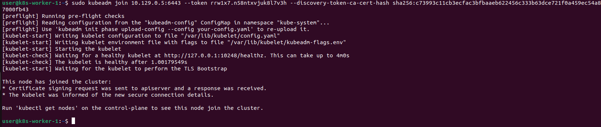
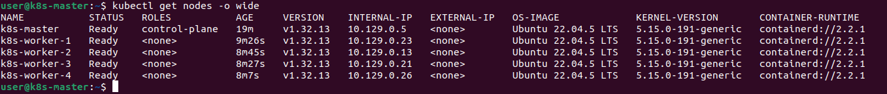
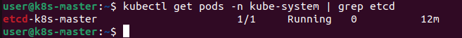
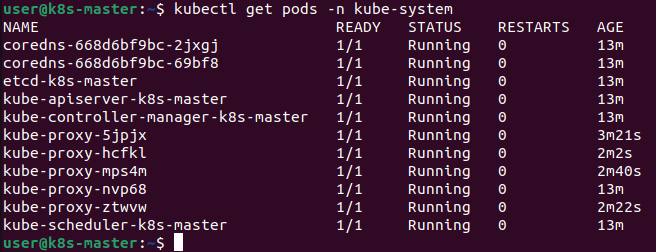
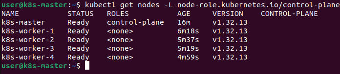

# Домашнее задание "Установка Kubernetes" — Прыкин Сергей
**Окружение:** Yandex Cloud, Ubuntu 22.04 LTS, Kubernetes v1.32.13, containerd 2.2.1  

---

## Содержание

- [Архитектура кластера](#архитектура-кластера)
- [Задание 1. Установка кластера k8s с 1 master node](#задание-1-установка-кластера-k8s-с-1-master-node)
- [Проверка работоспособности](#проверка-работоспособности)
- [Файлы в репозитории](#файлы-в-репозитории)

---

## Архитектура кластера

Кластер собран из 5 виртуальных машин в Yandex Cloud:

| ВМ | Роль | Публичный IP | Внутренний IP | vCPU | RAM | Диск |
|----|------|--------------|---------------|------|-----|------|
| k8s-master | control-plane | 84.201.136.219 | 10.129.0.5 | 2 | 4 ГБ | 20 ГБ |
| k8s-worker-1 | worker | 158.160.20.63 | 10.129.0.23 | 2 | 2 ГБ | 20 ГБ |
| k8s-worker-2 | worker | 37.230.168.119 | 10.129.0.13 | 2 | 2 ГБ | 20 ГБ |
| k8s-worker-3 | worker | 158.160.70.94 | 10.129.0.21 | 2 | 2 ГБ | 20 ГБ |
| k8s-worker-4 | worker | 62.84.122.178 | 10.129.0.26 | 2 | 2 ГБ | 20 ГБ |

**Ключевые параметры:**
- **CRI:** containerd
- **etcd:** запущен на мастере (stacked etcd)
- **CNI:** Flannel
- **Способ установки:** kubeadm

*Скриншот 1: Список виртуальных машин в консоли Yandex Cloud.*

---

## Задание 1. Установка кластера k8s с 1 master node

### 1.1. Подготовка всех нод

На всех 5 ВМ выполнены одинаковые подготовительные шаги.

#### Отключение swap

```
sudo swapoff -a
sudo sed -i '/ swap / s/^\(.*\)$/#\1/g' /etc/fstab
Загрузка модулей ядра и настройка sysctl
bash
sudo modprobe overlay
sudo modprobe br_netfilter

cat <<EOF | sudo tee /etc/sysctl.d/k8s.conf
net.bridge.bridge-nf-call-iptables  = 1
net.bridge.bridge-nf-call-ip6tables = 1
net.ipv4.ip_forward                 = 1
EOF

sudo sysctl --system
Установка containerd
bash
sudo apt update
sudo apt install -y containerd

sudo mkdir -p /etc/containerd
containerd config default | sudo tee /etc/containerd/config.toml

sudo sed -i 's/SystemdCgroup = false/SystemdCgroup = true/' /etc/containerd/config.toml

sudo systemctl restart containerd
sudo systemctl enable containerd
Установка kubeadm, kubelet, kubectl

sudo apt update
sudo apt install -y apt-transport-https ca-certificates curl

curl -fsSL https://pkgs.k8s.io/core:/stable:/v1.32/deb/Release.key | \
  sudo gpg --dearmor -o /etc/apt/keyrings/kubernetes-apt-keyring.gpg

echo 'deb [signed-by=/etc/apt/keyrings/kubernetes-apt-keyring.gpg] https://pkgs.k8s.io/core:/stable:/v1.32/deb/ /' | \
  sudo tee /etc/apt/sources.list.d/kubernetes.list

sudo apt update
sudo apt install -y kubelet kubeadm kubectl
sudo apt-mark hold kubelet kubeadm kubectl
```
### 1.2. Инициализация master-ноды
На k8s-master выполнен kubeadm init:
```
sudo kubeadm init \
  --pod-network-cidr=10.244.0.0/16 \
  --apiserver-advertise-address=10.129.0.5
```
Используется внутренний IP мастера 10.129.0.5 — worker-ноды подключаются к API-серверу по внутренней сети VPC.
В результате выведена команда kubeadm join для worker-нод.
Скриншот 2: kubeadm init — control-plane успешно инициализирован.


### 1.3. Настройка kubectl на мастере
```
mkdir -p $HOME/.kube
sudo cp -i /etc/kubernetes/admin.conf $HOME/.kube/config
sudo chown $(id -u):$(id -g) $HOME/.kube/config
```

### 1.4. Установка CNI (Flannel)
```
kubectl apply -f https://github.com/flannel-io/flannel/releases/latest/download/kube-flannel.yml
```
После установки CNI мастер перешёл в статус Ready.
Скриншот 3: kubectl get nodes — k8s-master Ready после установки CNI.


### 1.5. Генерация join-команды
На мастере:
```
sudo kubeadm token create --print-join-command
```
Выведена команда:
```
kubeadm join 10.129.0.5:6443 --token xxxxx.yyyyyyyyyyyyyyyy \
  --discovery-token-ca-cert-hash sha256:zzzz...
```
Скриншот 4: kubeadm token create --print-join-command — команда для worker-нод.


### 1.6. Подключение worker-нод
На каждой из 4 worker-нод выполнена команда:
```
sudo kubeadm join 10.129.0.5:6443 --token xxxxx.yyyyyyyyyyyyyyyy \
  --discovery-token-ca-cert-hash sha256:zzzz...
```
Вывод на каждой ноде:
This node has joined the cluster:
* Certificate signing request was sent to apiserver and a response was received.
* The Kubelet was informed of the new secure connection details.
Скриншот 5: kubeadm join на worker-ноде.


## Проверка работоспособности
### 2.1. Все ноды кластера
```
kubectl get nodes -o wide
```
Все 5 нод в статусе Ready:
Скриншот 6: kubectl get nodes -o wide — все 5 нод Ready.


### 2.2. etcd на мастере
```
kubectl get pods -n kube-system | grep etcd
```
Скриншот 7: kubectl get pods -n kube-system | grep etcd — etcd работает на мастере.


### 2.3. Системные поды
```
kubectl get pods -n kube-system
```
Все системные компоненты в статусе Running:
Скриншот 8: kubectl get pods -n kube-system — все системные компоненты Running.


### 2.4. Финальная проверка
```
kubectl cluster-info
kubectl get nodes -L node-role.kubernetes.io/control-plane
```
Кластер доступен, control plane работает на 10.129.0.5:6443, CoreDNS отвечает. Мастер имеет роль control-plane, worker-ноды без роли.
Скриншот 9: kubectl cluster-info и роли нод.


## Итог
Кластер Kubernetes из 5 нод успешно развёрнут:
- 1 master-нода с control-plane и etcd
- 4 worker-ноды без роли
- CRI: containerd 2.2.1
- CNI: Flannel
- Версия Kubernetes: v1.32.13
- Способ установки: kubeadm

Все ноды в статусе Ready, системные компоненты работают, etcd запущен на мастере.
