# Домашнее задание "Настройка приложений и управление доступом в Kubernetes" — Прыкин Сергей
---

## Содержание

- [Задание 1. Работа с ConfigMaps]
- [Задание 2. Настройка HTTPS с Secrets]
- [Задание 3. Настройка RBAC]

---

## Задание 1. Работа с ConfigMaps

### 1.1. Создание ConfigMap с веб-страницей

Создан ConfigMap `web-content`, содержащий готовый `index.html`. Этот файл монтируется в контейнер nginx вместо дефолтной страницы.

**Файл: `configmap-web.yaml`**

```yaml
apiVersion: v1
kind: ConfigMap
metadata:
  name: web-content
  namespace: default
data:
  index.html: |
    <!DOCTYPE html>
    <html>
    <head>
      <title>Страница из ConfigMap</title>
    </head>
    <body>
      <h1>Привет от Kubernetes! Это страница из ConfigMap</h1>
      <p>Студент: Прыкин Сергей</p>
      <p>Дата: Сентябрь 2026</p>
    </body>
    </html>
```
### 1.2. Создание Deployment с двумя контейнерами
Создан Deployment web-app с двумя контейнерами:

nginx — слушает порт 80, отдаёт статику из ConfigMap
multitool — слушает порт 8080

ConfigMap web-content монтируется в /usr/share/nginx/html — директорию, откуда nginx отдаёт статику.

**Файл: `deployment.yaml`**

```yaml
apiVersion: apps/v1
kind: Deployment
metadata:
  name: web-app
  labels:
    app: web-app
spec:
  replicas: 1
  selector:
    matchLabels:
      app: web-app
  template:
    metadata:
      labels:
        app: web-app
    spec:
      containers:
      - name: nginx
        image: nginx:1.27
        ports:
        - containerPort: 80
        volumeMounts:
        - name: nginx-web-content
          mountPath: /usr/share/nginx/html
        resources:
          requests:
            cpu: 100m
            memory: 128Mi
          limits:
            cpu: 200m
            memory: 256Mi

      - name: multitool
        image: wbitt/network-multitool:latest
        env:
        - name: HTTP_PORT
          value: "8080"
        ports:
        - containerPort: 8080
        resources:
          requests:
            cpu: 50m
            memory: 64Mi
          limits:
            cpu: 100m
            memory: 128Mi

      volumes:
      - name: nginx-web-content
        configMap:
          name: web-content
```
### 1.3. Применение манифестов и проверка

```
kubectl apply -f configmap-web.yaml
kubectl apply -f deployment.yaml
kubectl get configmap web-content
kubectl get pods -l app=web-app
```
Скриншот 1: kubectl get configmap web-content и kubectl get pods -l app=web-app — ConfigMap создан, под 2/2 Running.
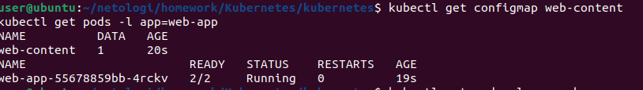

### 1.4. Проверка доступности через port-forward

Запущен port-forward:
```
kubectl port-forward deployment/web-app 8080:80
```
В другом терминале выполнен запрос:
```
curl -s http://localhost:8080
```
Возвращается HTML-страница, загруженная из ConfigMap:
Скриншот 2: Вывод curl -s http://localhost:8080 — страница из ConfigMap отображается корректно.
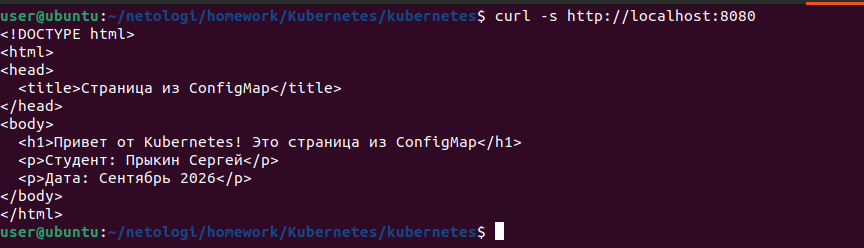

## Задание 2. Настройка HTTPS с Secrets
### 2.1. Генерация самоподписанного сертификата
```
openssl req -x509 -nodes -days 365 -newkey rsa:2048 \
  -keyout tls.key -out tls.crt -subj "/CN=myapp.example.com"
```
Созданы файлы tls.key и tls.crt.

2.2. Кодирование в base64 и создание Secret
```
cat tls.crt | base64 -w 0 > tls.crt.b64
cat tls.key | base64 -w 0 > tls.key.b64

cat > secret-tls.yaml <<EOF
apiVersion: v1
kind: Secret
metadata:
  name: tls-secret
type: kubernetes.io/tls
data:
  tls.crt: $(cat tls.crt.b64)
  tls.key: $(cat tls.key.b64)
EOF
```
Файл: secret-tls.yaml

### 2.3. Включение Ingress-контроллера
```
microk8s enable ingress
kubectl get pods -n ingress
```
Под nginx-ingress-microk8s-controller в статусе Running.
Скриншот 3: kubectl get pods -n ingress — Ingress-контроллер в статусе Running.
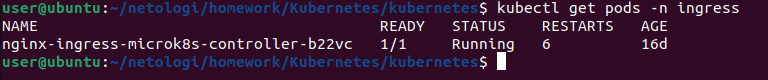

### 2.4. Создание Service для web-app
**Файл: `service-web.yaml`**

```yaml
apiVersion: v1
kind: Service
metadata:
  name: web-svc
  labels:
    app: web-app
spec:
  type: ClusterIP
  selector:
    app: web-app
  ports:
  - name: nginx
    protocol: TCP
    port: 80
    targetPort: 80
```
```
kubectl apply -f service-web.yaml
kubectl get svc web-svc
```
Скриншот 4: kubectl get svc web-svc — сервис типа ClusterIP с портом 80/TCP.
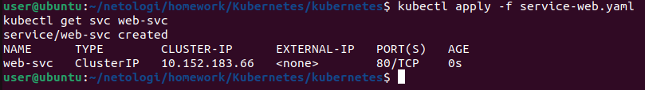

### 2.5. Создание Ingress с TLS
**Файл: `ingress-tls.yaml`**

```yaml
apiVersion: networking.k8s.io/v1
kind: Ingress
metadata:
  name: web-ingress-tls
  annotations:
    nginx.ingress.kubernetes.io/ssl-redirect: "true"
spec:
  ingressClassName: public
  tls:
  - hosts:
    - myapp.example.com
    secretName: tls-secret
  rules:
  - host: myapp.example.com
    http:
      paths:
      - path: /
        pathType: Prefix
        backend:
          service:
            name: web-svc
            port:
              number: 80
```
```
kubectl apply -f secret-tls.yaml
kubectl apply -f ingress-tls.yaml
kubectl get secret tls-secret
kubectl get ingress web-ingress-tls
```
Скриншот 5: kubectl get secret tls-secret — Secret типа kubernetes.io/tls.
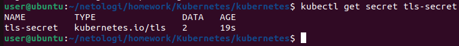

Скриншот 6: kubectl get ingress web-ingress-tls — Ingress создан, класс public, порт 80.
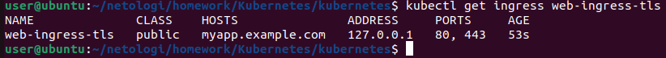

### 2.6. Проверка HTTPS-доступа
Узнаём IP узла и выполняем запрос:

```
hostname -I | awk '{print $1}'
curl -k -H "Host: myapp.example.com" https://192.168.212.128/ | head -20
```
Возвращается HTML-страница из ConfigMap через HTTPS. Флаг -k используется для игнорирования самоподписанного сертификата.

Скриншот 7: Вывод curl -k -H "Host: myapp.example.com" https://192.168.212.128/ — страница из ConfigMap по HTTPS.
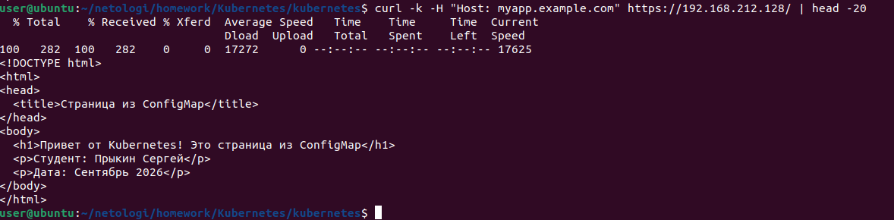

## Задание 3. Настройка RBAC
### 3.1. Включение RBAC в MicroK8S
```
microk8s enable rbac
```
### 3.2. Генерация ключа и CSR для пользователя developer
```
openssl genrsa -out developer.key 2048
openssl req -new -key developer.key -out developer.csr -subj "/CN=developer/O=dev-group"
```
### 3.3. Подпись сертификата CA-сертификатом кластера
```
sudo openssl x509 -req -in developer.csr \
  -CA /var/snap/microk8s/current/certs/ca.crt \
  -CAkey /var/snap/microk8s/current/certs/ca.key \
  -CAcreateserial -out developer.crt -days 365

openssl x509 -in developer.crt -text -noout | head -20
```
Сертификат подписан. В выводе видны данные: Subject CN=developer, O=dev-group, срок действия.
Скриншот 8: openssl x509 -in developer.crt -text -noout — данные сертификата.
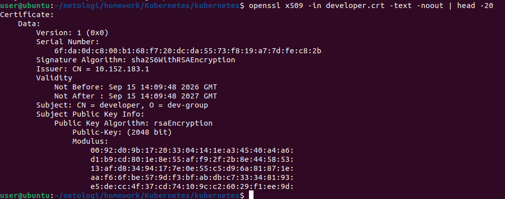

### 3.4. Создание Role для просмотра подов и логов
**Файл: `role-pod-reader.yaml`**
```
yaml
apiVersion: rbac.authorization.k8s.io/v1
kind: Role
metadata:
  name: pod-reader
  namespace: default
rules:
- apiGroups: [""]
  resources:
    - pods
    - pods/log
  verbs:
    - get
    - list
    - watch
```
### 3.5. Создание RoleBinding
**Файл: `rolebinding-developer.yaml`**
```
yaml
apiVersion: rbac.authorization.k8s.io/v1
kind: RoleBinding
metadata:
  name: developer-pod-reader
  namespace: default
subjects:
- kind: User
  name: developer
  apiGroup: rbac.authorization.k8s.io
roleRef:
  kind: Role
  name: pod-reader
  apiGroup: rbac.authorization.k8s.io
```
### 3.6. Применение RBAC-манифестов
```
kubectl apply -f role-pod-reader.yaml
kubectl apply -f rolebinding-developer.yaml
kubectl get role pod-reader
kubectl get rolebinding developer-pod-reader
```
Скриншот 9: kubectl get role pod-reader и kubectl get rolebinding developer-pod-reader.
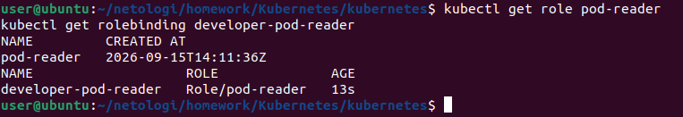

### 3.7. Настройка kubeconfig для developer
```
CA_B64=$(sudo cat /var/snap/microk8s/current/certs/ca.crt | base64 -w 0)
API_SERVER=$(kubectl config view --minify -o jsonpath='{.clusters[0].cluster.server}')

cat > developer.kubeconfig <<EOF
apiVersion: v1
kind: Config
clusters:
- name: microk8s
  cluster:
    server: $API_SERVER
    certificate-authority-data: $CA_B64
contexts:
- name: developer-context
  context:
    cluster: microk8s
    user: developer
    namespace: default
current-context: developer-context
users:
- name: developer
  user:
    client-certificate: $(pwd)/developer.crt
    client-key: $(pwd)/developer.key
EOF
```
### 3.8. Проверка прав пользователя developer
Developer может просматривать поды в namespace default:
```
kubectl --kubeconfig=developer.kubeconfig get pods
```
Команда возвращает список подов из default. Пользователь developer имеет право на просмотр (get, list, watch).
Скриншот 10: kubectl --kubeconfig=developer.kubeconfig get pods — успешный просмотр подов в default.
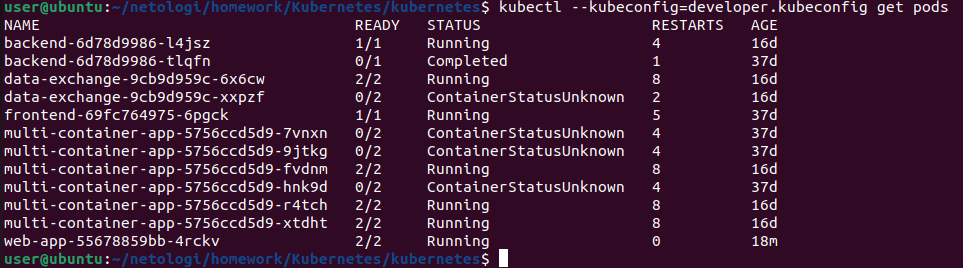

Developer может просматривать логи подов:
```
kubectl --kubeconfig=developer.kubeconfig logs -l app=web-app -c nginx
```
Возвращаются логи nginx.
Скриншот 11: kubectl --kubeconfig=developer.kubeconfig logs -l app=web-app -c nginx — логи nginx.
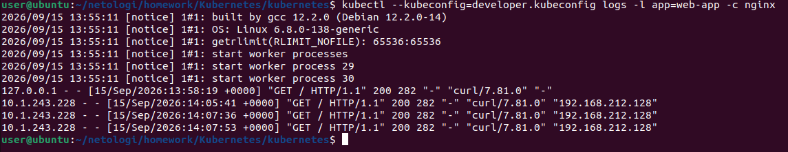

Developer НЕ может удалять поды:
```
POD_NAME=$(kubectl get pods -l app=web-app -o jsonpath='{.items[0].metadata.name}')
kubectl --kubeconfig=developer.kubeconfig delete pod $POD_NAME
```
Возвращается ошибка Error from server (Forbidden). У пользователя нет права delete на ресурсы pods.
Скриншот 12: kubectl --kubeconfig=developer.kubeconfig delete pod <pod-name> — ошибка Forbidden.
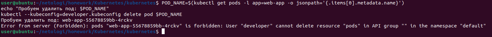

Developer НЕ может просматривать поды в namespace kube-system:
```
kubectl --kubeconfig=developer.kubeconfig get pods -n kube-system
```
Возвращается ошибка Error from server (Forbidden). Role pod-reader привязана только к namespace default.
Скриншот 13: kubectl --kubeconfig=developer.kubeconfig get pods -n kube-system — ошибка Forbidden.
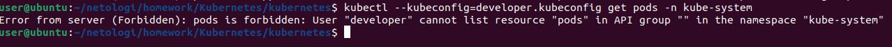

## Пояснения
### ConfigMap
ConfigMap web-content содержит статический файл index.html, который монтируется как volume в контейнер nginx в директорию /usr/share/nginx/html.  
Это позволяет изменять содержимое веб-страницы без пересборки образа.

### Secret с TLS
Secret tls-secret типа kubernetes.io/tls содержит сертификат и приватный ключ в base64.  
Ingress-контроллер использует этот Secret для терминации HTTPS-трафика на хосте myapp.example.com.

### RBAC
- Role pod-reader в namespace default разрешает действия get, list, watch для ресурсов pods и pods/log.
- RoleBinding developer-pod-reader связывает пользователя developer с ролью pod-reader.
- Пользователь developer имеет доступ только к namespace default. В других namespace доступ запрещён.
- Пользователь не может удалять, создавать или изменять поды — только просматривать их и их логи.
