# Домашнее задание "Как работает сеть в K8s" — Прыкин Сергей

**Вводные** Задание выполнялось на основе домашнего задания "Установка Kubernetes с помощью kubeadm, kubespray"  
**Кластер:** 1 master + 4 worker  

---

## Содержание

- [Задача](#задача)
- [Архитектура решения](#архитектура-решения)
- [Задание 1. Создать сетевую политику для обеспечения доступа](#задание-1-создать-сетевую-политику-для-обеспечения-доступа)
- [Проверка трафика](#проверка-трафика)
- [Пояснения](#Пояснения)

---

## Задача

Создать Deployment'ы приложений frontend, backend и cache и соответствующие сервисы. В качестве образа использовать network-multitool. Разместить поды в namespace `app`.

Создать политики, чтобы обеспечить доступ `frontend → backend → cache`. Другие виды подключений должны быть запрещены. Продемонстрировать, что трафик разрешён и запрещён.

---

## Архитектура решения

### Пространство имён `app`

Три приложения, каждое в своём Deployment с сервисом:

| Приложение | Образ | Порт | Роль |
|------------|-------|------|------|
| frontend | wbitt/network-multitool | 8080 | обрабатывает запросы пользователей |
| backend | wbitt/network-multitool | 8080 | бизнес-логика |
| cache | wbitt/network-multitool | 8080 | кеш данных |

### Разрешённые потоки

- `frontend` → `backend` (frontend может обращаться к backend)
- `backend` → `cache` (backend может обращаться к cache)

### Запрещённые потоки

- `frontend` → `cache` (напрямую — нельзя)
- `backend` → `frontend` (обратный поток — нельзя)
- Любой трафик извне namespace `app` — запрещён
- Любой другой трафик между подами — запрещён

### CNI: Calico

Для работы NetworkPolicy используется **Calico**. Плагин установлен через Tigera Operator.
*Скриншот 1: `kubectl get pods -A | grep calico` — Calico установлен на всех 5 нодах.*
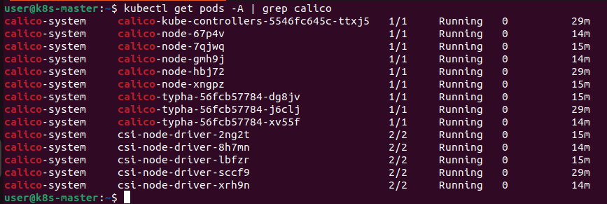
---

## Задание 1. Создать сетевую политику для обеспечения доступа

### 1.1. Создание namespace `app`
```
kubectl create namespace app
kubectl get namespaces
```
Скриншот 2: kubectl get namespaces — namespace app создан.
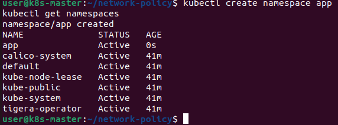

### 1.2. Создание Deployment и Service для frontend
Файл: frontend.yaml
```
apiVersion: apps/v1
kind: Deployment
metadata:
  name: frontend
  namespace: app
  labels:
    app: frontend
spec:
  replicas: 1
  selector:
    matchLabels:
      app: frontend
  template:
    metadata:
      labels:
        app: frontend
    spec:
      containers:
      - name: multitool
        image: wbitt/network-multitool:latest
        env:
        - name: HTTP_PORT
          value: "8080"
        ports:
        - containerPort: 8080
---
apiVersion: v1
kind: Service
metadata:
  name: frontend-svc
  namespace: app
  labels:
    app: frontend
spec:
  selector:
    app: frontend
  ports:
  - name: http
    protocol: TCP
    port: 8080
    targetPort: 8080
```
### 1.3. Создание Deployment и Service для backend
Файл: backend.yaml
```
apiVersion: apps/v1
kind: Deployment
metadata:
  name: backend
  namespace: app
  labels:
    app: backend
spec:
  replicas: 1
  selector:
    matchLabels:
      app: backend
  template:
    metadata:
      labels:
        app: backend
    spec:
      containers:
      - name: multitool
        image: wbitt/network-multitool:latest
        env:
        - name: HTTP_PORT
          value: "8080"
        ports:
        - containerPort: 8080
---
apiVersion: v1
kind: Service
metadata:
  name: backend-svc
  namespace: app
  labels:
    app: backend
spec:
  selector:
    app: backend
  ports:
  - name: http
    protocol: TCP
    port: 8080
    targetPort: 8080
```
### 1.4. Создание Deployment и Service для cache
Файл: cache.yaml
```
apiVersion: apps/v1
kind: Deployment
metadata:
  name: cache
  namespace: app
  labels:
    app: cache
spec:
  replicas: 1
  selector:
    matchLabels:
      app: cache
  template:
    metadata:
      labels:
        app: cache
    spec:
      containers:
      - name: multitool
        image: wbitt/network-multitool:latest
        env:
        - name: HTTP_PORT
          value: "8080"
        ports:
        - containerPort: 8080
---
apiVersion: v1
kind: Service
metadata:
  name: cache-svc
  namespace: app
  labels:
    app: cache
spec:
  selector:
    app: cache
  ports:
  - name: http
    protocol: TCP
    port: 8080
    targetPort: 8080
```
Применение всех манифестов:
```
kubectl apply -f frontend.yaml -f backend.yaml -f cache.yaml
kubectl get pods,svc -n app
```
Скриншот 3: kubectl get pods,svc -n app — все три приложения Running, сервисы созданы.
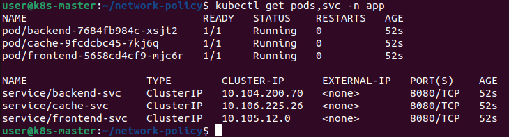

### 1.5. Создание default-deny политики
Блокирует весь входящий и исходящий трафик для всех подов в namespace app. После её применения трафик между подами запрещён.
Файл: default-deny.yaml
```
apiVersion: networking.k8s.io/v1
kind: NetworkPolicy
metadata:
  name: default-deny
  namespace: app
spec:
  podSelector: {}
  policyTypes:
  - Ingress
  - Egress
```
### 1.6. Создание разрешающих политик
Файл: network-policies.yaml
```
# Разрешаем frontend получать трафик от backend и ходить в backend
apiVersion: networking.k8s.io/v1
kind: NetworkPolicy
metadata:
  name: frontend-policy
  namespace: app
spec:
  podSelector:
    matchLabels:
      app: frontend
  policyTypes:
  - Ingress
  - Egress
  ingress:
  - from:
    - podSelector:
        matchLabels:
          app: backend
    ports:
    - protocol: TCP
      port: 8080
  egress:
  - to:
    - podSelector:
        matchLabels:
          app: backend
    ports:
    - protocol: TCP
      port: 8080
  - to:
    - namespaceSelector:
        matchLabels:
          kubernetes.io/metadata.name: kube-system
      podSelector:
        matchLabels:
          k8s-app: kube-dns
    ports:
    - protocol: UDP
      port: 53
    - protocol: TCP
      port: 53

---
# Разрешаем backend получать трафик от frontend и ходить в cache
apiVersion: networking.k8s.io/v1
kind: NetworkPolicy
metadata:
  name: backend-policy
  namespace: app
spec:
  podSelector:
    matchLabels:
      app: backend
  policyTypes:
  - Ingress
  - Egress
  ingress:
  - from:
    - podSelector:
        matchLabels:
          app: frontend
    ports:
    - protocol: TCP
      port: 8080
  egress:
  - to:
    - podSelector:
        matchLabels:
          app: cache
    ports:
    - protocol: TCP
      port: 8080
  - to:
    - namespaceSelector:
        matchLabels:
          kubernetes.io/metadata.name: kube-system
      podSelector:
        matchLabels:
          k8s-app: kube-dns
    ports:
    - protocol: UDP
      port: 53
    - protocol: TCP
      port: 53

---
# Разрешаем cache получать трафик только от backend
apiVersion: networking.k8s.io/v1
kind: NetworkPolicy
metadata:
  name: cache-policy
  namespace: app
spec:
  podSelector:
    matchLabels:
      app: cache
  policyTypes:
  - Ingress
  - Egress
  ingress:
  - from:
    - podSelector:
        matchLabels:
          app: backend
    ports:
    - protocol: TCP
      port: 8080
  egress:
  - to:
    - namespaceSelector:
        matchLabels:
          kubernetes.io/metadata.name: kube-system
      podSelector:
        matchLabels:
          k8s-app: kube-dns
    ports:
    - protocol: UDP
      port: 53
    - protocol: TCP
      port: 53
```
Применение:
```
kubectl apply -f default-deny.yaml -f network-policies.yaml
kubectl get networkpolicy -n app
```
Скриншот 4: kubectl get networkpolicy -n app — 4 политики созданы.
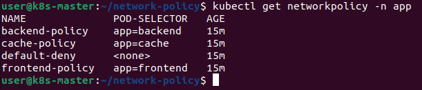

## Проверка трафика
### 2.1. Разрешено: frontend → backend
Запускаем временный под с меткой app=frontend и проверяем доступ к backend:
```
kubectl run test-frontend --image=wbitt/network-multitool --rm -it --restart=Never -n app \
  --labels="app=frontend" -- sh
Внутри пода:
curl -s --max-time 5 http://backend-svc.app.svc.cluster.local:8080
echo "=== EXIT CODE: $? ==="
exit
```
Скриншот 5: Успешный запрос frontend → backend.
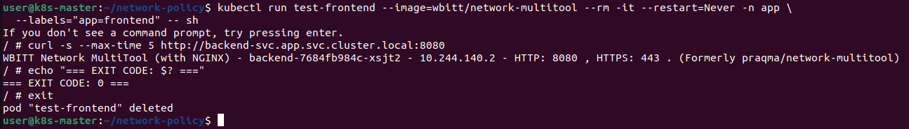

### 2.2. Разрешено: backend → cache
```
kubectl run test-backend --image=wbitt/network-multitool --rm -it --restart=Never -n app \
  --labels="app=backend" -- sh
Внутри:
curl -s --max-time 5 http://cache-svc.app.svc.cluster.local:8080
echo "=== EXIT CODE: $? ==="
exit
```
Скриншот 6: Успешный запрос backend → cache.
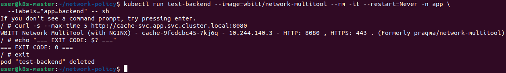

### 2.3. Запрещено: frontend → cache
```
kubectl run test-frontend-2 --image=wbitt/network-multitool --rm -it --restart=Never -n app \
  --labels="app=frontend" -- sh
Внутри:
curl -s --max-time 5 http://cache-svc.app.svc.cluster.local:8080
echo "=== EXIT CODE: $? ==="
exit
```
Скриншот 7: Запрос frontend → cache заблокирован (таймаут).
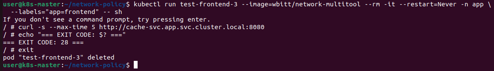
### 2.4. Запрещено: backend → frontend
```
kubectl run test-backend-2 --image=wbitt/network-multitool --rm -it --restart=Never -n app \
  --labels="app=backend" -- sh
Внутри:
curl -s --max-time 5 http://frontend-svc.app.svc.cluster.local:8080
echo "=== EXIT CODE: $? ==="
exit
```
Скриншот 8: Запрос backend → frontend заблокирован.
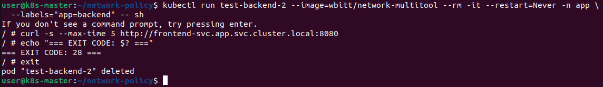

### 2.5. Запрещено: из другого namespace
```
kubectl run test-external --image=wbitt/network-multitool --rm -it --restart=Never -n default -- sh
Внутри:
curl -s --max-time 5 http://backend-svc.app.svc.cluster.local:8080
echo "=== EXIT CODE: $? ==="
exit
```
Скриншот 9: Запрос к backend из namespace default заблокирован.
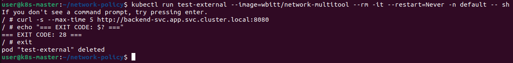

### 2.6. Итоговое состояние политик
```
kubectl get networkpolicy -n app
kubectl describe networkpolicy -n app
```
Скриншот 10: Список и описание всех NetworkPolicy в namespace app.
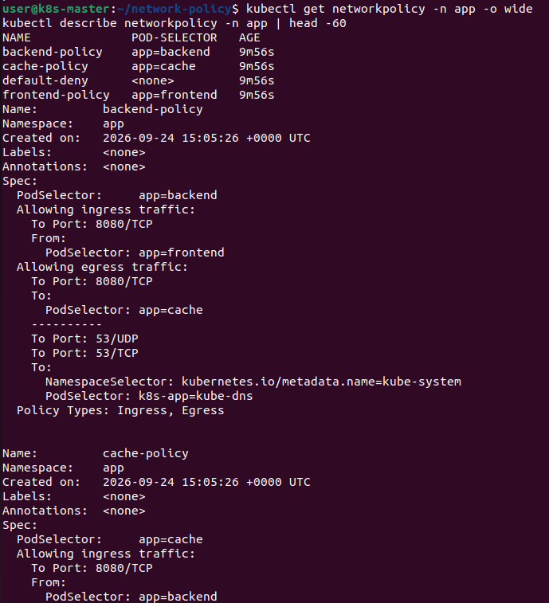
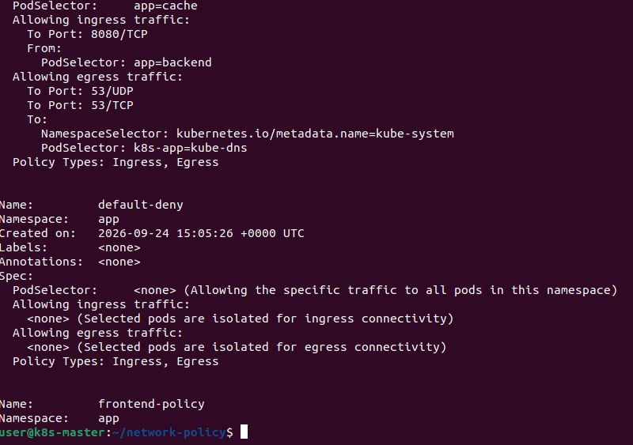

## Пояснения

### Default-deny
Политика default-deny с пустым podSelector: {} применяется ко всем подам в namespace app и блокирует весь входящий и исходящий трафик.
Это базовая мера безопасности: пока не разрешено явно — запрещено.

### Разрешающие политики
Три политики разрешают строго определённые потоки:
- frontend-policy — frontend может принимать трафик от backend (для обратных ответов) и отправлять трафик в backend.
- backend-policy — backend принимает трафик от frontend и отправляет в cache.
- cache-policy — cache принимает трафик только от backend.

### DNS
Каждая политика разрешает исходящий трафик к CoreDNS (kube-system / k8s-app: kube-dns) на порт 53. Без этого поды не смогли бы резолвить имена сервисов.

### Порядок применения
Сначала применяются default-deny и разрешающие политики, потом запускаются тестовые поды. NetworkPolicy работает на уровне L3/L4 (IP + порт), поэтому трафик,
не подходящий ни под одно разрешающее правило, блокируется.

### Результаты проверок
| Проверка | Ожидание | Результат |
|----------|----------|-----------|
| frontend → backend | Разрешено | EXIT CODE: 0 |
| backend → cache | Разрешено | EXIT CODE: 0 |
| frontend → cache | Запрещено | EXIT CODE: 28 |
| backend → frontend | Запрещено | EXIT CODE: 28 |
| external → backend | Запрещено | EXIT CODE: 28 |

