# Домашнее задание "Сетевое взаимодействие в Kubernetes" - `Прыкин Сергей`

## Задание 1. Настройка Service (ClusterIP и NodePort)

### 1.1. Создание Deployment (nginx + multitool, 3 реплики)

Создан Deployment `multi-container-app` с двумя контейнерами и тремя репликами:

- **nginx** — слушает порт 80
- **multitool** — слушает порт 8080 (назначен через переменную `HTTP_PORT`)

**Файл: `deployment-multi-container.yaml`**

```
yaml
apiVersion: apps/v1
kind: Deployment
metadata:
  name: multi-container-app
  labels:
    app: multi-container
spec:
  replicas: 3
  selector:
    matchLabels:
      app: multi-container
  template:
    metadata:
      labels:
        app: multi-container
    spec:
      containers:
      - name: nginx
        image: nginx:1.27
        ports:
        - containerPort: 80
        resources:
          requests:
            cpu: 100m
            memory: 128Mi
          limits:
            cpu: 200m
            memory: 256Mi

      - name: multitool
        image: wbitt/network-multitool:latest
        ports:
        - containerPort: 8080
        env:
        - name: HTTP_PORT
          value: "8080"
        resources:
          requests:
            cpu: 50m
            memory: 64Mi
          limits:
            cpu: 100m
            memory: 128Mi
```
Применение и проверка:
```
kubectl apply -f deployment-multi-container.yaml
kubectl get pods -l app=multi-container
```
Все 3 пода multi-container-app в статусе Running, READY 2/2.
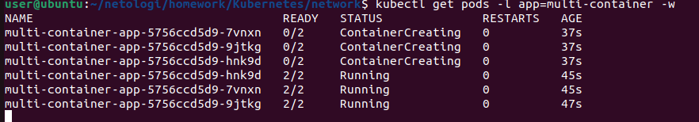

### 1.2. Создание Service типа ClusterIP
Создан сервис multi-container-svc типа ClusterIP, который пробрасывает:

Порт 9001 → nginx (порт 80)

Порт 9002 → multitool (порт 8080)

Файл: service-clusterip.yaml
```
yaml
apiVersion: v1
kind: Service
metadata:
  name: multi-container-svc
  labels:
    app: multi-container
spec:
  type: ClusterIP
  selector:
    app: multi-container
  ports:
  - name: nginx
    protocol: TCP
    port: 9001
    targetPort: 80
  - name: multitool
    protocol: TCP
    port: 9002
    targetPort: 8080
```
Применение и проверка:
```
kubectl apply -f service-clusterip.yaml
kubectl get svc multi-container-svc
```
Сервис multi-container-svc типа ClusterIP с портами 9001/TCP и 9002/TCP.
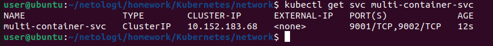

### 1.3. Проверка доступа изнутри кластера
Запущен временный под с multitool для проверки доступа через ClusterIP:
```
kubectl run test-pod --image=wbitt/network-multitool --rm -it --restart=Never -- sh
```
Внутри пода выполнены запросы:
```
curl -s multi-container-svc:9001 | head -10
curl -s multi-container-svc:9002 | head -10
```
Результат:

curl multi-container-svc:9001 — возвращает HTML страницы nginx

curl multi-container-svc:9002 — возвращает информацию о multitool

Успешные запросы curl к сервису multi-container-svc на порты 9001 и 9002 изнутри кластера.
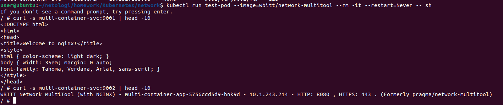

### 1.4. Создание Service типа NodePort
Создан сервис multi-container-nodeport типа NodePort для доступа к nginx снаружи кластера на порту 30080.

Файл: service-nodeport.yaml
```
yaml
apiVersion: v1
kind: Service
metadata:
  name: multi-container-nodeport
  labels:
    app: multi-container
spec:
  type: NodePort
  selector:
    app: multi-container
  ports:
  - name: nginx
    protocol: TCP
    port: 80
    targetPort: 80
    nodePort: 30080
```
Применение и проверка:
```
kubectl apply -f service-nodeport.yaml
kubectl get svc multi-container-nodeport
```
Сервис multi-container-nodeport типа NodePort, порт 80:30080/TCP.
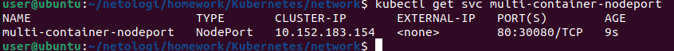

### 1.5. Проверка доступа с локального компьютера
Доступ проверен через curl к IP узла и порту NodePort:
```
curl -s http://192.168.212.128:30080 | head -10
```
Результат: Возвращается HTML страницы nginx, что подтверждает доступность приложения снаружи кластера.

Успешный запрос curl к nginx через NodePort (http://192.168.212.128:30080).
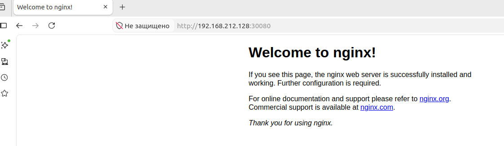
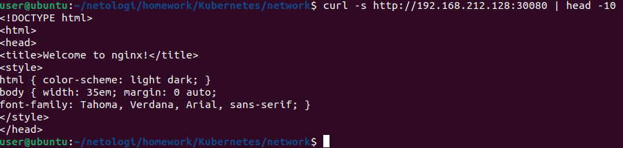

## Задание 2. Настройка Ingress
### 2.1. Включение Ingress-контроллера
Ingress-контроллер встроен в MicroK8S и включается одной командой:
```
microk8s enable ingress
```
Проверка:
```
kubectl get pods -n ingress
```
Под nginx-ingress-microk8s-controller в namespace ingress в статусе Running.
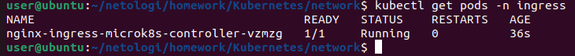

### 2.2. Создание Deployment для frontend и backend
Созданы два Deployment:

frontend — образ nginx:1.27, 1 реплика

backend — образ wbitt/network-multitool:latest, порт 80, 1 реплика

Файл: deployment-frontend.yaml
```
yaml
apiVersion: apps/v1
kind: Deployment
metadata:
  name: frontend
  labels:
    app: frontend
spec:
  replicas: 1
  selector:
    matchLabels:
      app: frontend
  template:
    metadata:
      labels:
        app: frontend
    spec:
      containers:
      - name: nginx
        image: nginx:1.27
        ports:
        - containerPort: 80
        resources:
          requests:
            cpu: 50m
            memory: 64Mi
          limits:
            cpu: 100m
            memory: 128Mi
```
Файл: deployment-backend.yaml
```
yaml
apiVersion: apps/v1
kind: Deployment
metadata:
  name: backend
  labels:
    app: backend
spec:
  replicas: 1
  selector:
    matchLabels:
      app: backend
  template:
    metadata:
      labels:
        app: backend
    spec:
      containers:
      - name: multitool
        image: wbitt/network-multitool:latest
        ports:
        - containerPort: 80
        env:
        - name: HTTP_PORT
          value: "80"
        resources:
          requests:
            cpu: 50m
            memory: 64Mi
          limits:
            cpu: 100m
            memory: 128Mi
```
Применение и проверка:
```
kubectl apply -f deployment-frontend.yaml -f deployment-backend.yaml
kubectl get pods
```
Поды frontend и backend в статусе Running, READY 1/1.
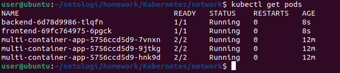

### 2.3. Создание Service для frontend и backend
Созданы два сервиса типа ClusterIP:

frontend-svc — порт 80

backend-svc — порт 80

Файл: service-frontend.yaml
```
yaml
apiVersion: v1
kind: Service
metadata:
  name: frontend-svc
  labels:
    app: frontend
spec:
  type: ClusterIP
  selector:
    app: frontend
  ports:
  - protocol: TCP
    port: 80
    targetPort: 80
```
Файл: service-backend.yaml
```
yaml
apiVersion: v1
kind: Service
metadata:
  name: backend-svc
  labels:
    app: backend
spec:
  type: ClusterIP
  selector:
    app: backend
  ports:
  - protocol: TCP
    port: 80
    targetPort: 80
```
Применение и проверка:
```
kubectl apply -f service-frontend.yaml -f service-backend.yaml
kubectl get svc frontend-svc backend-svc
```
Сервисы frontend-svc и backend-svc типа ClusterIP с портами 80/TCP.
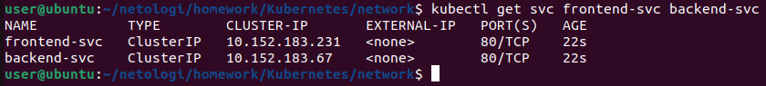

### 2.4. Создание Ingress
Создан Ingress example-ingress, который маршрутизирует трафик по путям:

/ → frontend-svc:80 (nginx)

/api → backend-svc:80 (multitool)

Файл: ingress.yaml
```
yaml
apiVersion: networking.k8s.io/v1
kind: Ingress
metadata:
  name: example-ingress
  annotations:
    nginx.ingress.kubernetes.io/rewrite-target: /
spec:
  rules:
  - http:
      paths:
      - path: /
        pathType: Prefix
        backend:
          service:
            name: frontend-svc
            port:
              number: 80
      - path: /api
        pathType: Prefix
        backend:
          service:
            name: backend-svc
            port:
              number: 80
```
Применение и проверка:
```
kubectl apply -f ingress.yaml
kubectl get ingress
```
Ingress example-ingress создан, класс public, порт 80.
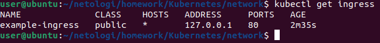

### 2.5. Проверка доступа через Ingress
Доступ проверен через curl к IP узла по порту 80:
```
curl -s http://192.168.212.128/ | head -10
curl -s http://192.168.212.128/api | head -10
```
Результат:
curl / — возвращает HTML страницы nginx (frontend)
curl /api — возвращает информацию о multitool (backend)
Оба приложения доступны через один IP и порт (80), маршрутизация работает корректно.

Успешные запросы curl к http://192.168.212.128/ (nginx) и http://192.168.212.128/api (multitool).
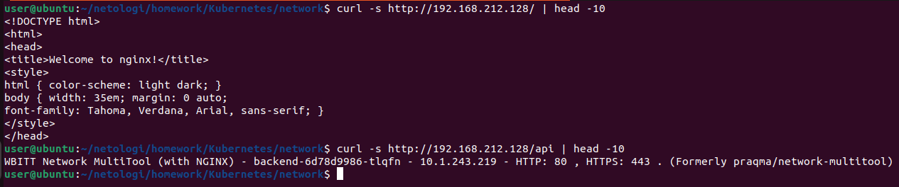


