# Домашнее задание "Запуск приложений в K8S" - `Прыкин Сергей`

## Задание 1. Deployment с nginx и multitool, масштабирование и доступ

### 1.1. Создание Deployment

Создан манифест `deployment-nginx-multitool.yaml`. Приложение состоит из двух контейнеров:

- **nginx** — слушает порт 80
- **multitool** — слушает порт 8080 (переопределён через переменную `HTTP_PORT`, чтобы избежать конфликта с nginx)

**Файл: `deployment-nginx-multitool.yaml`**

```yaml
apiVersion: apps/v1
kind: Deployment
metadata:
  name: web-app
  labels:
    app: web
spec:
  replicas: 1
  selector:
    matchLabels:
      app: web
  template:
    metadata:
      labels:
        app: web
    spec:
      containers:
      - name: nginx
        image: nginx:1.27
        ports:
        - containerPort: 80
        resources:
          requests:
            cpu: 100m
            memory: 128Mi
          limits:
            cpu: 200m
            memory: 256Mi

      - name: multitool
        image: praqma/network-multitool:latest
        env:
        - name: HTTP_PORT
          value: "8080"
        ports:
        - containerPort: 8080
        resources:
          requests:
            cpu: 50m
            memory: 64Mi
          limits:
            cpu: 100m
            memory: 128Mi
```
```
kubectl apply -f deployment-nginx-multitool.yaml
kubectl get pods```
Под web-app в статусе Running, READY 2/2. Ошибка с конфликтом портов решена путём назначения multitool порта 8080 через переменную HTTP_PORT
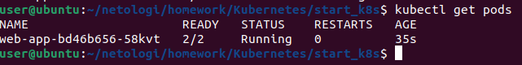

### 1.2. Масштабирование до 2 реплик

```
kubectl get pods -l app=web```
Один под до масштабирования
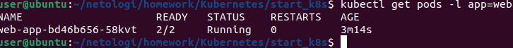

Масштабирование:
```
kubectl scale deployment web-app --replicas=2
```
После масштабирования:

```
kubectl get pods -l app=web
```
Два пода после масштабирования, оба 2/2 Running
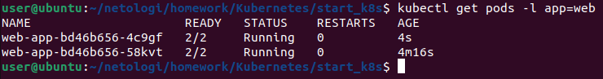

### 1.3. Создание Service
Создан сервис web-svc, который пробрасывает порты 80 (nginx) и 8080 (multitool).

Файл: service-web.yaml
```
yaml
apiVersion: v1
kind: Service
metadata:
  name: web-svc
spec:
  selector:
    app: web
  ports:
  - name: nginx
    protocol: TCP
    port: 80
    targetPort: 80
  - name: multitool
    protocol: TCP
    port: 8080
    targetPort: 8080
```
Применение и проверка:
```
kubectl apply -f service-web.yaml
kubectl get svc web-svc
```
Сервис web-svc с ClusterIP и портами 80/TCP, 8080/TCP
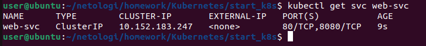

### 1.4. Проверка доступа из отдельного Pod
Запущен временный под с multitool, выполнен curl к сервису:
```
kubectl run test-pod --image=praqma/network-multitool:latest --rm -it --restart=Never -- sh
```
### 1.5. Проверка доступа до реплик приложений из отдельного Pod
Внутри пода:
```
curl -s web-svc | head -10
curl -s web-svc:8080 | head -10
```
Первый запрос возвращает HTML страницы nginx
Второй запрос возвращает информацию о multitool

Вывод команд curl внутри тестового пода. Виден HTML-код страницы nginx и JSON с информацией о multitool
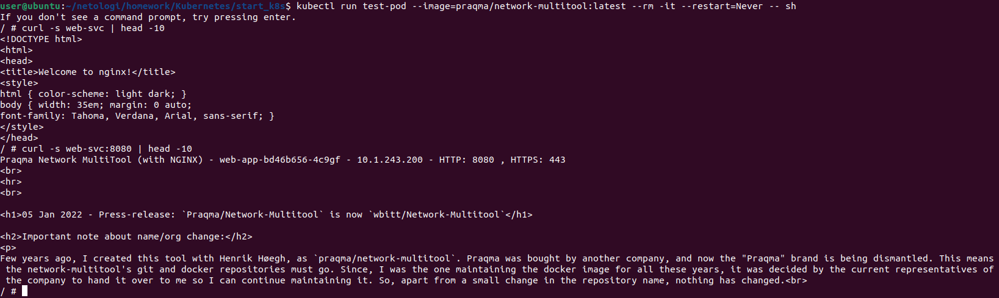
---

## Задание 2. Deployment с Init-контейнером
### 2.1. Создание Deployment с Init-контейнером
Создан манифест deployment-nginx-init.yaml. Init-контейнер с busybox проверяет доступность сервиса nginx-init-svc по полному DNS-имени nginx-init-svc.default.svc.cluster.local. Основной контейнер nginx запускается только после успешного завершения Init-контейнера.

Файл: deployment-nginx-init.yaml
```
yaml
apiVersion: apps/v1
kind: Deployment
metadata:
  name: nginx-init
  labels:
    app: nginx-init
spec:
  replicas: 1
  selector:
    matchLabels:
      app: nginx-init
  template:
    metadata:
      labels:
        app: nginx-init
    spec:
      initContainers:
      - name: check-svc
        image: busybox:1.36
        command:
        - sh
        - -c
        - |
          echo "Starting DNS check for nginx-init-svc..."
          until nslookup nginx-init-svc.default.svc.cluster.local 2>&1 | grep -q "Address"; do
            echo "$(date) Waiting for nginx-init-svc..."
            sleep 3
          done
          echo "Service nginx-init-svc found! Exiting init-container."
      containers:
      - name: nginx
        image: nginx:1.27
        ports:
        - containerPort: 80
```
Применение манифеста:
```
kubectl apply -f deployment-nginx-init.yaml
```
### 2.2. Проверка, что nginx не стартует без сервиса
Сразу после создания Deployment сервис nginx-init-svc отсутствует. Init-контейнер не может его разрешить и продолжает цикл ожидания.
```
kubectl get pods -l app=nginx-init
```
Под в статусе Init:0/1. Основной контейнер nginx не запущен
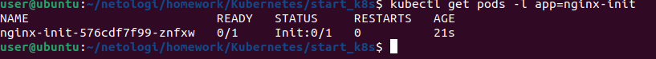

```kubectl logs -l app=nginx-init -c check-svc```
Логи Init-контейнера с сообщениями Waiting for nginx-init-svc.... Init-контейнер находится в цикле ожидания сервиса
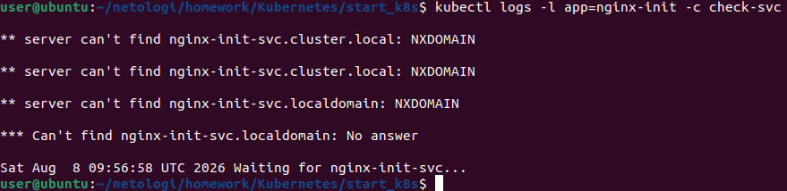
### 2.3. Создание Service и запуск Init-контейнера
Создаём сервис, которого ожидает Init-контейнер:
```
kubectl create service clusterip nginx-init-svc --tcp=80:80
kubectl get svc nginx-init-svc
```
Сервис nginx-init-svc создан, показан ClusterIP и порт 80/TCP
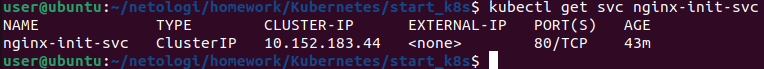
### 2.4. Состояние пода после запуска сервиса
```
kubectl logs -l app=nginx-init -c check-svc
```
 Логи Init-контейнера, показывающие успешный поиск сервиса: Service nginx-init-svc found! Exiting init-container.
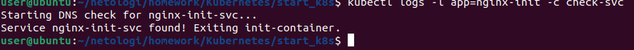

```
kubectl get pods -l app=nginx-init
```
Под в статусе 1/1 Running. Init-контейнер успешно завершился, основной контейнер nginx запущен
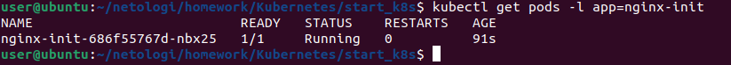

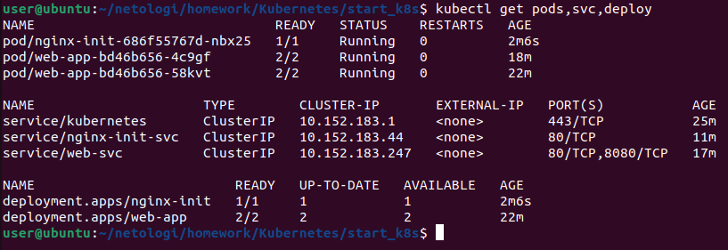

### Примечание по DNS
В ходе выполнения выявлена особенность busybox: короткое DNS-имя nginx-init-svc не резолвилось, требовалось полное имя nginx-init-svc.default.svc.cluster.local. Полное имя успешно разрешается через CoreDNS кластера
