# Домашнее задание "Хранение данных в K8S" — Прыкин Сергей

- [Задание 1. Volume: обмен данными между контейнерами в поде]
- [Задание 2. PV, PVC]
- [Задание 3. StorageClass]

---

## Задание 1. Volume: обмен данными между контейнерами в поде

### 1.1. Создание Deployment с общим томом

Создан Deployment `data-exchange` с двумя контейнерами:

- **writer** (busybox) — записывает данные в файл `/shared/output.log` каждые 5 секунд
- **reader** (busybox) — читает файл через `tail -f`

Обмен данными реализован через том `emptyDir` с именем `shared-data`, который монтируется в оба контейнера по пути `/shared`.

**Файл: `containers-data-exchange.yaml`**

```
apiVersion: apps/v1
kind: Deployment
metadata:
  name: data-exchange
  labels:
    app: data-exchange
spec:
  replicas: 1
  selector:
    matchLabels:
      app: data-exchange
  template:
    metadata:
      labels:
        app: data-exchange
    spec:
      containers:
      - name: writer
        image: busybox:1.36
        command: ["/bin/sh", "-c"]
        args:
        - |
          while true; do
            echo "$(date) - Data from writer" >> /shared/output.log
            sleep 5
          done
        volumeMounts:
        - name: shared-data
          mountPath: /shared

      - name: reader
        image: busybox:1.36
        command: ["/bin/sh", "-c"]
        args:
        - |
          tail -f /shared/output.log
        volumeMounts:
        - name: shared-data
          mountPath: /shared

      volumes:
      - name: shared-data
        emptyDir: {}
```
Применение манифеста и проверка:
```
kubectl apply -f containers-data-exchange.yaml
kubectl get pods -l app=data-exchange
```
### 1.2. Описание пода

```
kubectl describe pod -l app=data-exchange
```
В выводе видны два контейнера (writer и reader), том shared-data типа EmptyDir, смонтированный в оба контейнера по пути /shared.
Скриншот 1: Контейнеры и общий том emptyDir
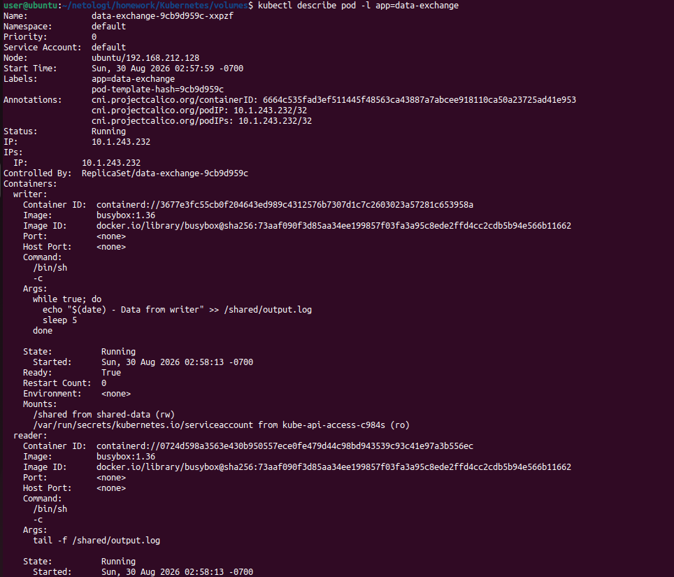
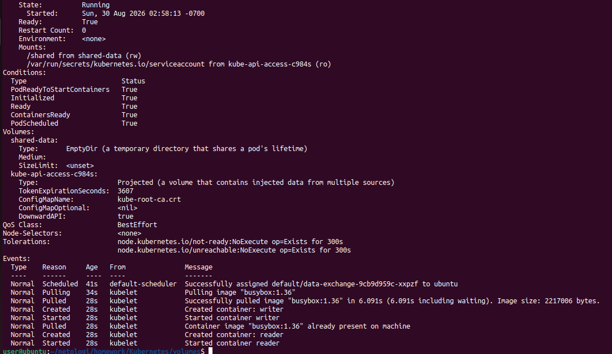

### 1.3. Проверка чтения файла контейнером reader

```
kubectl logs -l app=data-exchange -c reader --tail=20
```
В логах контейнера reader видны строки с датами, которые записал контейнер writer. Обмен данными между контейнерами работает.
Скриншот 2: Логи контейнера reader — успешное чтение данных из общего файла.
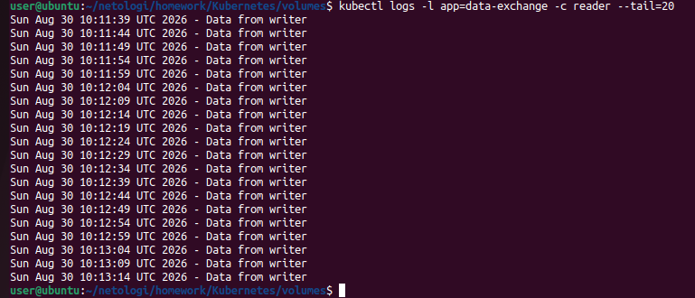

Дополнительная проверка напрямую через exec:
```
kubectl exec -it deployment/data-exchange -c reader -- sh -c "tail -5 /shared/output.log"
```
Скриншот 3: Прямое чтение файла через kubectl exec в контейнере reader.
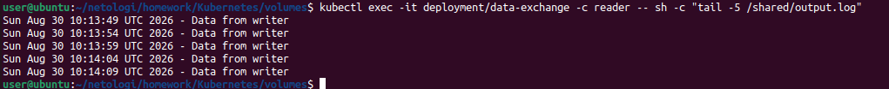

## Задание 2. PV, PVC

### 2.1. Создание директории на ноде

```
sudo mkdir -p /mnt/k8s-data
sudo chmod 777 /mnt/k8s-data
```
### 2.2. Создание PV, PVC и Deployment
Создан манифест pv-pvc.yaml, включающий:
PersistentVolume local-pv — тип hostPath, путь /mnt/k8s-data, ReclaimPolicy: Retain
PersistentVolumeClaim local-pvc — привязан к PV через volumeName
Deployment data-exchange-pvc — использует PVC для монтирования в контейнеры
Файл: pv-pvc.yaml
```
---
apiVersion: v1
kind: PersistentVolume
metadata:
  name: local-pv
spec:
  capacity:
    storage: 1Gi
  volumeMode: Filesystem
  accessModes:
    - ReadWriteOnce
  persistentVolumeReclaimPolicy: Retain
  storageClassName: microk8s-hostpath
  hostPath:
    path: /mnt/k8s-data

---
apiVersion: v1
kind: PersistentVolumeClaim
metadata:
  name: local-pvc
spec:
  volumeName: local-pv
  volumeMode: Filesystem
  accessModes:
    - ReadWriteOnce
  storageClassName: microk8s-hostpath
  resources:
    requests:
      storage: 1Gi

---
apiVersion: apps/v1
kind: Deployment
metadata:
  name: data-exchange-pvc
  labels:
    app: data-exchange-pvc
spec:
  replicas: 1
  selector:
    matchLabels:
      app: data-exchange-pvc
  template:
    metadata:
      labels:
        app: data-exchange-pvc
    spec:
      containers:
      - name: writer
        image: busybox:1.36
        command: ["/bin/sh", "-c"]
        args:
        - |
          while true; do
            echo "$(date) - Data from PVC writer" >> /shared/output.log
            sleep 5
          done
        volumeMounts:
        - name: persistent-data
          mountPath: /shared

      - name: reader
        image: busybox:1.36
        command: ["/bin/sh", "-c"]
        args:
        - |
          tail -f /shared/output.log
        volumeMounts:
        - name: persistent-data
          mountPath: /shared

      volumes:
      - name: persistent-data
        persistentVolumeClaim:
          claimName: local-pvc
```
Применение манифеста и проверка:
```
kubectl apply -f pv-pvc.yaml
kubectl get pv local-pv
kubectl get pvc local-pvc
```
PV local-pv и PVC local-pvc в статусе Bound. Хранилище 1Gi, access mode RWO, storage class microk8s-hostpath.
Скриншот 4: kubectl get pv local-pv — статус Bound, PVC default/local-pvc привязан.
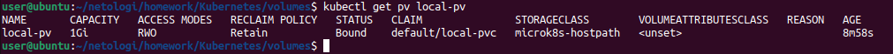
Скриншот 5: kubectl get pvc local-pvc — статус Bound, том local-pv привязан.
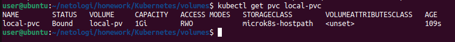

### 2.3. Проверка чтения данных из смонтированной директории
```
kubectl logs -l app=data-exchange-pvc -c reader --tail=20
```
Контейнер reader успешно читает данные из файла на смонтированном томе PV.
Скриншот 6: Логи контейнера reader — данные читаются из файла на PV.
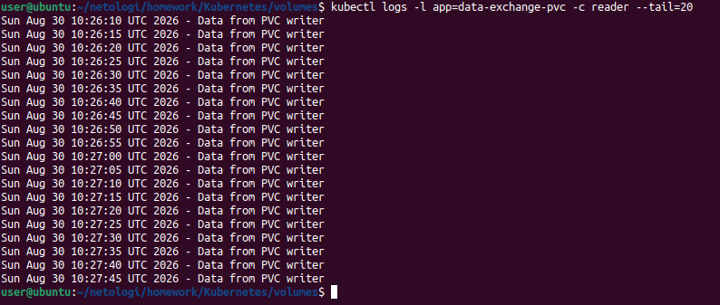

### 2.4. Удаление Deployment и PVC
```
kubectl delete deployment data-exchange-pvc
kubectl delete pvc local-pvc
```
Проверка состояния PV:
```
kubectl get pv local-pv
kubectl describe pv local-pv
```
PV перешёл в статус Released.
Скриншот 7: kubectl describe pv local-pv — статус Released после удаления PVC.
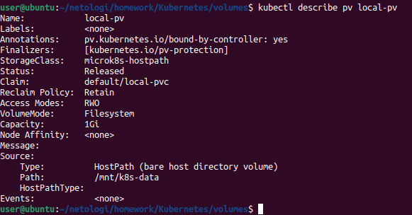
Пояснение:
PV имеет persistentVolumeReclaimPolicy: Retain. После удаления PVC PV не удаляется автоматически, а переходит в статус Released. 
Данные на ноде сохраняются. PV не может быть привязан к новому PVC, пока администратор не освободит его вручную.

### 2.5. Проверка сохранения файла на ноде
```
ls -la /mnt/k8s-data/
cat /mnt/k8s-data/output.log | tail -10
```
Файл output.log существует на ноде и содержит данные, записанные контейнером writer.
Скриншот 8: Файл output.log с данными на локальном диске ноды.
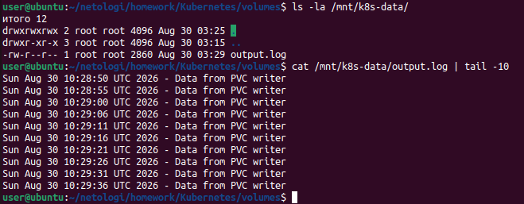

### 2.6. Удаление PV
```
kubectl delete pv local-pv
kubectl get pv local-pv
```
Вывод: Error from server (NotFound): persistentvolumes "local-pv" not found
Проверка файла на ноде:
```
ls -la /mnt/k8s-data/
cat /mnt/k8s-data/output.log | tail -10
```
Файл сохранился на ноде после удаления PV.
Скриншот 9: PV удалён (NotFound), но файл output.log на ноде остался.
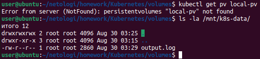
Пояснение:
PV типа hostPath просто ссылается на директорию на ноде. Удаление PV в Kubernetes не удаляет данные с диска. Kubernetes управляет только объектом PV, а не физическими данными на ноде.

## Задание 3. StorageClass

### 3.1. Создание StorageClass и PVC
Создан манифест sc.yaml, включающий:
StorageClass local-storage — provisioner: kubernetes.io/no-provisioner, volumeBindingMode: WaitForFirstConsumer
PersistentVolumeClaim sc-pvc — использует StorageClass local-storage
Файл: sc.yaml
```
---
apiVersion: storage.k8s.io/v1
kind: StorageClass
metadata:
  name: local-storage
provisioner: kubernetes.io/no-provisioner
volumeBindingMode: WaitForFirstConsumer

---
apiVersion: v1
kind: PersistentVolumeClaim
metadata:
  name: sc-pvc
spec:
  volumeMode: Filesystem
  accessModes:
    - ReadWriteOnce
  resources:
    requests:
      storage: 1Gi
  storageClassName: local-storage
```
Применение манифеста и проверка:
```
kubectl apply -f sc.yaml
kubectl get sc local-storage
```
StorageClass local-storage создан: no-provisioner, WaitForFirstConsumer.
Скриншот 10: kubectl get sc local-storage — StorageClass с provisioner no-provisioner.
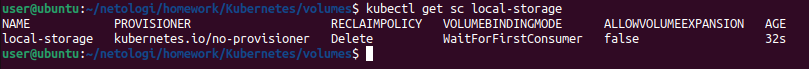

### 3.2. Проверка PVC до создания PV
```
kubectl get pvc sc-pvc
```
PVC в статусе Pending. Так как StorageClass использует no-provisioner, автоматическое создание PV невозможно. PVC ждёт, пока администратор создаст PV вручную.
Скриншот 11: kubectl get pvc sc-pvc — статус Pending до создания PV.
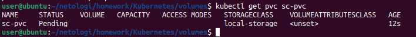

### 3.3. Создание PV вручную
Создан PV sc-pv с указанием storageClassName: local-storage:
```
sudo mkdir -p /mnt/k8s-sc-data
sudo chmod 777 /mnt/k8s-sc-data

kubectl apply -f - <<EOF
apiVersion: v1
kind: PersistentVolume
metadata:
  name: sc-pv
spec:
  capacity:
    storage: 1Gi
  volumeMode: Filesystem
  accessModes:
    - ReadWriteOnce
  persistentVolumeReclaimPolicy: Retain
  storageClassName: local-storage
  hostPath:
    path: /mnt/k8s-sc-data
EOF
```
Проверка PVC после создания PV:
```
kubectl get pvc sc-pvc
```
PVC перешёл в статус Bound, том sc-pv привязан.
Скриншот 12: kubectl get pvc sc-pvc — статус Bound после создания PV.
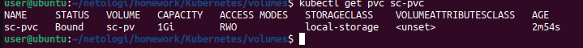

### 3.4. Создание Deployment
Создан Deployment data-exchange-sc, использующий PVC sc-pvc. Манифест включён в файл sc.yaml.
Файл: sc.yaml (секция Deployment)
```
apiVersion: apps/v1
kind: Deployment
metadata:
  name: data-exchange-sc
  labels:
    app: data-exchange-sc
spec:
  replicas: 1
  selector:
    matchLabels:
      app: data-exchange-sc
  template:
    metadata:
      labels:
        app: data-exchange-sc
    spec:
      containers:
      - name: writer
        image: busybox:1.36
        command: ["/bin/sh", "-c"]
        args:
        - |
          while true; do
            echo "$(date) - Data from SC writer" >> /shared/output.log
            sleep 5
          done
        volumeMounts:
        - name: sc-data
          mountPath: /shared

      - name: reader
        image: busybox:1.36
        command: ["/bin/sh", "-c"]
        args:
        - |
          tail -f /shared/output.log
        volumeMounts:
        - name: sc-data
          mountPath: /shared

      volumes:
      - name: sc-data
        persistentVolumeClaim:
          claimName: sc-pvc
```
Применение:
```
kubectl apply -f sc.yaml
kubectl get pods -l app=data-exchange-sc
```

### 3.5. Проверка чтения данных
```
kubectl logs -l app=data-exchange-sc -c reader --tail=20
```
Контейнер reader успешно читает данные из файла на томе, созданном через StorageClass.
Скриншот 13: Логи контейнера reader — данные читаются из файла на PVC, созданном через StorageClass.
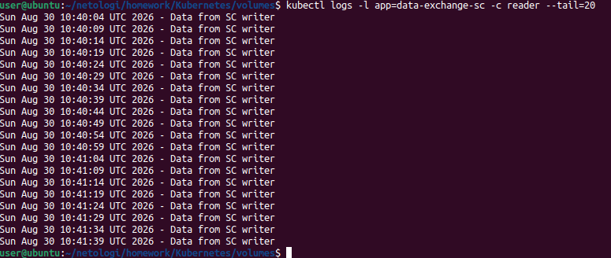

## Пояснения
### PV с ReclaimPolicy: Retain
При удалении PVC PV переходит в статус Released. PV не удаляется автоматически и не может быть привязан к новому PVC без ручного вмешательства администратора.
Данные на ноде сохраняются.

### hostPath и данные на ноде
PV типа hostPath ссылается на директорию на ноде. При удалении PV Kubernetes не удаляет физические данные с диска ноды. Файл остаётся до ручного удаления.

### StorageClass с WaitForFirstConsumer и no-provisioner
PVC не привязывается к PV, пока не будет создан PV вручную. Так как StorageClass использует no-provisioner,
Kubernetes не может автоматически создать PV. После создания PV с соответствующим storageClassName PVC привязывается к нему.


