# Отчет по выполнению домашнего задания «Введение в Terraform» Прыкин Сергей

## Задание 1

```Чек-лист готовности к домашнему заданию
Скачайте и установите Terraform версии >=1.12.0 . Приложите скриншот вывода команды terraform --version.
Скачайте на свой ПК этот git-репозиторий. Исходный код для выполнения задания расположен в директории 01/src.
Убедитесь, что в вашей ОС установлен docker.
1. Перейдите в каталог src. Скачайте все необходимые зависимости, использованные в проекте.
2. Изучите файл .gitignore. В каком terraform-файле, согласно этому .gitignore, допустимо сохранить личную, секретную информацию?(логины,пароли,ключи,токены итд)
3. Выполните код проекта. Найдите в state-файле секретное содержимое созданного ресурса random_password, пришлите в качестве ответа конкретный ключ и его значение.
4. Раскомментируйте блок кода, примерно расположенный на строчках 29–42 файла main.tf. Выполните команду terraform validate. Объясните, в чём заключаются намеренно допущенные ошибки. Исправьте их.
5. Выполните код. В качестве ответа приложите: исправленный фрагмент кода и вывод команды docker ps.
6. Замените имя docker-контейнера в блоке кода на hello_world. Не перепутайте имя контейнера и имя образа. Мы всё ещё продолжаем использовать name = "nginx:latest". Выполните команду terraform apply -auto-approve. Объясните своими словами, в чём может быть опасность применения ключа -auto-approve. Догадайтесь или нагуглите зачем может пригодиться данный ключ? В качестве ответа дополнительно приложите вывод команды docker ps.
7. Уничтожьте созданные ресурсы с помощью terraform. Убедитесь, что все ресурсы удалены. Приложите содержимое файла terraform.tfstate.
8. Объясните, почему при этом не был удалён docker-образ nginx:latest. Ответ ОБЯЗАТЕЛЬНО НАЙДИТЕ В ПРЕДОСТАВЛЕННОМ КОДЕ, а затем ОБЯЗАТЕЛЬНО ПОДКРЕПИТЕ строчкой из документации terraform провайдера docker. (ищите в классификаторе resource docker_image )
```
Версии ПО в системе:  
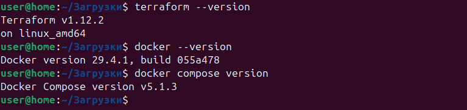  
1. Скачать все зависимости.  
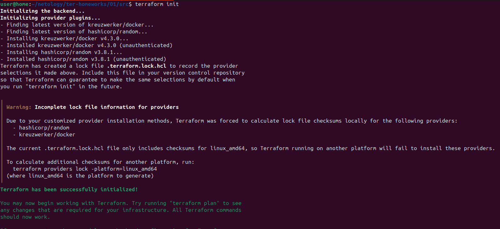  
2. Согласно файлу .gitignore, строка personal.auto.tfvars указывает, что файл с именем personal.auto.tfvars  
предназначен для хранения личной, секретной информации. Terraform автоматически загружает все файлы  
с расширением .auto.tfvars, поэтому этот файл будет использоваться, но не попадёт в Git.  
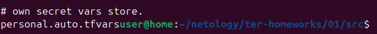  
3. Выполнить код проекта.   
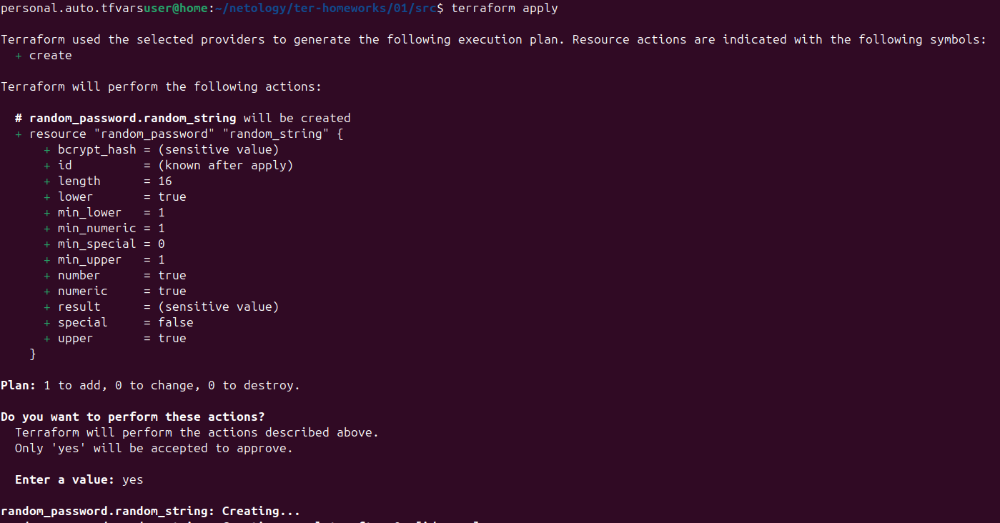  
Секретный ключ: result - wt9XUbHVKkbO6167
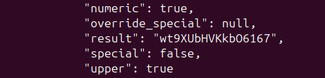
4.   Обнаруженные ошибки:  
1 В ресурсе docker_image: отсутствует обязательный параметр name (label/имя ресурса) и пропущен аргумент name. Правильно: resource "docker_image" "nginx".
2 В ресурсе docker_container: имя ресурса 1nginx начинается с цифры, что недопустимо в Terraform.
3 В строке name контейнера: обращение random_password.random_string_FAKE.resulT содержит опечатку в имени ресурса (должен быть random_string)  
и в имени атрибута (должен быть result).
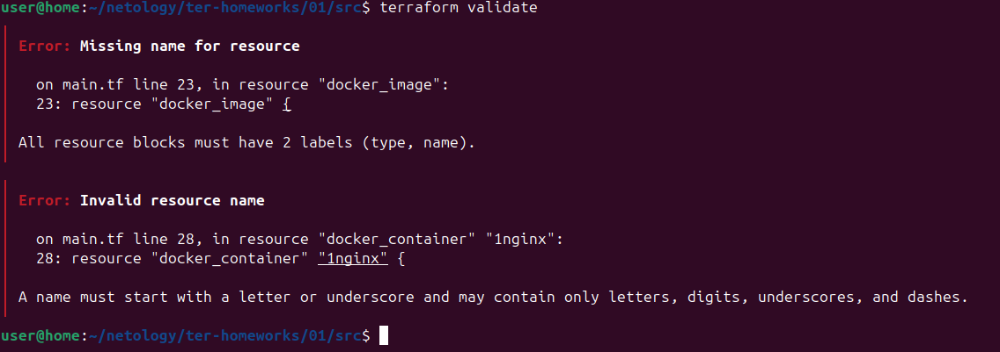 
5. 
``` 
resource "docker_image" "nginx" {
  name         = "nginx:latest"
  keep_locally = true
}

resource "docker_container" "nginx" {
  image = docker_image.nginx.image_id
  name  = "example_${random_password.random_string.result}"

  ports {
    internal = 80
    external = 9090
  }
}
```
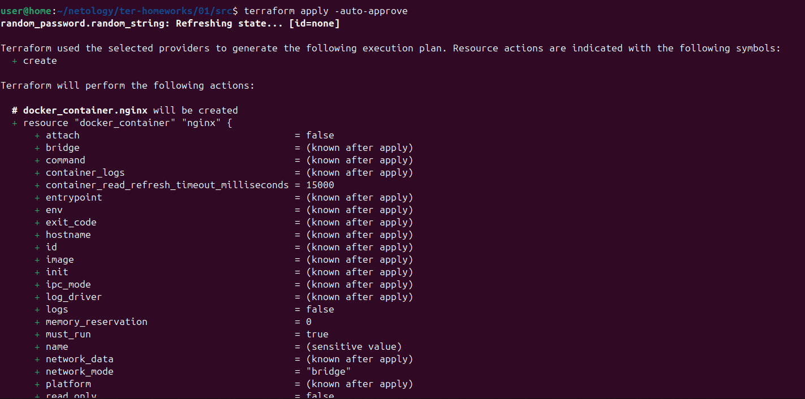  
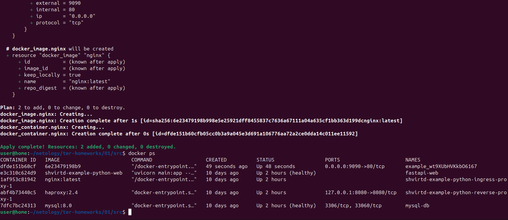  
6. Заменим имя docker-контейнера в блоке кода на hello_world.
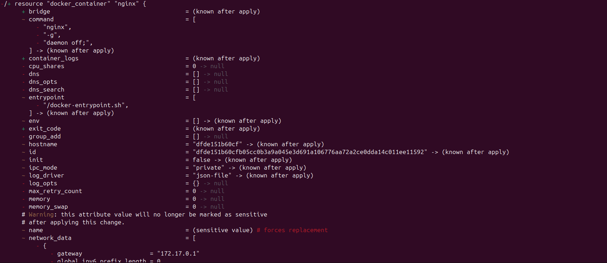  
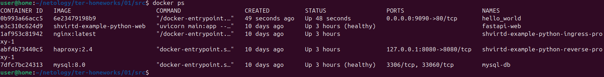 
Опасность -auto-approve: Этот ключ автоматически подтверждает применение изменений без запроса согласия пользователя.  
Опасность в том, что можно случайно применить разрушительные изменения в production-окружении без возможности проверить план.  
Где может пригодиться: В CI/CD пайплайнах, где нет возможности интерактивного подтверждения, и все изменения предварительно проверены автоматическими тестами. 
7. Уничтожим контейнер с помощью terraform.  
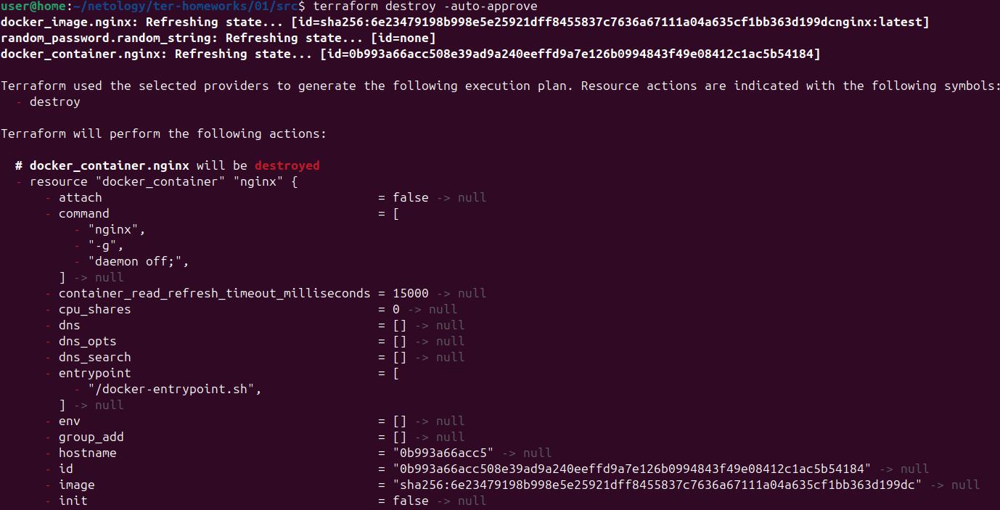  
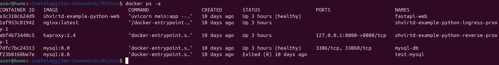 
Содержимое terraform.tfstate:  
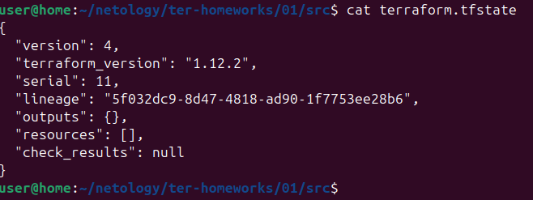  
8. В ресурсе docker_image установлен параметр keep_locally = true  
Подтверждение из документации Terraform провайдера docker (resource docker_image):  
В документации сказано: keep_locally (Boolean) - If true, then the Docker image won't be deleted on destroy operation.  
If this is false, it will delete the image from the docker local storage on destroy operation.  
Таким образом, параметр keep_locally = true явно указывает Terraform сохранять образ локально даже при уничтожении ресурса.  
Это предотвращает удаление образа nginx:latest из локального хранилища Docker.  

