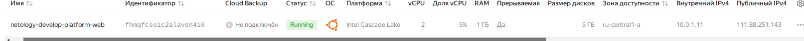
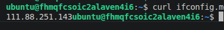
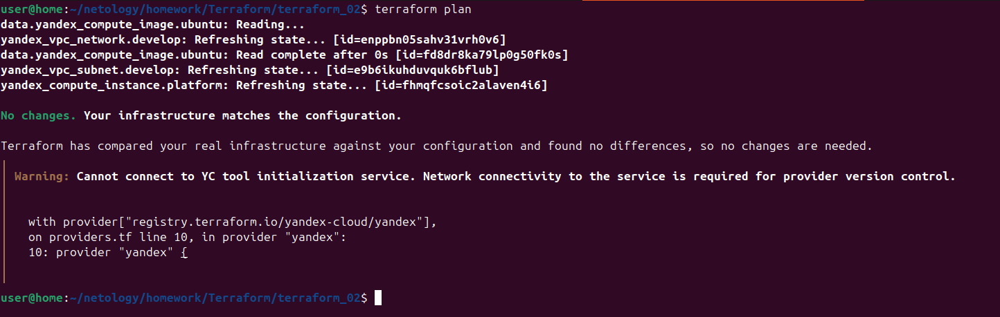
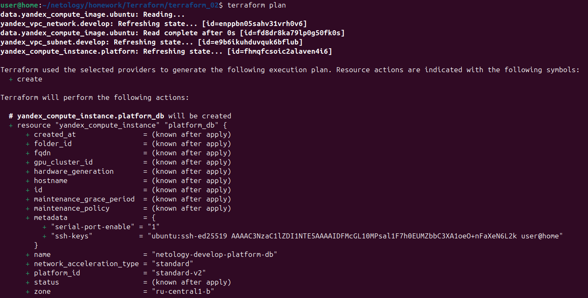
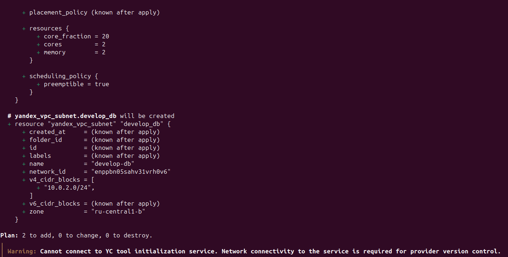
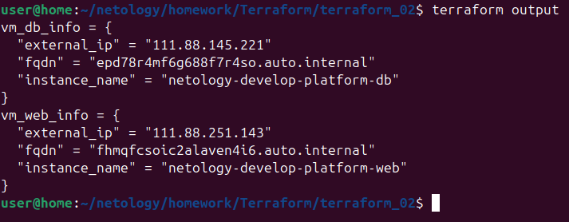
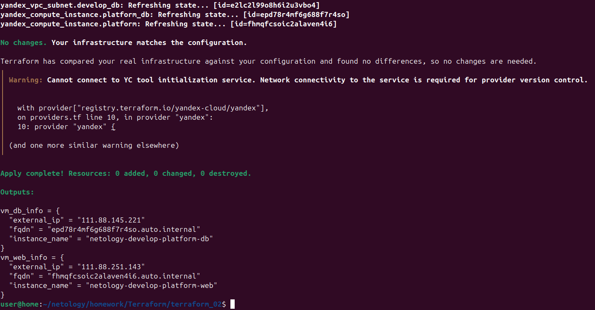
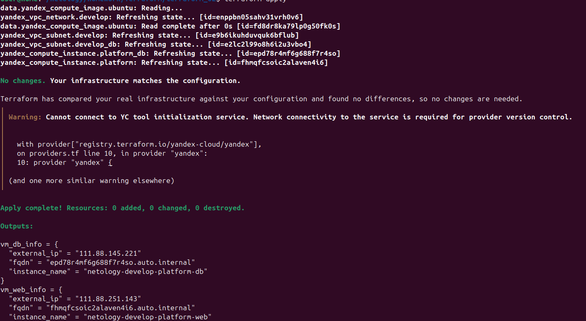

# Отчет по выполнению домашнего задания «Основы работы с Terraform» Прыкин Сергей  

**Задание 1.**  

``` 
В качестве ответа всегда полностью прикладывайте ваш terraform-код в git. Убедитесь что ваша версия Terraform ~>1.12.0

Изучите проект. В файле variables.tf объявлены переменные для Yandex provider.
Создайте сервисный аккаунт и ключ. service_account_key_file.
Сгенерируйте новый или используйте свой текущий ssh-ключ. Запишите его открытую(public) часть в переменную vms_ssh_public_root_key.
Инициализируйте проект, выполните код. Исправьте намеренно допущенные синтаксические ошибки. Ищите внимательно, посимвольно. Ответьте, в чём заключается их суть.
Подключитесь к консоли ВМ через ssh и выполните команду  curl ifconfig.me. Примечание: К OS ubuntu "out of a box, те из коробки" необходимо подключаться 
под пользователем ubuntu: "ssh ubuntu@vm_ip_address". Предварительно убедитесь, что ваш ключ добавлен в ssh-агент: eval $(ssh-agent) && ssh-add Вы познакомитесь 
с тем как при создании ВМ создать своего пользователя в блоке metadata в следующей лекции.;
Ответьте, как в процессе обучения могут пригодиться параметры preemptible = true и core_fraction=5 в параметрах ВМ.
В качестве решения приложите:

скриншот ЛК Yandex Cloud с созданной ВМ, где видно внешний ip-адрес;
скриншот консоли, curl должен отобразить тот же внешний ip-адрес;
ответы на вопросы.

```
**Ответ**  
Скриншот ЛК Yandex Cloud с созданой  ВМ.  
   

Залогинимся в машину и выполним curl ifconfig.me

   

Ошибки в файле:  
platform_id = "standart-v4"  
   - Опечатка в слове "standard"  
   - Несуществующая платформа "v4"  
   - Необходимо минимум 2 core  

preemptible = true:  
- Делает ВМ прерываемой (может быть остановлена через 24 часа или раньше)  
- Стоимость в 2-3 раза ниже обычной ВМ  
- Для учебных лабораторных работ идеально, так как ВМ нужна на короткое время  

core_fraction = 5:  
- Гарантирует 5% процессорного времени  
- Минимальная стоимость при достаточной производительности  
- Для тестовых задач (веб-сервер, curl) такой производительности достаточно  

Оба параметра позволяют существенно экономить бюджет при обучении.

**Задание 2.**  

``` 
Замените все хардкод-значения для ресурсов yandex_compute_image и yandex_compute_instance на отдельные переменные.  
К названиям переменных ВМ добавьте в начало префикс vm_web_ . Пример: vm_web_name.
Объявите нужные переменные в файле variables.tf, обязательно указывайте тип переменной. Заполните их default прежними значениями из main.tf.
Проверьте terraform plan. Изменений быть не должно.

```
**Ответ**  
Перенесли все хардкод значения в переменные в [variables.tf]  
Проверим конфигурацию. Изменений не произошло как и было укзаано в задании.

   

**Задание 3.**  

``` 
Создайте в корне проекта файл 'vms_platform.tf' . Перенесите в него все переменные первой ВМ.
Скопируйте блок ресурса и создайте с его помощью вторую ВМ в файле main.tf: "netology-develop-platform-db" , cores  = 2, memory = 2, core_fraction = 20.
Объявите её переменные с префиксом vm_db_ в том же файле ('vms_platform.tf'). ВМ должна работать в зоне "ru-central1-b"
Примените изменения.

```
**Ответ**  
Создадим в корне проекта [vms_platform.tf]. Сделаем перенос в него всех переменных. Создадим вторую виртуальную машину [в main.tf].  
Проверим конфигурацию.  
    
  

**Задание 4.**  

``` 
Объявите в файле outputs.tf один output , содержащий: instance_name, external_ip, fqdn для каждой из ВМ в удобном лично для вас формате.(без хардкода!!!)
Примените изменения.
В качестве решения приложите вывод значений ip-адресов команды terraform output.

```
**Ответ**  
Создадим [Outputs.tf]
Запустим инстанс:  
   


**Задание 5.**  

``` 
В файле locals.tf опишите в одном local-блоке имя каждой ВМ, используйте интерполяцию ${..} с НЕСКОЛЬКИМИ переменными по примеру из лекции.
Замените переменные внутри ресурса ВМ на созданные вами local-переменные.
Примените изменения.

```
**Ответ**  
Создадим [locals.tf](../locals.tf) и опишем в нем имя для каждой ВМ.  
И провери конфигурацию:  
   

**Задание 6.**  
```
6.1 Вместо использования трёх переменных ".._cores",".._memory",".._core_fraction" в блоке resources {...}, объедините их в единую map-переменную
vms_resources и внутри неё конфиги обеих ВМ в виде вложенного map(object).

пример из terraform.tfvars:
vms_resources = {
  web={
    cores=2
    memory=2
    core_fraction=5
    hdd_size=10
    hdd_type="network-hdd"
    ...
  },
  db= {
    cores=2
    memory=4
    core_fraction=20
    hdd_size=10
    hdd_type="network-ssd"
    ...
  }
}
6.2 Создайте и используйте отдельную map(object) переменную для блока metadata, она должна быть общая для всех ваших ВМ.

пример из terraform.tfvars:
metadata = {
  serial-port-enable = 1
  ssh-keys           = "ubuntu:ssh-ed25519 AAAAC..."
}
6.3 Найдите и закоментируйте все, более не используемые переменные проекта.

6.4 Проверьте terraform plan. Изменений быть не должно.

```
**Ответ**  

