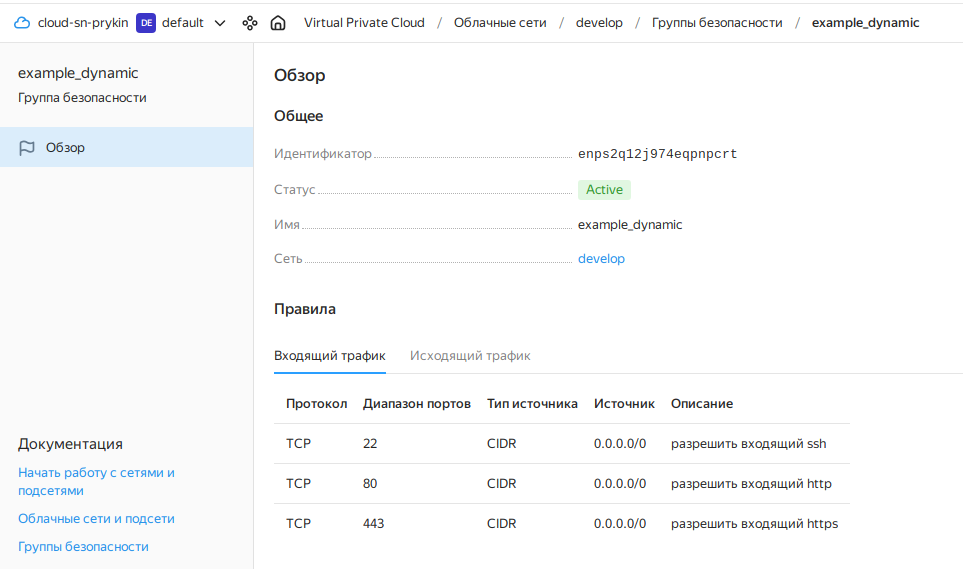
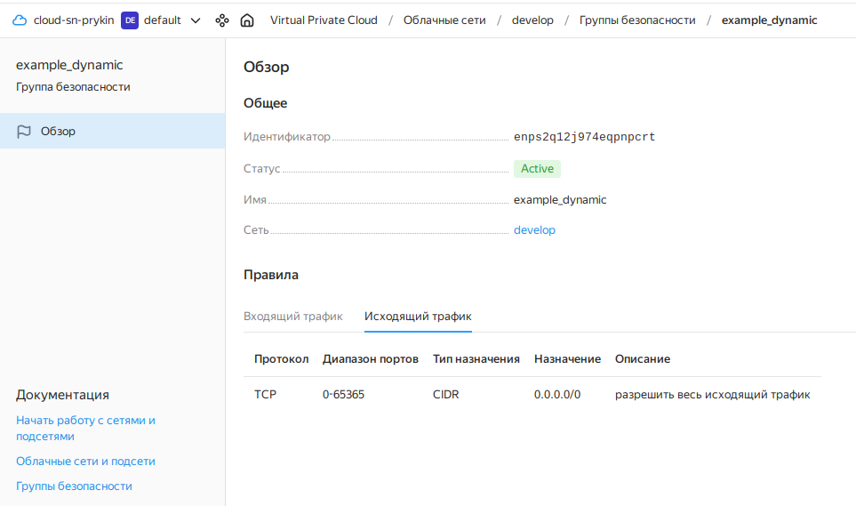
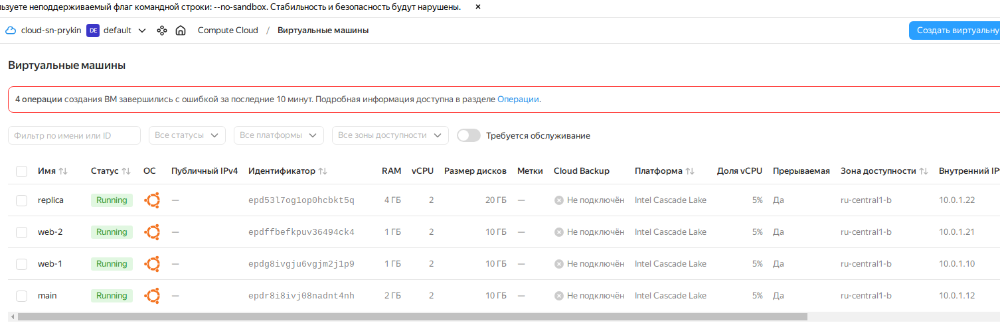
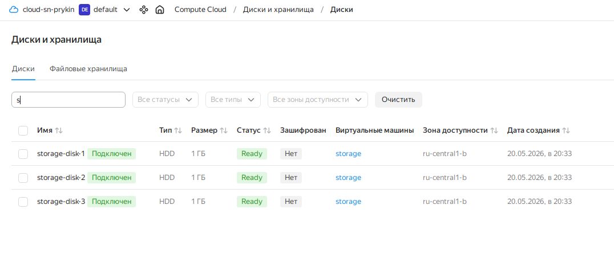
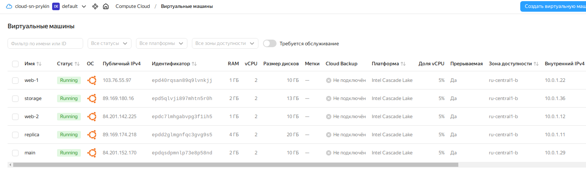
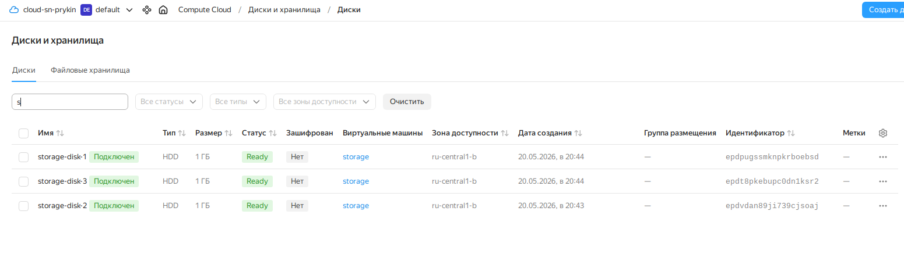
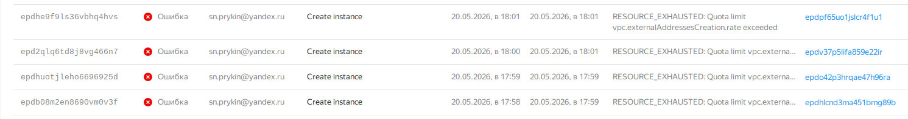

# Отчет по выполнению домашнего задания «Управляющие конструкции в коде Terraform» Прыкин Сергей  

**Задание 1.**  

``` 
Изучите проект.
Инициализируйте проект, выполните код.
Приложите скриншот входящих правил «Группы безопасности» в ЛК Yandex Cloud .

```
**Ответ**  
Инициализируцем проект и сделаем скриншоты входщих правил:   
   
 

**Задание 2.**  

``` 
Создайте файл count-vm.tf. Опишите в нём создание двух одинаковых ВМ web-1 и web-2 (не web-0 и web-1) с минимальными параметрами, используя мета-аргумент count loop. Назначьте ВМ созданную в первом задании группу безопасности.(как это сделать узнайте в документации провайдера yandex/compute_instance )
Создайте файл for_each-vm.tf. Опишите в нём создание двух ВМ для баз данных с именами "main" и "replica" разных по cpu/ram/disk_volume , используя мета-аргумент for_each loop. Используйте для обеих ВМ одну общую переменную типа:
variable "each_vm" {
  type = list(object({  vm_name=string, cpu=number, ram=number, disk_volume=number }))
}
При желании внесите в переменную все возможные параметры. 4. ВМ из пункта 2.1 должны создаваться после создания ВМ из пункта 2.2. 5. Используйте функцию file в local-переменной для считывания ключа ~/.ssh/id_rsa.pub и его последующего использования в блоке metadata, взятому из ДЗ 2. 6. Инициализируйте проект, выполните код.
```
**Ответ**  
  
  

**Задание 3.**  

``` 
Создайте 3 одинаковых виртуальных диска размером 1 Гб с помощью ресурса yandex_compute_disk и мета-аргумента count в файле disk_vm.tf .
Создайте в том же файле одиночную(использовать count или for_each запрещено из-за задания №4) ВМ c именем "storage" . Используйте блок dynamic secondary_disk{..} и мета-аргумент for_each для подключения созданных вами дополнительных дисков.


```
**Ответ**  
Создадим все запрашиваемые эллементы согласно заданию. Всё укажем в файле: [disk_vm.tf](../disk_vm.tf).  
В консоле видим, что всё создалось корректно. 
  
  

Ссылка на коммит с выполненнием задания:
https://github.com/Barsiyatinka/mngfuncinterraform/commit/a12bfb1a1159ec8ec2212fcb4b55da3e5dff5fd8

**Задание 4.**  

``` 
В файле ansible.tf создайте inventory-файл для ansible. Используйте функцию tepmplatefile и файл-шаблон для создания ansible inventory-файла из лекции. Готовый код возьмите из демонстрации к лекции demonstration2. Передайте в него в качестве переменных группы виртуальных машин из задания 2.1, 2.2 и 3.2, т. е. 5 ВМ.
Инвентарь должен содержать 3 группы и быть динамическим, т. е. обработать как группу из 2-х ВМ, так и 999 ВМ.
Добавьте в инвентарь переменную fqdn.
[webservers]
web-1 ansible_host=<внешний ip-адрес> fqdn=<полное доменное имя виртуальной машины>
web-2 ansible_host=<внешний ip-адрес> fqdn=<полное доменное имя виртуальной машины>

[databases]
main ansible_host=<внешний ip-адрес> fqdn=<полное доменное имя виртуальной машины>
replica ansible_host<внешний ip-адрес> fqdn=<полное доменное имя виртуальной машины>

[storage]
storage ansible_host=<внешний ip-адрес> fqdn=<полное доменное имя виртуальной машины>
Пример fqdn: web1.ru-central1.internal(в случае указания переменной hostname(не путать с переменной name)); fhm8k1oojmm5lie8i22a.auto.internal(в случае отсутвия перменной hostname - автоматическая генерация имени, зона изменяется на auto). нужную вам переменную найдите в документации провайдера или terraform console. 4. Выполните код. Приложите скриншот получившегося файла.

Для общего зачёта создайте в вашем GitHub-репозитории новую ветку terraform-03. Закоммитьте в эту ветку свой финальный код проекта, пришлите ссылку на коммит.
```
**Ответ**  

Создадим [host.tftpl] и [ansible.tf] согласно заданию.  
Произведеём запуск прочитаем содержимое inventory.ini:  

  


Ссылка на коммит с выполненнием задания:  
Получилось поднять только в зоне доступности ru-central1-b, так как ru-central1-а постояно выдовала ошику о перегруженности.
