# Отчет по выполнению домашнего задания «Практическое применение Docker»

## Задание 0: Проверка окружения
 Установлен Docker Compose версии v5.1.1  
 Отсутствует устаревший docker-compose (с тире)
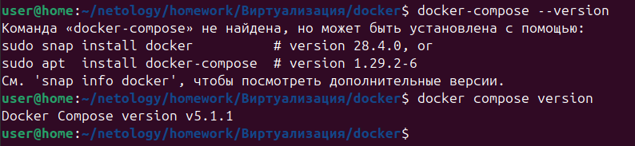
---

## Задание 1: Сборка Python приложения

### Созданные файлы:

**Dockerfile.python:**
```FROM python:3.12-slim AS builder
# Устанавливаем системные зависимости для сборки
RUN apt-get update && apt-get install -y --no-install-recommends \
    gcc \
    default-libmysqlclient-dev \
    pkg-config \
    && rm -rf /var/lib/apt/lists/*
# Создаём рабочую директорию
WORKDIR /app
# Копируем только requirements.txt для кэширования слоя зависимостей
COPY requirements.txt .
# Устанавливаем Python-зависимости в системную директорию
RUN pip install --no-cache-dir --upgrade pip && \
    pip install --no-cache-dir -r requirements.txt

FROM python:3.12-slim
# Устанавливаем только runtime-зависимости
RUN apt-get update && apt-get install -y --no-install-recommends \
    default-libmysqlclient-dev \
    && rm -rf /var/lib/apt/lists/*
# Копируем ВСЕ пакеты Python из builder (системная установка)
COPY --from=builder /usr/local/lib/python3.12/site-packages /usr/local/lib/python3.12/site-packages
COPY --from=builder /usr/local/bin /usr/local/bin
# Создаём непривилегированного пользователя
RUN groupadd -r appuser && useradd -r -g appuser -d /app appuser
# Рабочая директория
WORKDIR /app
# Копируем код приложения
COPY . .
# Меняем владельца
RUN chown -R appuser:appuser /app
# Переключаемся на непривилегированного пользователя
USER appuser
# Проверяем доступность uvicorn
RUN uvicorn --version
# Запускаем приложение
CMD ["uvicorn", "main:app", "--host", "0.0.0.0", "--port", "5000"]
```

**.dockerignore:**
```
# Git
.git
.gitignore
.gitattributes
# Python
__pycache__
*.py[cod]
*$py.class
*.so
*.egg
*.egg-info/
dist/
build/
eggs/
*.whl
.Python
env/
venv/
.venv/
.env
# IDE
.vscode/
.idea/
*.swp
*.swo
*~
# OS
.DS_Store
Thumbs.db
# Docker
Dockerfile*
docker-compose*.yml
.dockerignore
# Documentation
README*.md
LICENSE
*.txt
!requirements.txt
# Logs
*.log
# Tests
tests/
test_*
*_test.py
# CI/CD
.github/
.gitlab-ci.yml
Jenkinsfile
# Proxy configs (уже в отдельных volumes)
proxy.yaml
haproxy/
nginx/
# Environment (будет передан через переменные окружения)
.env*
!.env.example
# Database
*.db
*.sqlite
```

### Проверка сборки:
```
docker build -f Dockerfile.python -t prykinsn:multistage --build-arg BUILDKIT_INLINE_CACHE=1 .
```
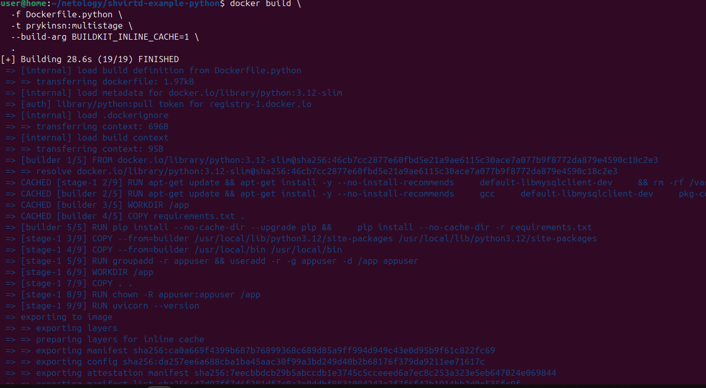
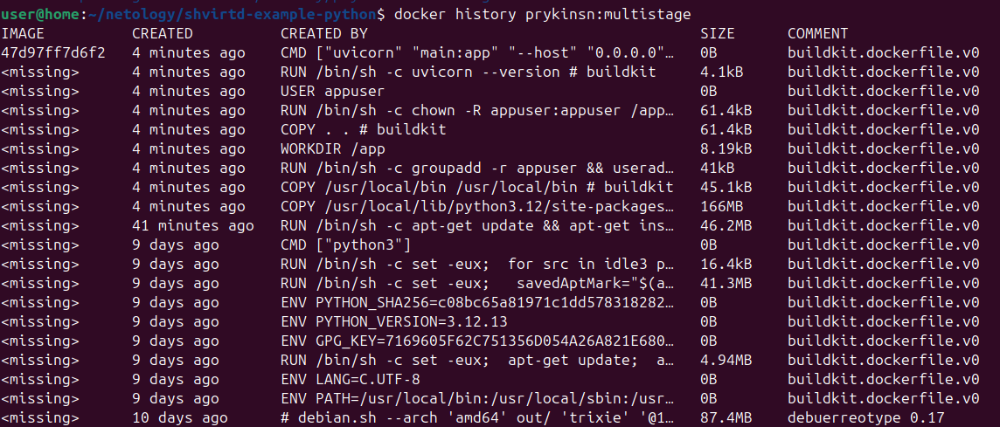
---

## Задание 3: Docker Compose

### Созданные файлы:

**compose.yaml:**
```include:
  - proxy.yaml

services:
  web:
    build:
      context: .
      dockerfile: Dockerfile.python
    container_name: fastapi-web
    restart: always
    networks:
      backend:
        ipv4_address: 172.20.0.5
    environment:
      DB_HOST: "172.20.0.10"
      DB_USER: ${MYSQL_USER}
      DB_PASSWORD: ${MYSQL_PASSWORD}
      DB_NAME: ${MYSQL_DATABASE}
    depends_on:
      db:
        condition: service_healthy
    healthcheck:
      test: ["CMD", "python", "-c", "import urllib.request; urllib.request.urlopen('http://localhost:5000/debug')"]
      interval: 30s
      timeout: 10s
      retries: 3
      start_period: 40s

  db:
    image: mysql:8.0
    container_name: mysql-db
    restart: always
    networks:
      backend:
        ipv4_address: 172.20.0.10
    environment:
      MYSQL_ROOT_PASSWORD: ${MYSQL_ROOT_PASSWORD}
      MYSQL_DATABASE: ${MYSQL_DATABASE}
      MYSQL_USER: ${MYSQL_USER}
      MYSQL_PASSWORD: ${MYSQL_PASSWORD}
    volumes:
      - mysql_data:/var/lib/mysql
    healthcheck:
      test: ["CMD", "mysqladmin", "ping", "-h", "localhost", "-u", "root", "-p${MYSQL_ROOT_PASSWORD}"]
      interval: 10s
      timeout: 5s
      retries: 5
      start_period: 30s

volumes:
  mysql_data:
```

**.env:**
```
MYSQL_ROOT_PASSWORD="YtReWq4321"
MYSQL_DATABASE="virtd"
MYSQL_USER="app"
MYSQL_PASSWORD="QwErTy1234"
```

### Запуск проекта:
```
docker compose up -d
```

### Проверка работы:
```
curl -L http://127.0.0.1:8090
```
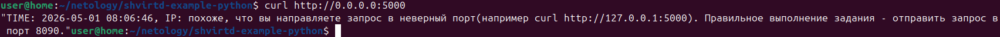
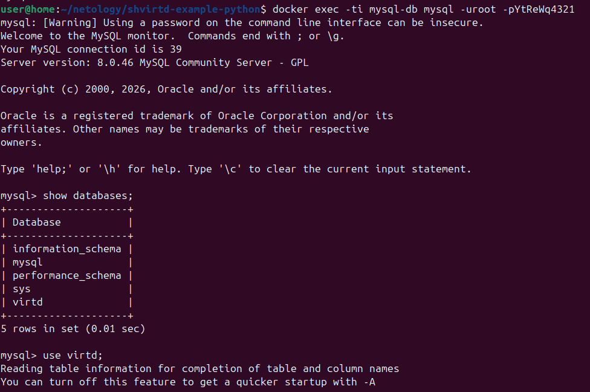

### Проверка базы данных:
```
mysql -uroot -prootpassword -e "USE example; SELECT * FROM requests LIMIT 10;"
```
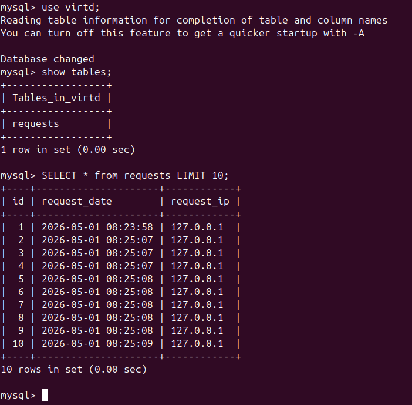
---

## Задание 4: Развертывание в Yandex Cloud

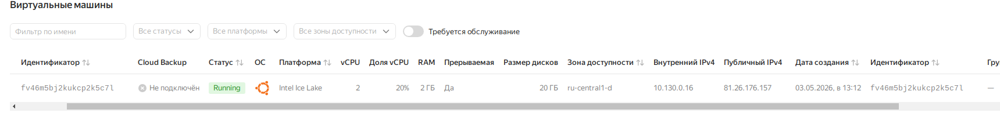

### Bash-скрипт для развертывания:

**deploy_app.sh:**
```
#!/bin/bash

REPO_URL="https://github.com/SERMSN/shvirtd-example-python.git"
TARGET_DIR="/opt/app"

if [ -d "$TARGET_DIR" ]; then
  echo "Обновление репозитория..."
  cd $TARGET_DIR
  git pull
else
  echo "Клонирование репозитория..."
  git clone $REPO_URL $TARGET_DIR
  cd $TARGET_DIR
fi

echo "Запуск проекта..."
docker compose down
docker compose up -d

echo "Готово!"
```

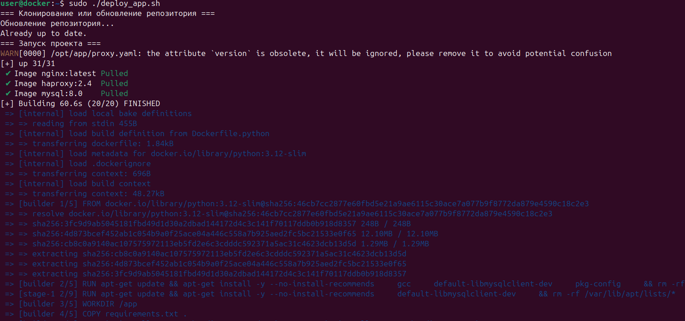
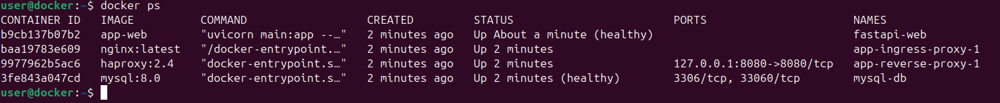

### Проверка на сервере:
```
curl -L http://81.26.176.157:8090
```

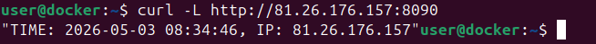
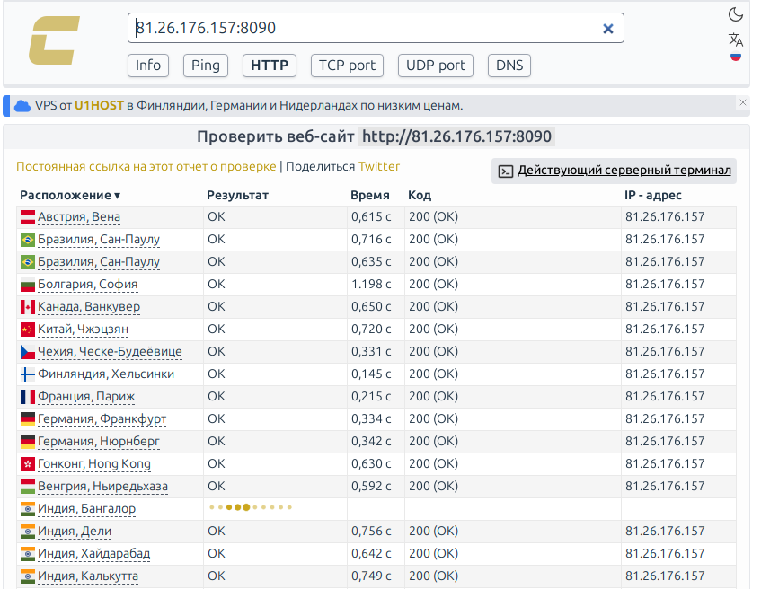
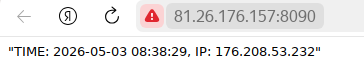

### SQL запрос на сервере:
```
sudo docker exec mysql-db mysql -u root -pYtReWq4321 virtd -e "SHOW TABLES; SELECT * FROM requests LIMIT 10;"
```

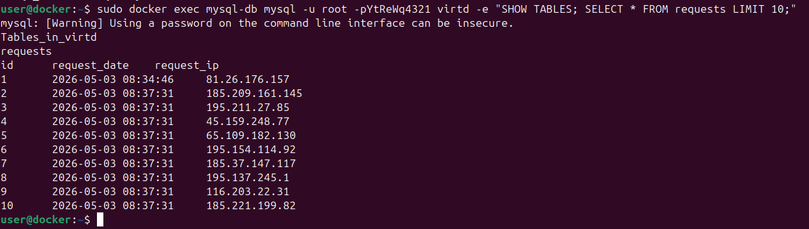

**Ссылка на fork репозитория:** https://github.com/snprykin/shvirtd-example-python#

---

## Задание 6: Извлечение Terraform из Docker образа


### Скопировать бинарный файл /bin/terraform на локальную машину, используя dive и docker save.

```
# Скачивание образа
docker pull hashicorp/terraform:latest
# Просматриваем образ в Dive, находим слой в котором находится /bin/terraform
dive hashicorp/terraform:latest
```
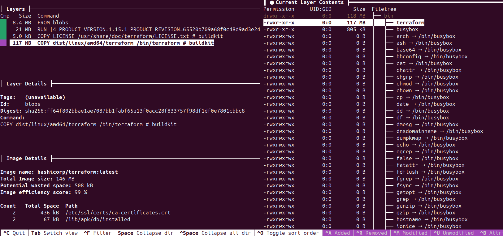

```# Сохраняем образ
docker save hashicorp/terraform:latest -o terraform.tar
# Извлекаем архив
mkdir -p temp_extract
tar -xf terraform.tar -C temp_extract/
# Извлекаем бинарник из известного слоя
tar -xf "temp_extract/blobs/sha256/850ab86db08b9009333767db0762326b9e77cf592be91d8e23ecdeba5882367c" -C ./ bin/terraform
chmod +x ./bin/terraform
# Очищаем от лишнего 
rm -rf temp_extract terraform.tar
# Получаем версию о бенарнике terraform
echo "Успешно извлечено: $(./bin/terraform version)"
```
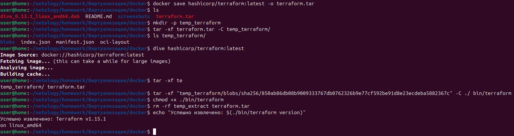
---

## Задание 6.1: Альтернативный способ извлечения

### Использование docker cp:

```
# Создание временного контейнера
docker create --name temp-terraform hashicorp/terraform:latest
# Копирование бинарника
docker cp temp-terraform:/bin/terraform ./terraform-cp
# Удаление контейнера
docker rm temp-terraform
# Проверка
./terraform-cp version
```
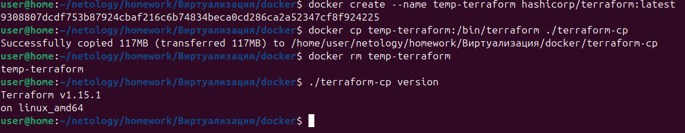
---


