# Домашнее задание"Teamcity" - `Прыкин Сергей`

## Выполнение задания  
### Создал три ВМ в соответствии с заданием:

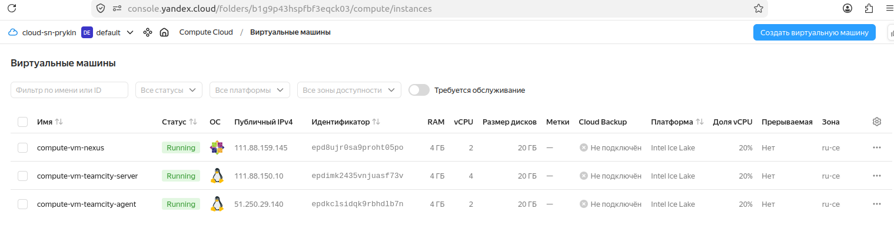  

### Агент авторизован

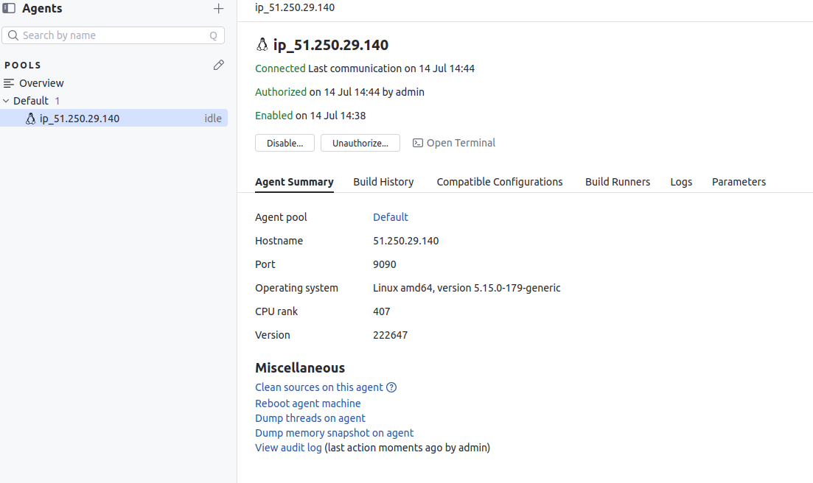  

### Запуск playbook

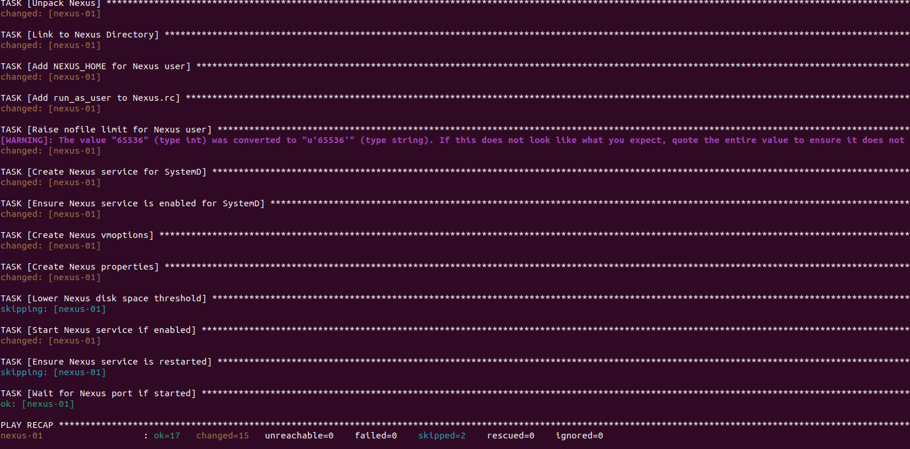  

## Решение - основная часть  
1. Новый проект в teamcity на основе fork.
2. Autodetect конфигурации.
3. Запуск первой сборки master. Сборка прошла успешно:

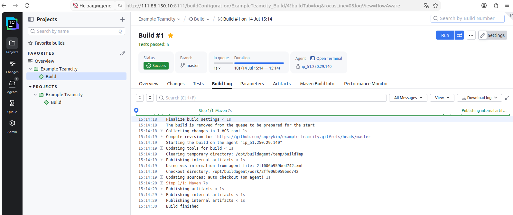  

4. Изменены условия сборки: если сборка по ветке master, то должен происходит mvn clean deploy, иначе mvn clean test:

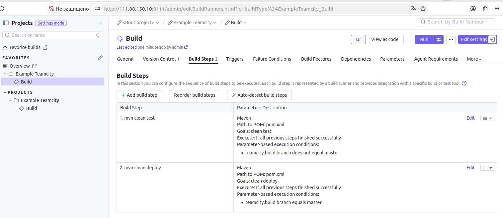  

5. Для deploy загрузили settings.xml в набор конфигураций maven у teamcity, предварительно записав туда креды для подключения к nexus:  

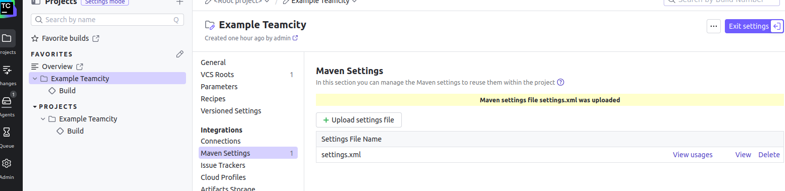

6. В pom.xml изменили ссылки на репозиторий и nexus:  

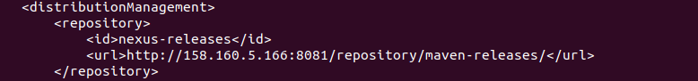

7. Запуск сборки по master, убедимся, что всё прошло успешно и артефакт появился в nexus:  

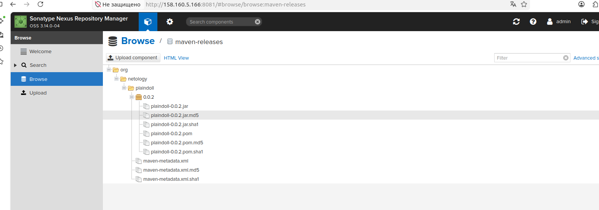

8. Мигрировали build configuration в репозиторий:  

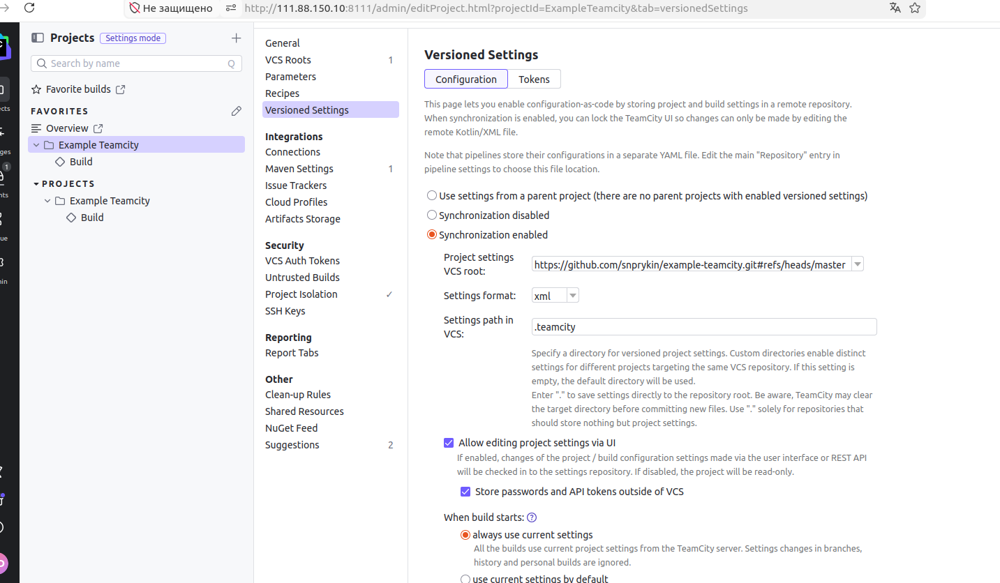
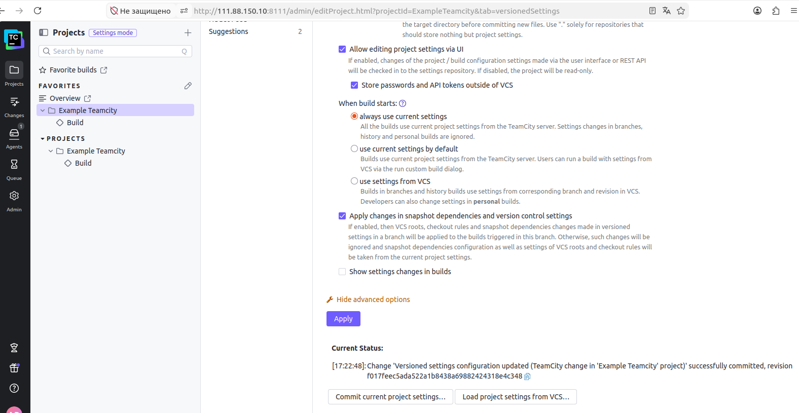

9. Создал отдельную ветку feature/add_reply в репозитории.  

10. Написал новый метод для класса Welcomer: метод возвращает произвольную реплику, содержащую слово hunter:  

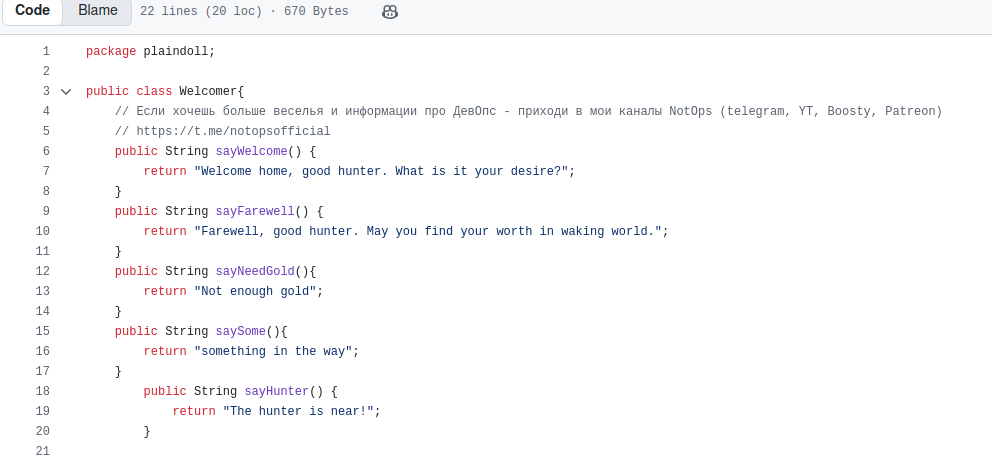

11. Дополнил тест для нового метода на поиск слова hunter в новой реплике:  

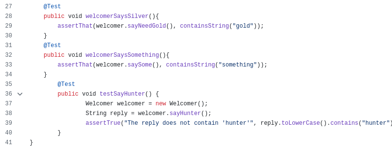

12. Сделал push всех изменений в новую ветку репозитория.  

13. Убедился, что сборка самостоятельно запустилась, тесты прошли успешно:

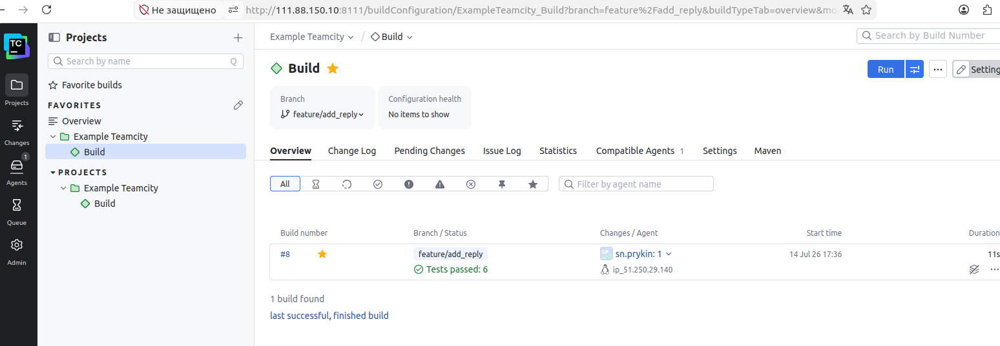

14. Сделал Merge ветки feature/add_reply в master.

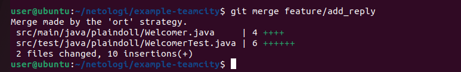

15. Убедитесь, что нет собранного артефакта в сборке по ветке master.  
16. Настройте конфигурацию так, чтобы она собирала .jar в артефакты сборки.  
17. Провел повторную сборку мастера  

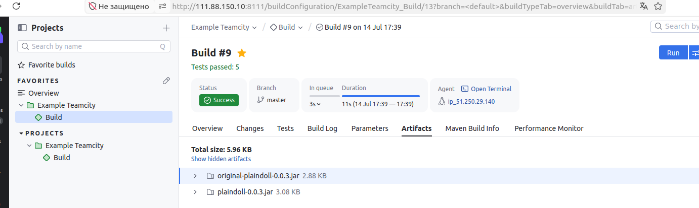

18. Проверьте, что конфигурация в репозитории содержит все настройки конфигурации из teamcity.  

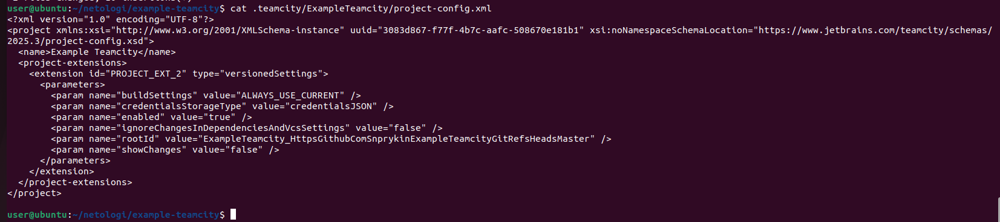

19. В ответе пришлите ссылку на репозиторий.  

https://github.com/snprykin/example-teamcity.git

