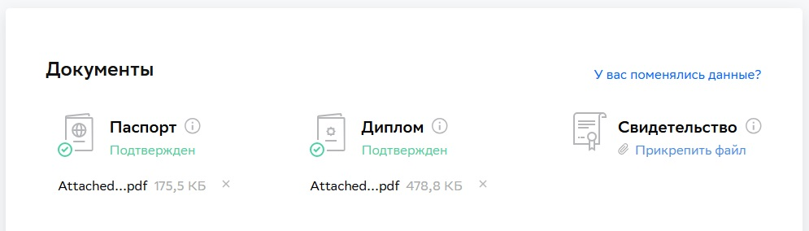

# Вопросы по заданию Прыкин Сергей

## 1. Получилось ли у вас загрузить в личный кабинет документы, подтверждающие личность, и диплом о высшем или среднем специальном образовании?

**Ответ: а) Да**

- а) Да
  - Пришлите ссылку на скриншот личного кабинета.
- б) Нет, но сделаю это в ближайшее время.** Инструкция по загрузке документов в личный кабинет.
- в) Не загрузил диплом, у меня его нет

## 2. Нужна ли вам справка об обучении после сдачи дипломной работы?

Справка выдаётся всем студентам, в том числе тем, у кого нет диплома о высшем или среднем специальном образовании.

**Ответ: а) Да**

- а) Да
  - После получения зачёта по дипломной работе напишите в чат поддержки.
- б) Нет

## 3. Выполнен ли вами необходимый минимум заданий на каждом модуле профессии для допуска к дипломной работе?

**Ответ: а) Да**

- а) Да
  - Поздравляем! Сообщим вам позже, кто будет вашим дипломным руководителем.
- б) Нет
  - В этом случае у вас нет допуска к дипломной работе. Если вы хотите сдать домашние работы на закрытых модулях, свяжитесь с координатором вашей профессии.

---

