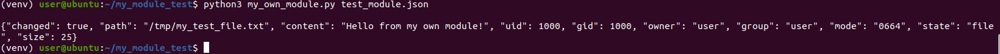
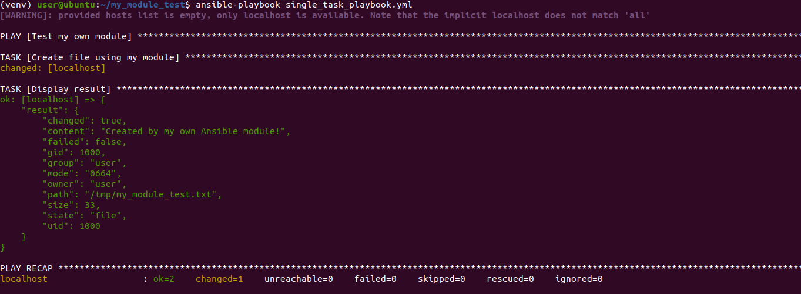
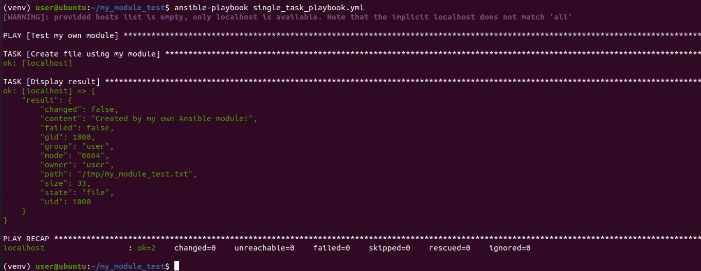
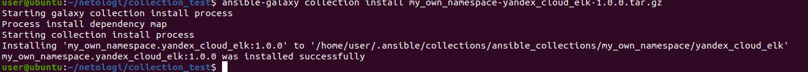
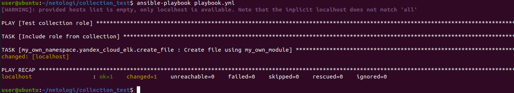

# Домашнее задание "Создание собственных модулей" - `Прыкин Сергей`

## Ссылки  

- **Репозиторий collection:** https://github.com/snprykin/my_own_collection  
- **Тег:** 1.0.0  
- **Архив:** my_own_namespace-yandex_cloud_elk-1.0.0.tar.gz  

## Выполнение задания  

### Подготовка окружения  
```
git clone https://github.com/ansible/ansible.git  
cd ansible  
python3.9 -m venv venv  
. venv/bin/activate  
pip install ansible==5.10.0 ansible-core==2.12.10   
```
### Создание модуля my_own_module.py    

### Проверка модуля локально  
```
python3 my_own_module.py test_module.json
```    
Результат: {"changed": true, "path": "/tmp/my_test_file.txt", "content": "Hello from my own module!"}    
  
 
###  Single task playbook и проверка идемпотентности    
  
  

### Создание collection   

``` 
ansible-galaxy collection init my_own_namespace.yandex_cloud_elk
```

Структура collection:  
 plugins/modules/my_own_module.py - модуль  
 roles/create_file/ - роль для использования модуля  
 playbook.yml - playbook для тестирования роли  

### Сборка collection  
```
ansible-galaxy collection build  
```
Создан архив: my_own_namespace-yandex_cloud_elk-1.0.0.tar.gz  

###  Установка и запуск  
```
ansible-galaxy collection install my_own_namespace-yandex_cloud_elk-1.0.0.tar.gz
ansible-playbook playbook.yml
```
    

