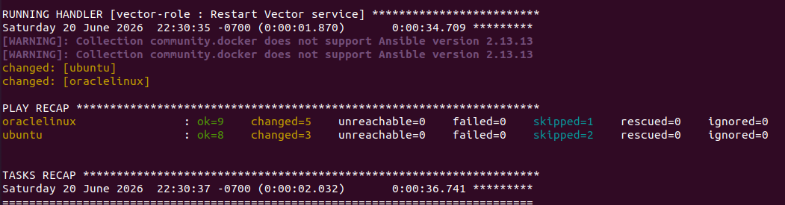
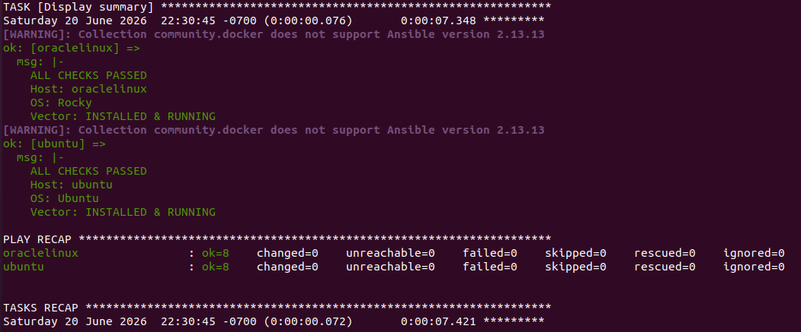
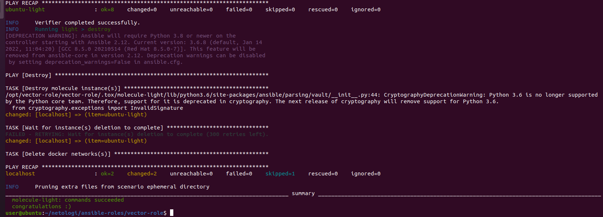

# Домашнее задание "Тестирование ролей" - `Прыкин Сергей`

## Ссылки на репозитории
(https://github.com/snprykin/ansible-roles)

## Выполнение задания

###Результат molecule test  
molecule test -s default  

Converge    
  
Verify  

###Результат tox  
docker run --privileged=True \  
  -v ~/netologi/ansible-roles:/opt/vector-role \  
  -v /var/run/docker.sock:/var/run/docker.sock \  
  -w /opt/vector-role/vector-role \  
  -it aragast/netology:latest /bin/bash  

####Внутри контейнера:  
tox  

###Теги решений

| Задание | Тег    |
|---------|--------|
| Molecule| v1.3.0 |
| Tox     | v1.4.0 |

