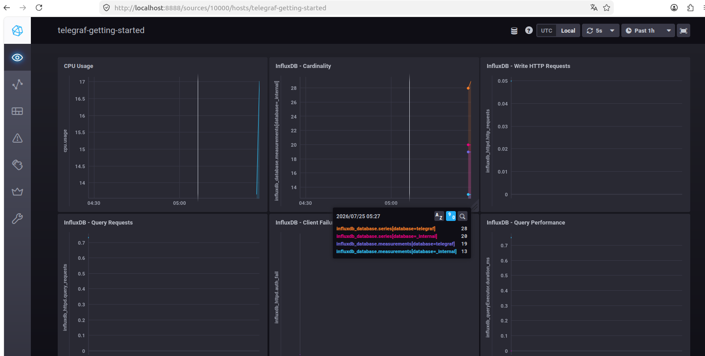
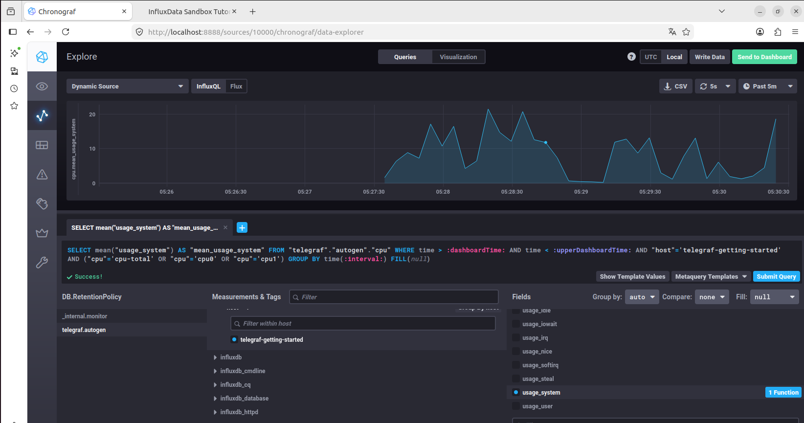
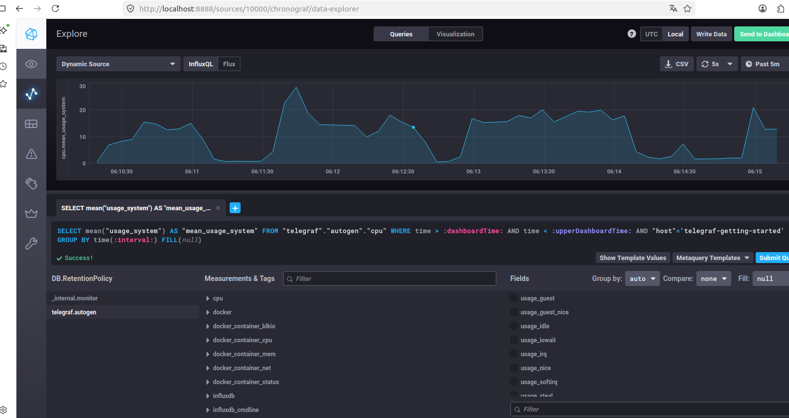

# Домашнее задание "Система мониторинга" - `Прыкин Сергей`

## Ответы

### Задание 1
1. Метрики приложения/сервиса (RED — Rate, Errors, Duration)  

   Rate (Количество запросов в секунду): http_requests_total.  
   Без понимания тренда трафика мы даже не поймем, является ли рост ошибок следствием DDoS-атаки или просто оборвался кабель.  
   Errors (Количество ошибок): http_errors_total (с разбивкой по кодам 4xx и 5xx).  
   Важно: ошибкой считать не только 500-е, но и 400-е, если это вина платформы, а не клиента (например, баг в парсере).  
   Duration (Длительность обработки): http_request_duration_seconds.  

2. Метрики хоста/железа (USE — Utilization, Saturation, Errors)  

   CPU:  
   cpu_utilization_percent (загрузка).  
   cpu_load_average (LA 1/5/15) — это saturation, очередь задач. Если LA > кол-ва ядер, CPU не справляется.  

   Memory:  
   memory_utilization_percent (использование RAM).  
   memory_oom_kills_total — сатурация памяти. Если приложение начинает жрать память, OOM Killer — это последний рубеж обороны,  
   мы должены знать, когда он убил процесс вычислений, оставив клиента с ошибкой.  

   Disk (это критично!):  
   disk_utilization_percent (место на разделе). Кончилось место — отчеты не пишутся, вычисления падают.  
   disk_inodes_used_percent (иноды). Когда на диске место есть, но миллионы временных файлов съели все inodes и система говорит «No space left on device».  
   disk_io_queue_depth (saturation по диску). Если очередь на запись отчетов растет — диски тормозят платформу.  

   Это минимальный набор.  
   Потому что если упадет сеть, мы увидим это через просадку Rate и рост Errors (если балансировщик отдает 502).  
   Если кончится место — в Errors будет 500 от бэкенда.  
---

### Задание 2
Предлагаю внедрить SLA/SLO/SLI.  
Строим мониторинг не вокруг «железа», а вокруг «качества услуги».  

 Дашборд «Качество обслуживания» (Executive Dashboard):  
   SLI — Индикатор качества: Доступность платформы. «Платформа доступна, если 99% запросов обрабатываются быстрее X секунд и без 5xx ошибок». Горит зеленым — всё ок.  
   SLO — Цель по качеству: «Мы обязуемся держать доступность на уровне 99.9% в квартал (это не более 43 минут простоя)».  
   SLA — Соглашение с последствиями: «Если за месяц доступность упадет ниже 99%, мы возвращаем 10% оплаты (предоставляем бонусы)». Это его прямые обязанности перед клиентами.  

 Бизнес-метрики:  
   Вместо «Загрузка CPU» → «Скорость обработки задачи». Если CPU забит, мы показываем тренд: «Сейчас средний отчет генерится на 20% дольше обычного».  
   Вместо «Место на диске» → «Ресурс для хранения отчетов заканчивается, нужно либо чистить, либо докупать, либо клиенты не получат отчеты через 3 дня».  
   Вместо «Inodes кончились» → «Счетчик файлов переполнен, система не может создать новый отчет».  
   Показываешь не графики Load Average (которые выглядят как кардиограмма), а одну большую циферку: «Текущий уровень счастья клиента (Apdex) = 0.95».  
---

### Задание 3
Решение: «syslog и скрипты»  
Не будем строить распределенную систему (дорого по ресурсам и дискам), а сделаем упор на концентрацию ошибок.  

Вариант 1  
   (Быстрый и бесплатный): journald + logger + почта/телеграм  
   Мы пользуемся тем, что приложения пишут в stdout/stderr, а systemd это подхватывает.  
   Приложения должны просто писать ошибки в stderr (это стандарт и бесплатно).  
   Пишем демона (буквально 15 строк на Python или Bash), который висит на journalctl -f -p err -o json.  
   Как только ловится строка с priority=3 (Error) — дергается Webhook в Telegram-чат разработчиков или отправляется письмо через sendmail.  
   Плюс: Бесплатно, мгновенно.  
   Минус: Всё в одном флаконе, если машина умрет, ты не увидишь логи за секунду до смерти.  

Вариант 2  
   (Более надежный): Rsyslog с фильтрацией  
   Настраиваем на сервере rsyslog. Приложения пишут в локальный сокет /dev/log (или UDP/TCP порт).  
   Rsyslog фильтрует по severity: *.err.  
   Действие: action(type="email" server="smtp.").  
   Итог: Все ошибки со всех подов/сервисов падают на один почтовый ящик "разработчикам".  
---

### Задание 4
  Неучтенные 3xx коды (Redirects) или 1xx, платформа вычислений наверняка использует редиректы.  
  Например:  
  Клиент делает запрос на отчет.  
  Сервер отвечает 302 Found («Твой отчет еще не готов, иди по этому URL»).  
  Клиент делает второй запрос и получает 200 OK.  
  Если 30% запросов — это коды 301, 302 или 304 (Not Modified), то сумма 2xx по отношению ко всем запросам будет равна 70%.  
  Также могут быть 401 Unauthorized, которые ты просто не видишь в отчете (логи смотришь), но они есть в метриках.  
  Как надо считать:
  SLA = (summ_2xx + summ_3xx + summ_4xx_клиента(например, 401)) / summ_all_requests  
  Либо строго: SLA = summ_5xx / summ_all_requests.  
  Мы считаем долю ошибок сервера (5xx), и если она > 0%, то SLA горит. А 3xx — это нормальное поведение, это не ошибка сервера.  
---

### Задание 5
  Push-модель (Агент сам отправляет метрики в центр)  
  Как это работает: Хост стучится в базу данных. Типичные примеры: Graphite, InfluxDB (в TICK), Zabbix (активные проверки), Elasticsearch.  

  Плюсы:  
   Заходит за NAT и Firewall без танцев с бубном. Агенты наружу ходят без проблем.  
   Работает с коротко-живущими задачами (Ephemeral Jobs). Задание выполнилось, отправило метрику и умерло.  
   Проще горизонтальное масштабирование агентов — им не надо ждать, пока их опросят.  

  Минусы:  
   (Thundering herd) 10 тысяч агентов одновременно кидают метрики — центральный сервер задыхается.  
   Сложность валидации конфигурации. Если нет метрики, непонятно: агент умер, сеть или он просто настроен на другой сервер?  
   Сложный control plane. Агентам нужно знать, куда слать данные.  

   Pull-модель (Центральный сервер сам забирает метрики)  
   Как это работает: Сервер идет к хостам и забирает данные. Типичный пример: Prometheus, Zabbix (пассивные проверки), Nagios.  

  Плюсы:  
   Единый источник. Prometheus сам решит, кого скрейпить и как часто. Если метрики не пришли — виноват либо endpoint, либо сеть.
   Простая отладка. Открыл браузер, зашел на http://host:9090/metrics и глазами видишь, что отдает узел.  
   Service Discovery. Prometheus умеет сам опрашивать Kubernetes API и находить новые поды без перезагрузки конфига.  

  Минусы:  
   Проблемы с NAT и Firewall. Сервер должен достучаться до каждого агента.  
   Не подходит для коротких задач. Проблема производительности. Тянуть метрики с тысяч агентов — это дорого, нужен федеративный сбор (иерархия).  
---

### Задание 6
Prometheus — Классический Pull.  
  Но: У него есть Pushgateway для коротких джоб. И агенты Telegraf умеют пушить в Prometheus (через remote_write), но это уже шаг в сторону гибрида.  
  В базовой философии — жесткий Pull.  

TICK (Telegraf, InfluxDB, Chronograf, Kapacitor) — Гибрид с уклоном в Push.  
  Telegraf по умолчанию пушит метрики в InfluxDB.  
  Но Telegraf умеет и Pull (читать Prometheus endpoint, читать SNMP).  
  InfluxDB умеет Pull через Scraper (появился в поздних версиях).  
  Итого: Push/Pull.  

Zabbix — Гибрид.  
  «Пассивные проверки» — это Zabbix Server стучится к агенту (Pull).  
  «Активные проверки» — Zabbix Agent сам шлет данные на сервер (Push).  
  Сюда же добавим Trapper (ловушку), куда можно пушить данные через zabbix_sender. Олдскульный, но 100% гибрид.  

VictoriaMetrics — можно считать гибридом.  
  Совместима с Prometheus, умеет Pull (скрейпить endpoints).  
  Умеет принимать данные по remote_write от тех же Prometheus, Telegraf и т.д. (Push).  
  Имеет свой агент vmagent, который умеет и скрейпить (Pull), и отправлять в центральный кластер (Push).  
  Итого: Push/Pull.  

Nagios — Классический Pull.  
  Всегда работает по принципу «планировщик запланировал чек, Nagios пошел и запустил скрипт через NRPE/SSH». Чистый Pull.  
---

### Задание 7
 
---

### Задание 8
 
---

### Задание 9
 
