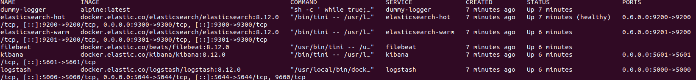
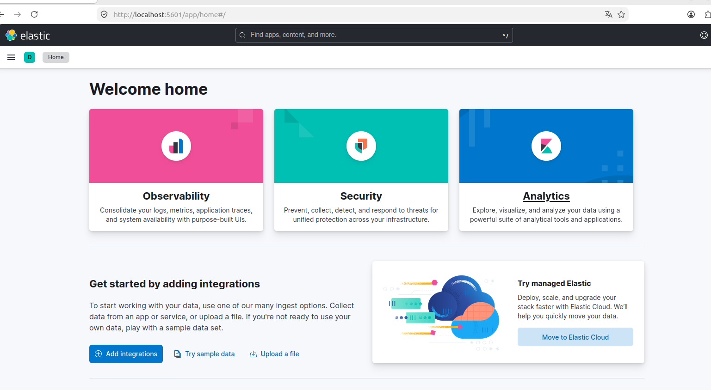
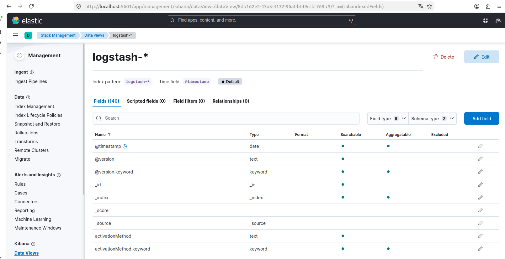
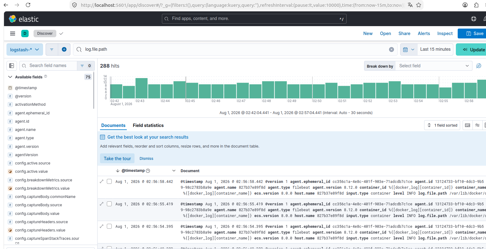

# Домашнее задание "Система сбора логов Elastic Stack" - `Прыкин Сергей`

## Структура проекта
- [docker-compose.yml](./docker-compose.yml) — основной манифест стека
- [elasticsearch/hot/elasticsearch.yml](./elasticsearch/hot/elasticsearch_hot.yml) — конфиг hot-ноды
- [elasticsearch/warm/elasticsearch.yml](./elasticsearch/warm/elasticsearch_warm.yml) — конфиг warm-ноды
- [logstash/config/logstash.yml](./logstash/config/logstash.yml) — конфиг Logstash
- [logstash/pipeline/logstash.conf](./logstash/pipeline/logstash.conf) — pipeline (input/filter/output)
- [filebeat/config/filebeat.yml](./filebeat/config/filebeat.yml) — конфиг Filebeat
- [setup-ilm.sh](./setup-ilm.sh) — скрипт настройки ILM политики

## Задание 1. Развертывание стека

Стек запущен командой `docker-compose up -d`.

Скриншот `docker ps`:

Скриншот интерфейса Kibana:

---

## Задание 2. Index Patterns и Discover

Создан index pattern `logstash-*` с time field `@timestamp`.

Скриншот создания index pattern:

Скриншот Discover с логами:

