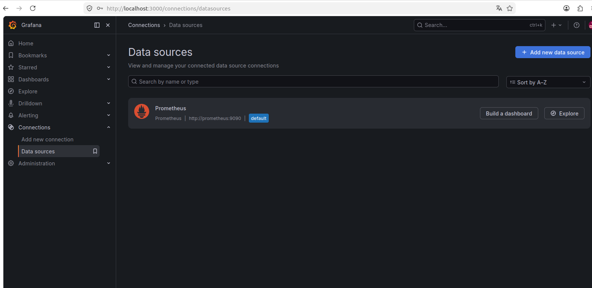
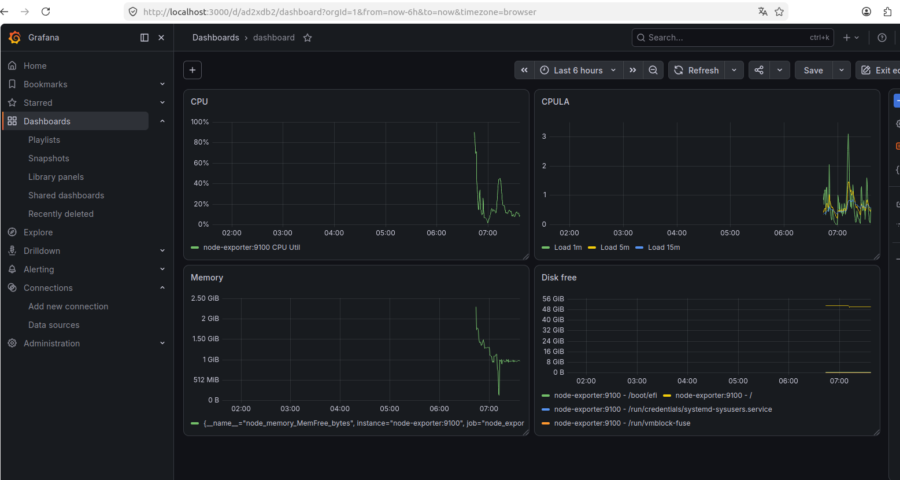
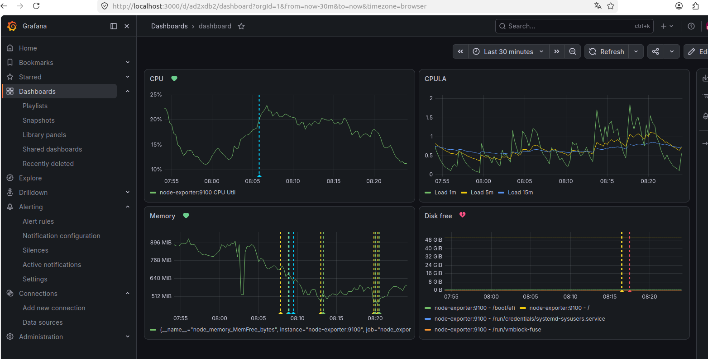

# Домашнее задание "Средство визуализации Grafana" - `Прыкин Сергей`

## Структура проекта
- [docker-compose.yml](./docker-compose.yml) - основной манифест для развертывания стека Prometheus + Grafana + Node Exporter
- [prometheus.yml](./prometheus.yml) - конфигурация целей для Prometheus
- [datasource.yml](./datasource.yml) - автоматическая настройка источника данных в Grafana

## Задание 1. Развертывание и Data Source
1. Стек поднят с помощью `docker-compose up -d`.
2. Вход в Grafana выполнен под `admin/admin`.
3. Data Source "Prometheus" был автоматически подключен через систему Provisioning.
4. Скриншот выполненного задания:

---

## Задание 2. PromQL и Панели
Создан дашборд `Dashboard`.
PromQL запросы:
- **CPU Utilization:** `100 - (avg(rate(node_cpu_seconds_total{mode="idle"}[5m])) * 100)`
- **CPU Load Average:** `node_load1`, `node_load5`, `node_load15`
- **Free RAM:** `node_memory_MemFree_bytes`
- **Free Disk Space:** `node_filesystem_free_bytes{fstype!="tmpfs", fstype!="fuse.lxcfs", fstype!="squashfs"}`

Скриншот итогового дашборда:

---

## Задание 3. Алерты
Настроены правила алертов:
- **High CPU Usage (>80%)**: На панели CPU.
- **Low Memory (<500MB)**: На панели RAM.
- **Low Disk Space (<10GB)**: На панели Filesystem.

---

## Задание 4. Модель дашборда
Файл [dashboard.json](./dashboard.json) приложен к решению.

